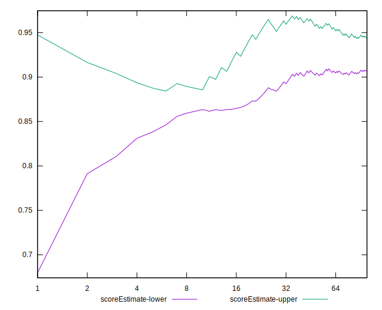

# //unminified-javascript/samples/astro

[→ Parent](../..)


## Raw


```yaml
p90min: 0
p90max: 160
p90range: 160
p90mean: 84.14893617021276
median: 150
p90stdev: 74.13916721874843
mad: 5
stdevBySn: 8.944500000000001
lfitCenter: 90.26743639206416
lfitStdev: 90.17260311782259
mfitCenter: 90.26743639206416
mfitStdev: 113.0145983998269
mfitConfidence: 11.301459839982689
p90skewness: -0.24864676453035145
p90eccentricity: 0.9999999999999997
p90discretization: 18.8
outlandishness: 1.0275448869311996

```


## Score


```yaml
p90min: 0.87
p90max: 1
p90range: 0.13
p90mean: 0.9325531914893616
median: 0.88
p90stdev: 0.05941086959458353
mad: 0
stdevBySn: 0
lfitCenter: 0.9275478082902708
lfitStdev: 0.07237607479713717
mfitCenter: 0.9275478082902708
mfitStdev: 0.09070995783793231
mfitConfidence: 0.009070995783793232
p90skewness: 0.24965220982635766
p90eccentricity: 0.9999999999999994
p90discretization: 23.5
outlandishness: 0.9977425485624167

```


## Raw Estimate


## Score Estimate


## P Score


```yaml
p90min: 0.8666666666666667
p90max: 1
p90range: 0.1333333333333333
p90mean: 0.9298758865248227
median: 0.875
p90stdev: 0.06178263934895701
mad: 0.004166666666666652
stdevBySn: 0.007453749999999974
lfitCenter: 0.924777136339947
lfitStdev: 0.07514383593151897
mfitCenter: 0.924777136339947
mfitStdev: 0.09417883199985592
mfitConfidence: 0.009417883199985592
p90skewness: 0.248646764530353
p90eccentricity: 1.0000000000000002
p90discretization: 18.8
outlandishness: 0.9979379503713723

```


## Score Difference


```yaml
p90min: 0
p90max: 0
p90range: 0
p90mean: 0
median: 0
p90stdev: 0
mad: 0
stdevBySn: 0
lfitCenter: 0
lfitStdev: 0
mfitCenter: 0
mfitStdev: 0
mfitConfidence: 0
p90skewness: .nan
p90eccentricity: .nan
p90discretization: 94
outlandishness: .nan

```


## P Score Difference


```yaml
p90min: -0.0050000000000000044
p90max: 0
p90range: 0.0050000000000000044
p90mean: -0.0026241134751773063
median: -0.004166666666666652
p90stdev: 0.0024491200921747556
mad: 0.0008333333333333526
stdevBySn: 0.0014907500000000346
lfitCenter: -0.002687519417818845
lfitStdev: 0.0029833418910992816
mfitCenter: -0.002687519417818845
mfitStdev: 0.003739064572322695
mfitConfidence: 0.00037390645723226954
p90skewness: 0.10606149919206313
p90eccentricity: 0.9999999999999996
p90discretization: 23.5
outlandishness: 0.9691604273192113

```

