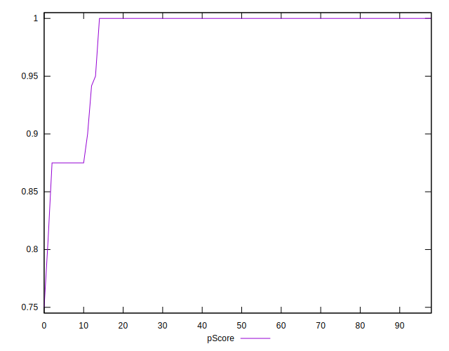

# //unminified-javascript/samples/card

[→ Parent](../..)


## Raw


```yaml
p90min: 0
p90max: 150
p90range: 150
p90mean: 15.591397849462366
median: 0
p90stdev: 44.029861948537906
mad: 0
stdevBySn: 0
lfitCenter: 11.63049595336948
lfitStdev: 26.84843460825726
mfitCenter: 11.63049595336948
mfitStdev: 33.64952269317915
mfitConfidence: 3.381904277206805
p90skewness: 2.582618970608208
p90eccentricity: 0.9999999999999989
p90discretization: 18.6
outlandishness: 1.904226963178428

```


## Score


```yaml
p90min: 0.88
p90max: 1
p90range: 0.12
p90mean: 0.9874193548387097
median: 1
p90stdev: 0.03540558323647485
mad: 0
stdevBySn: 0
lfitCenter: 0.9905545782751874
lfitStdev: 0.0218042969571363
mfitCenter: 0.9905545782751874
mfitStdev: 0.027327633658102497
mfitConfidence: 0.0027465305227943443
p90skewness: -2.563190989657613
p90eccentricity: 1.0000000000000016
p90discretization: 18.6
outlandishness: 0.9901116509740988

```


## Raw Estimate


## Score Estimate


## P Score


```yaml
p90min: 0.875
p90max: 1
p90range: 0.125
p90mean: 0.9870071684587814
median: 1
p90stdev: 0.0366915516237816
mad: 0
stdevBySn: 0
lfitCenter: 0.9903079200388585
lfitStdev: 0.022373695506881355
mfitCenter: 0.9903079200388585
mfitStdev: 0.028041268910983005
mfitConfidence: 0.0028182535643390427
p90skewness: -2.5826189706081992
p90eccentricity: 0.9999999999999996
p90discretization: 18.6
outlandishness: 0.9900221258222486

```


## Score Difference


```yaml
p90min: 0
p90max: 0
p90range: 0
p90mean: 0
median: 0
p90stdev: 0
mad: 0
stdevBySn: 0
lfitCenter: 1.0577304673893754e-18
lfitStdev: 2.626077309312598e-18
mfitCenter: 1.0577304673893754e-18
mfitStdev: 3.2912998207567746e-18
mfitConfidence: 3.307880781216425e-19
p90skewness: .nan
p90eccentricity: .nan
p90discretization: 93
outlandishness: .inf

```


## P Score Difference


```yaml
p90min: -0.0050000000000000044
p90max: 0
p90range: 0.0050000000000000044
p90mean: -0.00034050179211469604
median: 0
p90stdev: 0.0012356497617160014
mad: 0
stdevBySn: 0
lfitCenter: -0.0002383866267914999
lfitStdev: 0.0005853641555483708
mfitCenter: -0.0002383866267914999
mfitStdev: 0.0007336451723647477
mfitConfidence: 0.00007373411412089341
p90skewness: -3.4533331507038545
p90eccentricity: 0.9999999999999997
p90discretization: 31
outlandishness: 1.7820333783567184

```

