# //unminified-javascript/samples/music

[→ Parent](../..)


## Raw


```yaml
p90min: 0
p90max: 300
p90range: 300
p90mean: 38.51063829787234
median: 0
p90stdev: 82.71917947359054
mad: 0
stdevBySn: 0
lfitCenter: 29.186207405007963
lfitStdev: 63.01293417173564
mfitCenter: 29.186207405007963
mfitStdev: 78.97500131063526
mfitConfidence: 7.897500131063526
p90skewness: 2.0470187875447996
p90eccentricity: 0.9999999999999994
p90discretization: 15.666666666666666
outlandishness: 1.6992058728366048

```

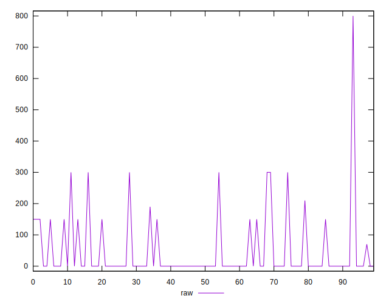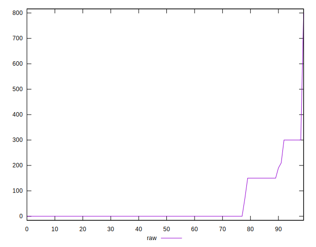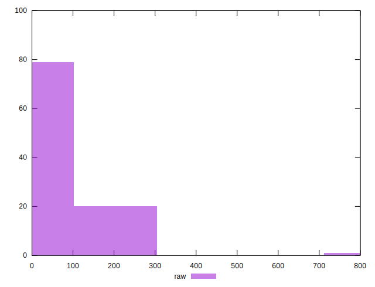
## Score


```yaml
p90min: 0.75
p90max: 1
p90range: 0.25
p90mean: 0.9685106382978724
median: 1
p90stdev: 0.06808876319966943
mad: 0
stdevBySn: 0
lfitCenter: 0.9768006380884149
lfitStdev: 0.050087352723675684
mfitCenter: 0.9768006380884149
mfitStdev: 0.06277518733245782
mfitConfidence: 0.006277518733245782
p90skewness: -2.098054717211931
p90eccentricity: 1.0000000000000033
p90discretization: 15.666666666666666
outlandishness: 0.983116685036377

```

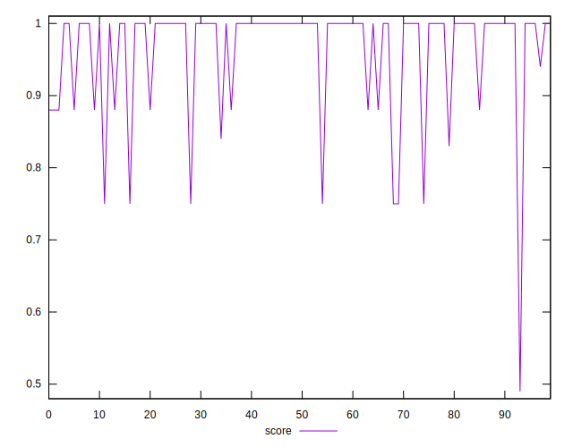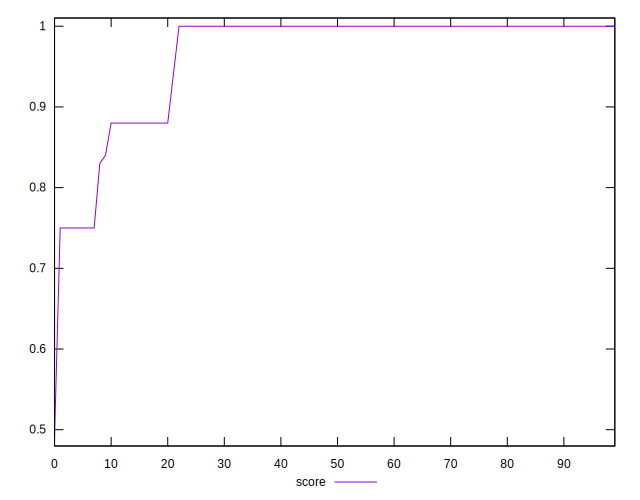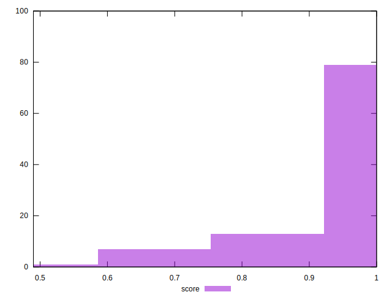
## Raw Estimate

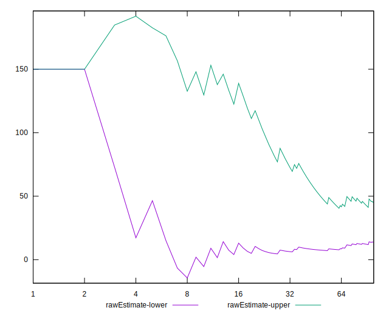
## Score Estimate

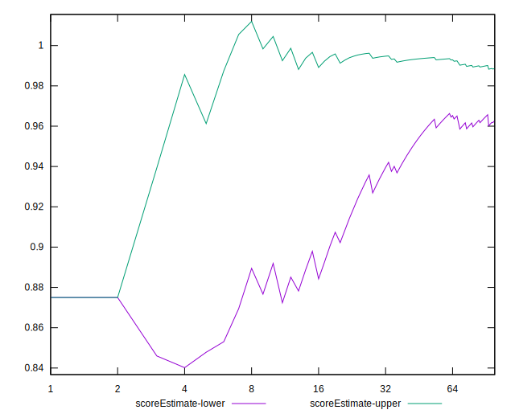
## P Score


```yaml
p90min: 0.75
p90max: 1
p90range: 0.25
p90mean: 0.9679078014184397
median: 1
p90stdev: 0.06893264956132536
mad: 0
stdevBySn: 0
lfitCenter: 0.9764263865956485
lfitStdev: 0.05089536057307239
mfitCenter: 0.9764263865956485
mfitStdev: 0.06378787499418762
mfitConfidence: 0.006378787499418762
p90skewness: -2.0470187875448076
p90eccentricity: 1.0000000000000022
p90discretization: 15.666666666666666
outlandishness: 0.983264687533094

```

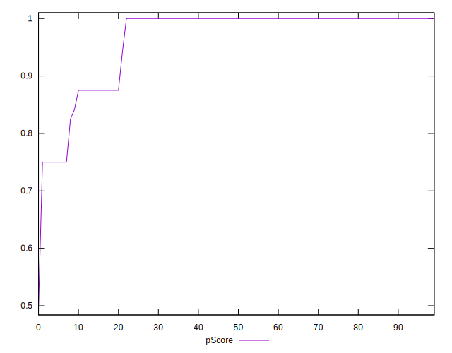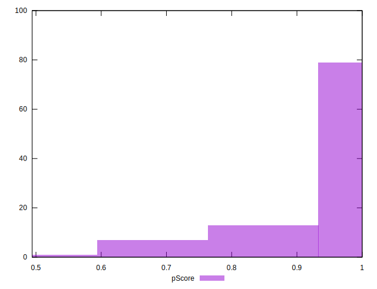
## Score Difference


```yaml
p90min: 0
p90max: 0
p90range: 0
p90mean: 0
median: 0
p90stdev: 0
mad: 0
stdevBySn: 0
lfitCenter: 1.0470608452365924e-18
lfitStdev: 2.5998395675404994e-18
mfitCenter: 1.0470608452365924e-18
mfitStdev: 3.2584156880294808e-18
mfitConfidence: 3.258415688029481e-19
p90skewness: .nan
p90eccentricity: .nan
p90discretization: 94
outlandishness: .inf

```

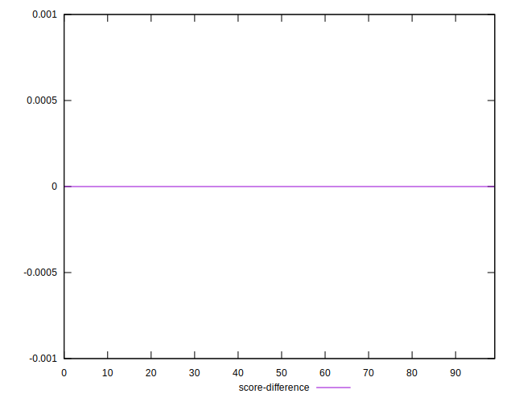
## P Score Difference


```yaml
p90min: -0.0050000000000000044
p90max: 0
p90range: 0.0050000000000000044
p90mean: -0.00047872340425531956
median: 0
p90stdev: 0.0014712039027595044
mad: 0
stdevBySn: 0
lfitCenter: -0.0002898339067571015
lfitStdev: 0.0007677483362743048
mfitCenter: -0.0002898339067571015
mfitStdev: 0.0009622298447212775
mfitConfidence: 0.00009622298447212775
p90skewness: -2.747785799036309
p90eccentricity: 1.0000000000000027
p90discretization: 47
outlandishness: 1.204924723159654

```

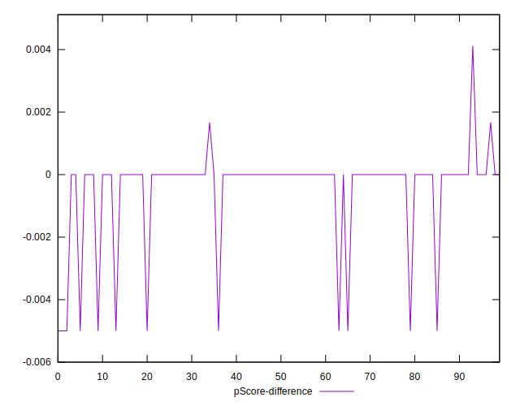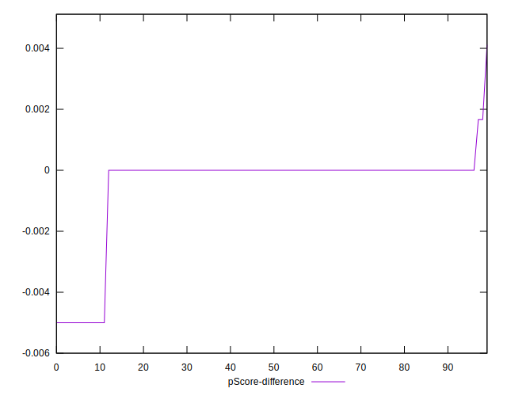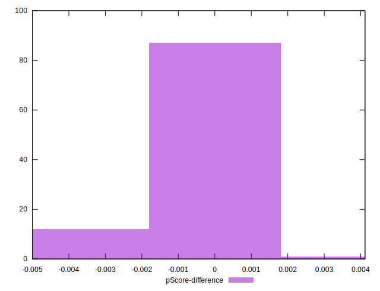