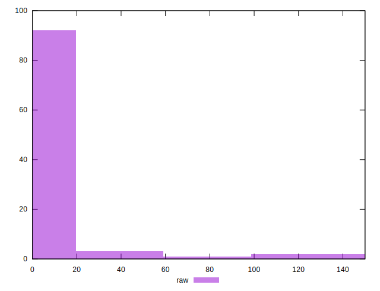
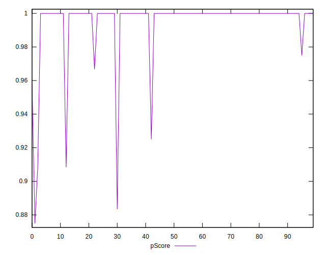

# //unused-css-rules/samples/agenda

[→ Parent](../..)


## Raw


```yaml
p90min: 0
p90max: 110
p90range: 110
p90mean: 3.404255319148936
median: 0
p90stdev: 16.015497248135162
mad: 0
stdevBySn: 0
lfitCenter: 3.5792753062635962
lfitStdev: 8.604557750547613
mfitCenter: 3.5792753062635962
mfitStdev: 10.784213884960517
mfitConfidence: 1.0784213884960516
p90skewness: 5.246892237869426
p90eccentricity: 1.0000000000000027
p90discretization: 15.666666666666666
outlandishness: 4.473225000000001

```


## Score


```yaml
p90min: 0.91
p90max: 1
p90range: 0.08999999999999997
p90mean: 0.997340425531915
median: 1
p90stdev: 0.012730891556325603
mad: 0
stdevBySn: 0
lfitCenter: 0.9971222092904956
lfitStdev: 0.006918192716438391
mfitCenter: 0.9971222092904956
mfitStdev: 0.008670668744910156
mfitConfidence: 0.0008670668744910155
p90skewness: -5.401597962069676
p90eccentricity: 1.0000000000000022
p90discretization: 15.666666666666666
outlandishness: 0.9937123149414396

```


## Raw Estimate


## Score Estimate


## P Score


```yaml
p90min: 0.9083333333333333
p90max: 1
p90range: 0.09166666666666667
p90mean: 0.9971631205673758
median: 1
p90stdev: 0.013346247706779299
mad: 0
stdevBySn: 0
lfitCenter: 0.9970172705781137
lfitStdev: 0.007170464792122935
mfitCenter: 0.9970172705781137
mfitStdev: 0.00898684490413367
mfitConfidence: 0.000898684490413367
p90skewness: -5.246892237869427
p90eccentricity: 0.9999999999999996
p90discretization: 15.666666666666666
outlandishness: 0.9936658233662277

```


## Score Difference


```yaml
p90min: 0
p90max: 0
p90range: 0
p90mean: 0
median: 0
p90stdev: 0
mad: 0
stdevBySn: 0
lfitCenter: 0
lfitStdev: 0
mfitCenter: 0
mfitStdev: 0
mfitConfidence: 0
p90skewness: .nan
p90eccentricity: .nan
p90discretization: 94
outlandishness: .nan

```


## P Score Difference


```yaml
p90min: -0.0033333333333332993
p90max: 0
p90range: 0.0033333333333332993
p90mean: -0.00008865248226950323
median: 0
p90stdev: 0.00044609027040457645
mad: 0
stdevBySn: 0
lfitCenter: -0.00009955713614857083
lfitStdev: 0.000279618852625933
mfitCenter: -0.00009955713614857083
mfitStdev: 0.0003504502614086592
mfitConfidence: 0.00003504502614086592
p90skewness: -5.498947078112035
p90eccentricity: 0.9999999999999967
p90discretization: 23.5
outlandishness: 5.089536000000045

```

