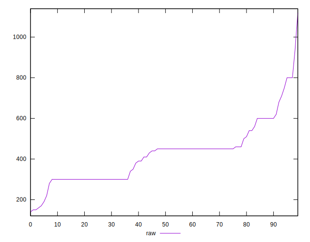

# //unused-css-rules/samples/astro

[→ Parent](../..)


## Raw


```yaml
p90min: 160
p90max: 800
p90range: 640
p90mean: 418.51063829787233
median: 450
p90stdev: 129.88503465469825
mad: 150
stdevBySn: 178.89000000000001
lfitCenter: 419.29752214878516
lfitStdev: 110.13937987722679
mfitCenter: 419.29752214878516
mfitStdev: 138.03924201419161
mfitConfidence: 13.80392420141916
p90skewness: 0.7029633071385091
p90eccentricity: 0.9999999999999997
p90discretization: 3.76
outlandishness: 1.03805744618436

```


## Score


```yaml
p90min: 0.49
p90max: 0.87
p90range: 0.38
p90mean: 0.6869148936170215
median: 0.67
p90stdev: 0.07421972261460347
mad: 0.07999999999999996
stdevBySn: 0.09540799999999997
lfitCenter: 0.6878116562859367
lfitStdev: 0.060839273638313734
mfitCenter: 0.6878116562859367
mfitStdev: 0.07625072183163155
mfitConfidence: 0.007625072183163155
p90skewness: -0.4181944988734044
p90eccentricity: 1.0000000000000002
p90discretization: 3.9166666666666665
outlandishness: 0.9985014136500968

```


## Raw Estimate


## Score Estimate


## P Score


```yaml
p90min: 0.49411764705882355
p90max: 0.8666666666666667
p90range: 0.37254901960784315
p90mean: 0.6860450563204001
median: 0.6666666666666666
p90stdev: 0.0736896549580359
mad: 0.08333333333333326
stdevBySn: 0.09938333333333339
lfitCenter: 0.6865142879627094
lfitStdev: 0.0616798400827887
mfitCenter: 0.6865142879627094
mfitStdev: 0.07730421564090512
mfitConfidence: 0.007730421564090512
p90skewness: -0.3636693991307688
p90eccentricity: 1.0000000000000007
p90discretization: 3.76
outlandishness: 0.9984059384496701

```


## Score Difference


```yaml
p90min: 0
p90max: 1.1102230246251565e-16
p90range: 1.1102230246251565e-16
p90mean: 3.543264972207946e-18
median: 0
p90stdev: 1.9514781802162963e-17
mad: 0
stdevBySn: 0
lfitCenter: 3.3158666172059827e-18
lfitStdev: 8.063403855810743e-18
mfitCenter: 3.3158666172059827e-18
mfitStdev: 1.0105978057540984e-17
mfitConfidence: 1.0105978057540984e-18
p90skewness: 5.326002287485487
p90eccentricity: 1.0000000000000044
p90discretization: 47
outlandishness: 3.5344000000000007

```


## P Score Difference


```yaml
p90min: -0.004444444444444362
p90max: 0.0033333333333334103
p90range: 0.007777777777777772
p90mean: -0.0009372827145042586
median: 0
p90stdev: 0.002263753427366067
mad: 0.0033333333333332993
stdevBySn: 0.003975333333333293
lfitCenter: -0.0009622037816891154
lfitStdev: 0.0021916595370493975
mfitCenter: -0.0009622037816891154
mfitStdev: 0.002746837884730339
mfitConfidence: 0.0002746837884730339
p90skewness: 0.36015308370910243
p90eccentricity: 1.0000000000000009
p90discretization: 6.266666666666667
outlandishness: 0.926049274009629

```

