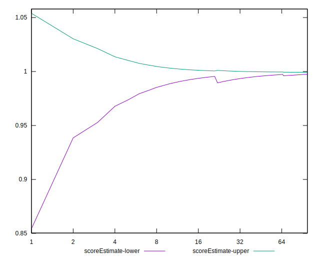

# //unused-css-rules/samples/card

[→ Parent](../..)


## Raw


```yaml
p90min: 0
p90max: 10
p90range: 10
p90mean: 0.10752688172043011
median: 0
p90stdev: 1.0313616179167153
mad: 0
stdevBySn: 0
lfitCenter: 1.8805382831525763
lfitStdev: 4.621524985618518
mfitCenter: 1.8805382831525763
mfitStdev: 5.792222606260884
mfitConfidence: 0.5821402753691458
p90skewness: 9.48740583959686
p90eccentricity: 0.9999999999999971
p90discretization: 46.5
outlandishness: 1342.2231404958675

```


## Score


```yaml
p90min: 0.99
p90max: 1
p90range: 0.010000000000000009
p90mean: 0.9998924731182796
median: 1
p90stdev: 0.0010313616179167169
mad: 0
stdevBySn: 0
lfitCenter: 0.9984561611687471
lfitStdev: 0.003794067792356867
mfitCenter: 0.9984561611687471
mfitStdev: 0.0047551588068791145
mfitConfidence: 0.0004779114418476387
p90skewness: -9.487405839596802
p90eccentricity: 0.999999999999995
p90discretization: 46.5
outlandishness: 0.9937595016797457

```


## Raw Estimate


## Score Estimate


## P Score


```yaml
p90min: 0.9916666666666667
p90max: 1
p90range: 0.008333333333333304
p90mean: 0.9999103942652329
median: 1
p90stdev: 0.0008594680149305935
mad: 0
stdevBySn: 0
lfitCenter: 0.9984328847640396
lfitStdev: 0.0038512708213486995
mfitCenter: 0.9984328847640396
mfitStdev: 0.0048268521718839875
mfitConfidence: 0.00048511689614094656
p90skewness: -9.48740583959726
p90eccentricity: 0.9999999999999968
p90discretization: 46.5
outlandishness: 0.9936231810883369

```


## Score Difference


```yaml
p90min: 0
p90max: 0
p90range: 0
p90mean: 0
median: 0
p90stdev: 0
mad: 0
stdevBySn: 0
lfitCenter: 0
lfitStdev: 0
mfitCenter: 0
mfitStdev: 0
mfitConfidence: 0
p90skewness: .nan
p90eccentricity: .nan
p90discretization: 93
outlandishness: .nan

```


## P Score Difference


```yaml
p90min: 0
p90max: 0
p90range: 0
p90mean: 0
median: 0
p90stdev: 0
mad: 0
stdevBySn: 0
lfitCenter: -0.000023712616990542586
lfitStdev: 0.00007850927941968947
mfitCenter: -0.000023712616990542586
mfitStdev: 0.0000983967899061607
mfitConfidence: 0.000009889249475580744
p90skewness: .nan
p90eccentricity: .nan
p90discretization: 93
outlandishness: .inf

```

