# //unused-css-rules/samples/music

[→ Parent](../..)


## Raw


```yaml
p90min: 0
p90max: 150
p90range: 150
p90mean: 17.5531914893617
median: 0
p90stdev: 47.01032413120309
mad: 0
stdevBySn: 0
lfitCenter: 11.870362680653512
lfitStdev: 27.22690627970419
mfitCenter: 11.870362680653512
mfitStdev: 34.12386659005431
mfitConfidence: 3.4123866590054313
p90skewness: 2.3804777159458013
p90eccentricity: 1.0000000000000024
p90discretization: 23.5
outlandishness: 1.4724719338842978

```

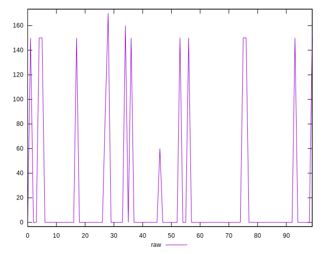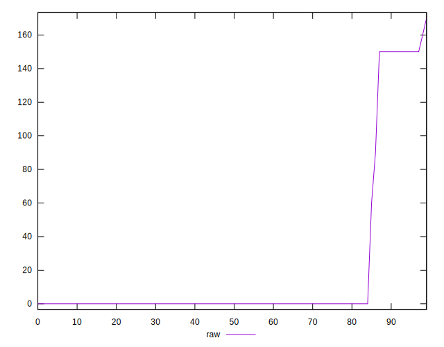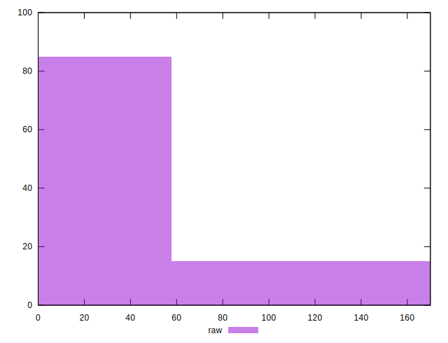
## Score


```yaml
p90min: 0.88
p90max: 1
p90range: 0.12
p90mean: 0.9859574468085106
median: 1
p90stdev: 0.0375958109067557
mad: 0
stdevBySn: 0
lfitCenter: 0.990475157529146
lfitStdev: 0.02184701514685407
mfitCenter: 0.990475157529146
mfitStdev: 0.02738117296925018
mfitConfidence: 0.002738117296925018
p90skewness: -2.3804141861096424
p90eccentricity: 1.000000000000002
p90discretization: 23.5
outlandishness: 0.993807630829643

```

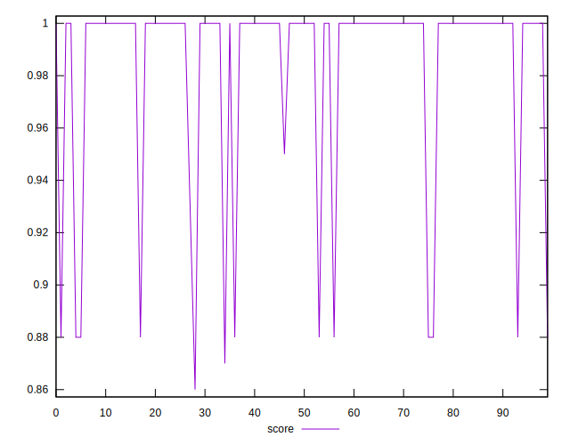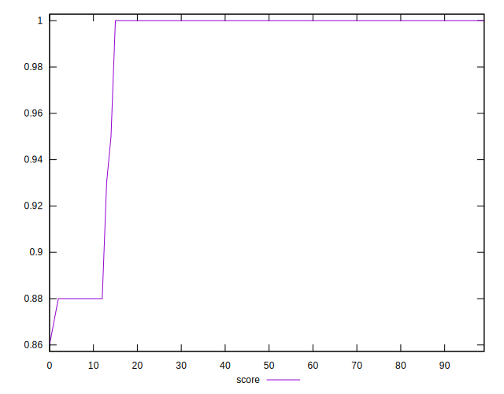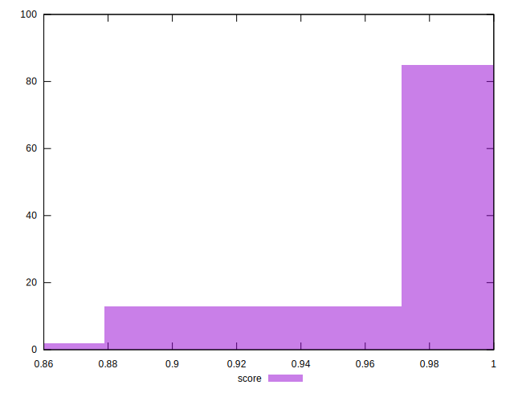
## Raw Estimate

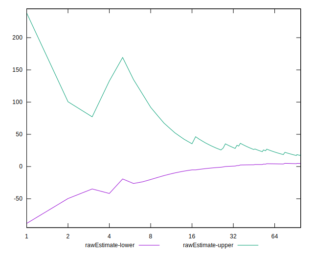
## Score Estimate

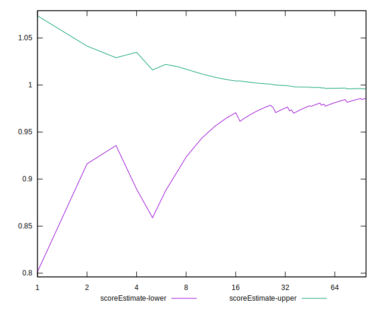
## P Score


```yaml
p90min: 0.875
p90max: 1
p90range: 0.125
p90mean: 0.9853723404255319
median: 1
p90stdev: 0.039175270109335913
mad: 0
stdevBySn: 0
lfitCenter: 0.9901080310994554
lfitStdev: 0.022689088566420122
mfitCenter: 0.9901080310994554
mfitStdev: 0.028436555491711885
mfitConfidence: 0.0028436555491711886
p90skewness: -2.3804777159458004
p90eccentricity: 1.0000000000000022
p90discretization: 23.5
outlandishness: 0.9936726586860591

```

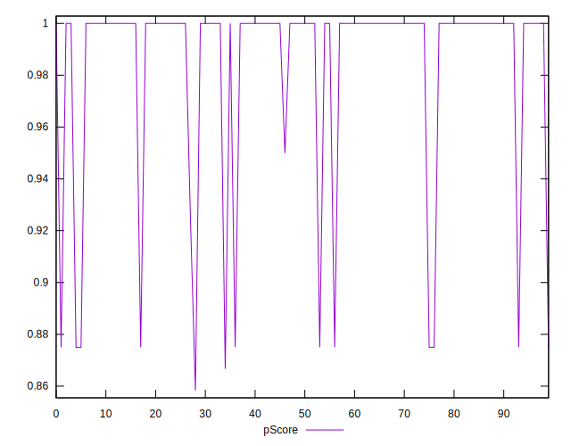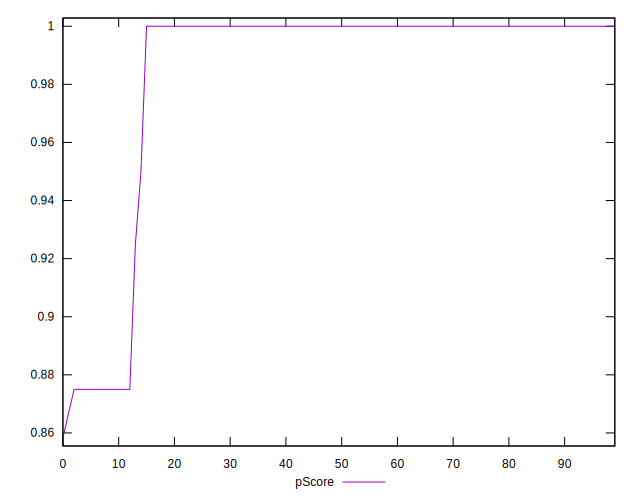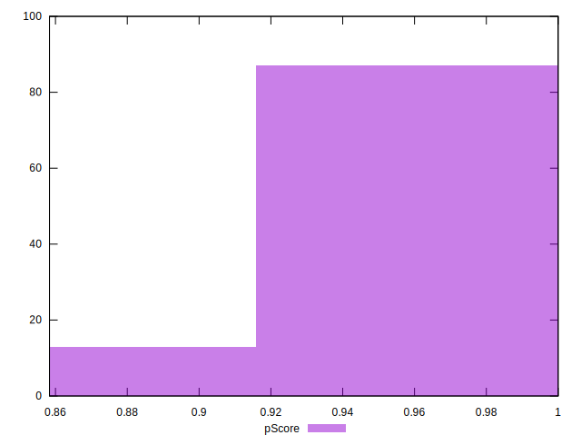
## Score Difference


```yaml
p90min: 0
p90max: 0
p90range: 0
p90mean: 0
median: 0
p90stdev: 0
mad: 0
stdevBySn: 0
lfitCenter: 5.166535369026208e-19
lfitStdev: 1.2890316797319448e-18
mfitCenter: 5.166535369026208e-19
mfitStdev: 1.6155616292812394e-18
mfitConfidence: 1.6155616292812395e-19
p90skewness: .nan
p90eccentricity: .nan
p90discretization: 94
outlandishness: .inf

```

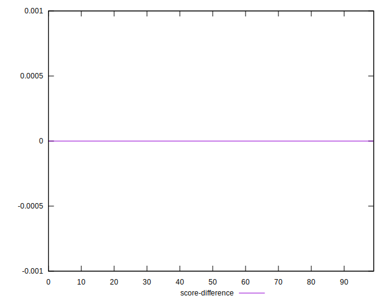
## P Score Difference


```yaml
p90min: -0.0050000000000000044
p90max: 0
p90range: 0.0050000000000000044
p90mean: -0.0005319148936170205
median: 0
p90stdev: 0.0015028099361997936
mad: 0
stdevBySn: 0
lfitCenter: -0.00035771320078201006
lfitStdev: 0.0008266072489795211
mfitCenter: -0.00035771320078201006
mfitStdev: 0.0010359985521959732
mfitConfidence: 0.00010359985521959732
p90skewness: -2.5506642183538872
p90eccentricity: 1.000000000000002
p90discretization: 23.5
outlandishness: 1.4932840000000016

```

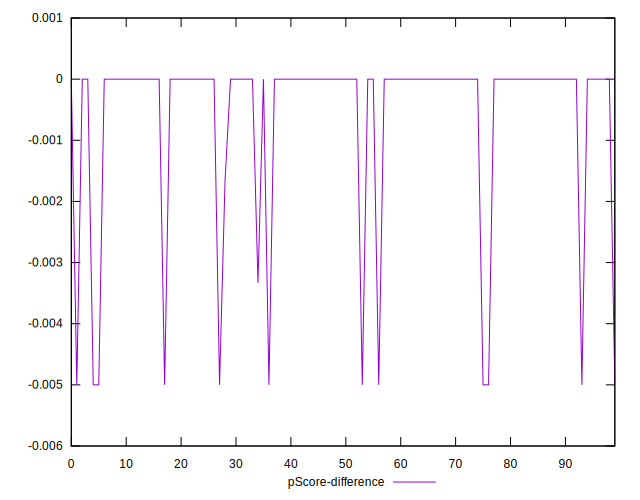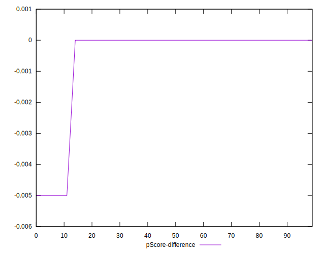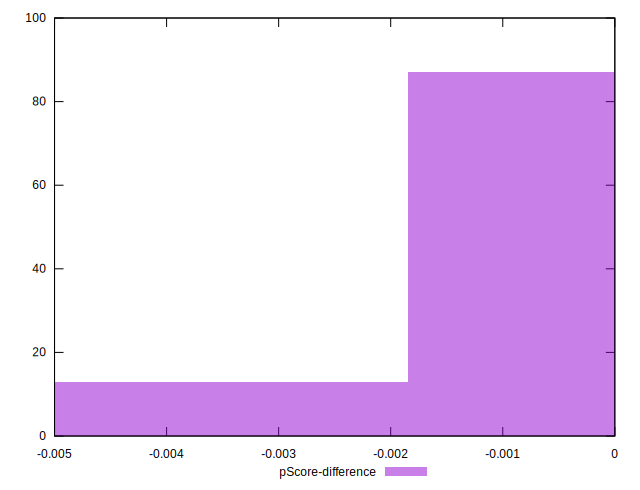