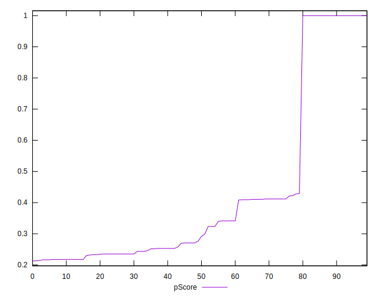

# //unused-javascript/samples/agenda

[→ Parent](../..)


## Raw


```yaml
p90min: 0
p90max: 3160
p90range: 3160
p90mean: 2043.6170212765958
median: 2585
p90stdev: 1125.0379199886572
mad: 565
stdevBySn: 736.4305
lfitCenter: 2152.5111687590193
lfitStdev: 1007.776705135618
mfitCenter: 2152.5111687590193
mfitStdev: 1263.0607930746498
mfitConfidence: 126.30607930746498
p90skewness: -0.8074664720500794
p90eccentricity: 0.9999999999999992
p90discretization: 3.2413793103448274
outlandishness: 0.9737343780029541

```


## Score


```yaml
p90min: 0.22
p90max: 1
p90range: 0.78
p90mean: 0.42244680851063815
median: 0.28500000000000003
p90stdev: 0.27980116865227017
mad: 0.06500000000000003
stdevBySn: 0.08944500000000002
lfitCenter: 0.38513856965086884
lfitStdev: 0.20224002306424063
mfitCenter: 0.38513856965086884
mfitStdev: 0.2534702802924782
mfitConfidence: 0.02534702802924782
p90skewness: 1.442784397022318
p90eccentricity: 0.9999999999999996
p90discretization: 6.266666666666667
outlandishness: 1.0525282157135072

```


## Raw Estimate


## Score Estimate


## P Score


```yaml
p90min: 0.21647058823529414
p90max: 1
p90range: 0.7835294117647058
p90mean: 0.42227784730913637
median: 0.28411764705882353
p90stdev: 0.28007922694137244
mad: 0.06647058823529411
stdevBySn: 0.08663888235294116
lfitCenter: 0.38531893091111813
lfitStdev: 0.2023815923241312
mfitCenter: 0.38531893091111813
mfitStdev: 0.25364771104748685
mfitConfidence: 0.025364771104748683
p90skewness: 1.4378770991311287
p90eccentricity: 1
p90discretization: 3.2413793103448274
outlandishness: 1.0530847367641745

```


## Score Difference


```yaml
p90min: 0
p90max: 5.551115123125783e-17
p90range: 5.551115123125783e-17
p90mean: 7.086529944415892e-18
median: 0
p90stdev: 1.852464652284098e-17
mad: 0
stdevBySn: 0
lfitCenter: 4.7157251520130346e-18
lfitStdev: 1.0816401335736953e-17
mfitCenter: 4.7157251520130346e-18
mfitStdev: 1.3556348722598358e-17
mfitConfidence: 1.3556348722598358e-18
p90skewness: 2.231518495721685
p90eccentricity: 1.0000000000000007
p90discretization: 47
outlandishness: 1.3806250000000002

```


## P Score Difference


```yaml
p90min: -0.004705882352941171
p90max: 0.003529411764705892
p90range: 0.008235294117647063
p90mean: -0.000037546933667086024
median: 0
p90stdev: 0.0022875914210354615
mad: 0.001764705882352946
stdevBySn: 0.0021045882352941567
lfitCenter: 0.000041622126901469885
lfitStdev: 0.0017055347224911434
mfitCenter: 0.000041622126901469885
mfitStdev: 0.002137570781531533
mfitConfidence: 0.00021375707815315332
p90skewness: -0.45975134770464837
p90eccentricity: 1.0000000000000007
p90discretization: 3.9166666666666665
outlandishness: 2.454444444444306

```

