# //unused-javascript/samples/astro

[→ Parent](../..)


## Raw


```yaml
p90min: 2910
p90max: 4320
p90range: 1410
p90mean: 3766.3829787234044
median: 3870
p90stdev: 376.2040275549613
mad: 280
stdevBySn: 459.15100000000007
lfitCenter: 3791.9107033344653
lfitStdev: 344.63594035355527
mfitCenter: 3791.9107033344653
mfitStdev: 431.9370967067658
mfitConfidence: 43.193709670676576
p90skewness: -0.5481592012279023
p90eccentricity: 0.9999999999999996
p90discretization: 1.8076923076923077
outlandishness: 0.9996373619978967

```

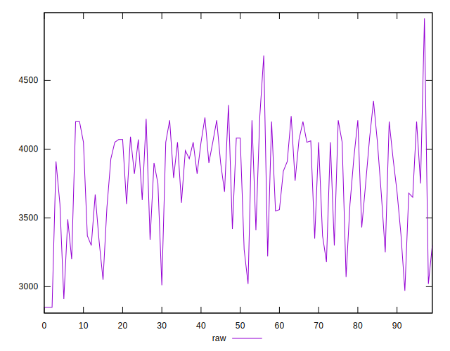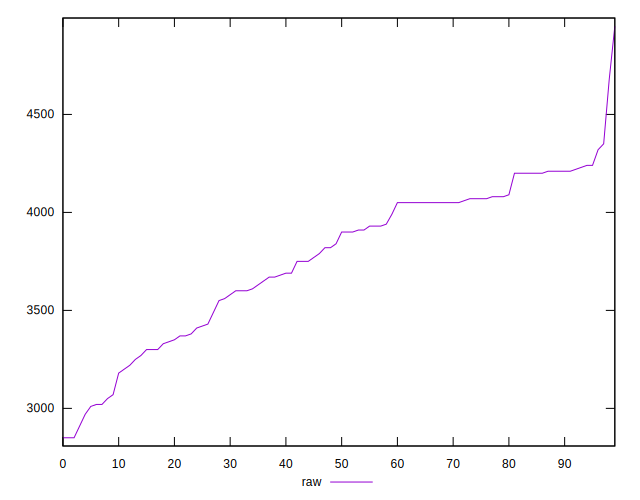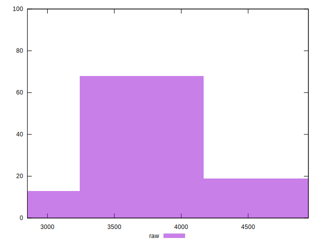
## Score


```yaml
p90min: 0.08
p90max: 0.25
p90range: 0.16999999999999998
p90mean: 0.1446808510638298
median: 0.135
p90stdev: 0.04476183137687576
mad: 0.030000000000000006
stdevBySn: 0.05963000000000001
lfitCenter: 0.14191300232772933
lfitStdev: 0.040567945226555525
mfitCenter: 0.14191300232772933
mfitStdev: 0.05084437932544468
mfitConfidence: 0.005084437932544468
p90skewness: 0.5152242907739415
p90eccentricity: 1.0000000000000002
p90discretization: 5.875
outlandishness: 1.0016477370242214

```

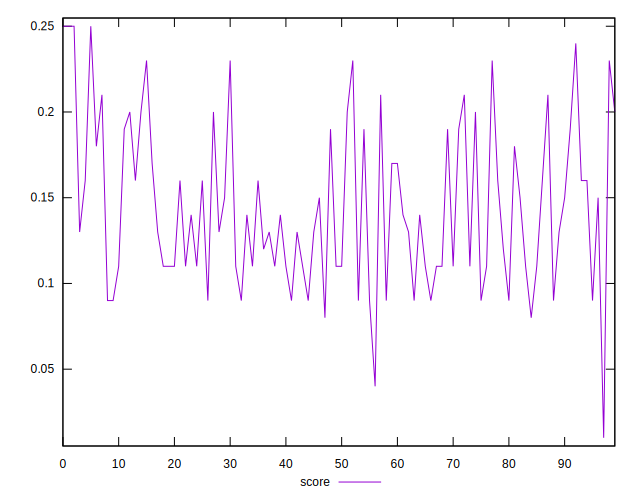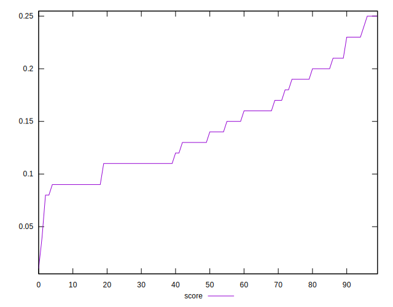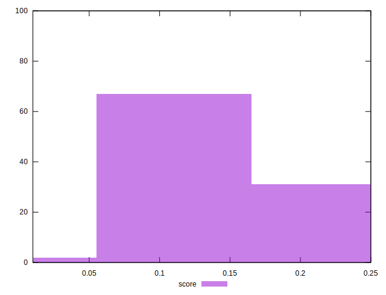
## Raw Estimate

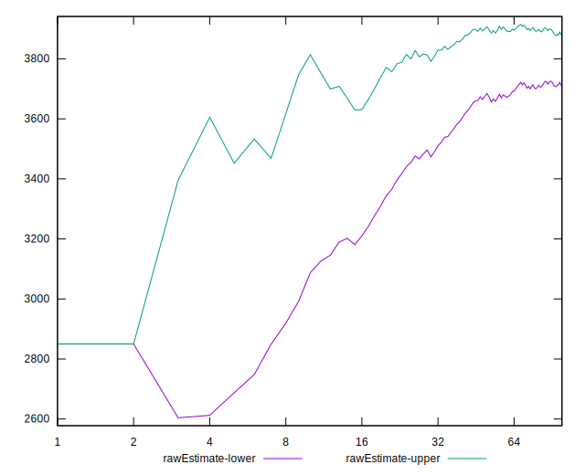
## Score Estimate

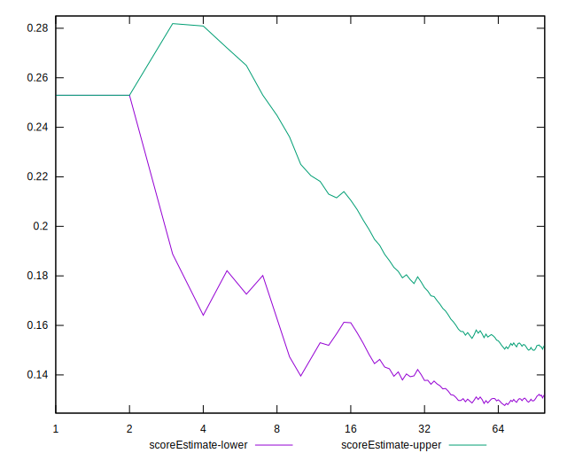
## P Score


```yaml
p90min: 0.08000000000000002
p90max: 0.24588235294117644
p90range: 0.16588235294117643
p90mean: 0.1451314142678347
median: 0.13294117647058823
p90stdev: 0.0442592973594072
mad: 0.032941176470588224
stdevBySn: 0.05401776470588232
lfitCenter: 0.14212815254888647
lfitStdev: 0.040545404747477094
mfitCenter: 0.14212815254888647
mfitStdev: 0.05081612902432539
mfitConfidence: 0.005081612902432539
p90skewness: 0.5481592012279067
p90eccentricity: 0.9999999999999999
p90discretization: 1.8076923076923077
outlandishness: 1.0011075848882007

```

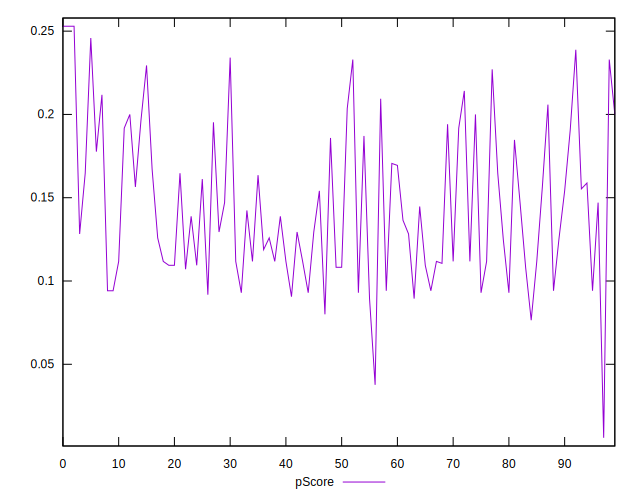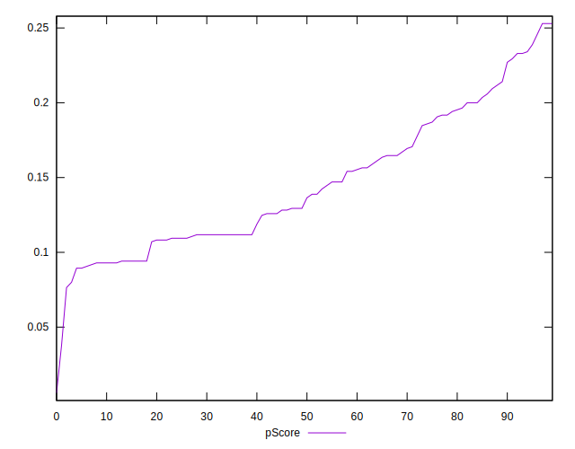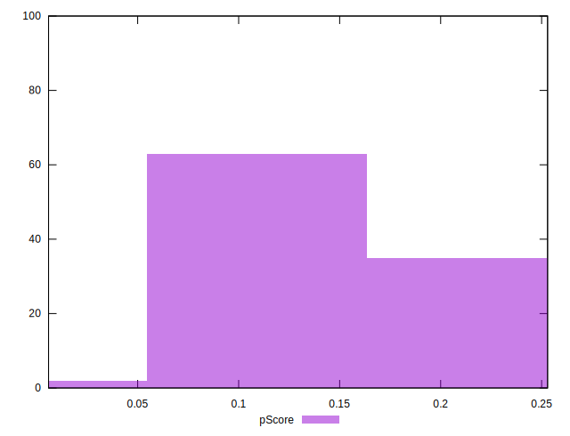
## Score Difference


```yaml
p90min: 0
p90max: 0
p90range: 0
p90mean: 0
median: 0
p90stdev: 0
mad: 0
stdevBySn: 0
lfitCenter: 0
lfitStdev: 0
mfitCenter: 0
mfitStdev: 0
mfitConfidence: 0
p90skewness: .nan
p90eccentricity: .nan
p90discretization: 94
outlandishness: .nan

```


## P Score Difference


```yaml
p90min: -0.004117647058823559
p90max: 0.004705882352941143
p90range: 0.008823529411764702
p90mean: 0.00043178973717145313
median: 0.0005882352941176255
p90stdev: 0.0026642820737814744
mad: 0.0023529411764705924
stdevBySn: 0.0031568823529411687
lfitCenter: 0.0004646490930970314
lfitStdev: 0.0024329431649608583
mfitCenter: 0.0004646490930970314
mfitStdev: 0.0030492420669988377
mfitConfidence: 0.00030492420669988375
p90skewness: -0.12739277163547788
p90eccentricity: 1.0000000000000002
p90discretization: 2.473684210526316
outlandishness: 0.909397185465236

```

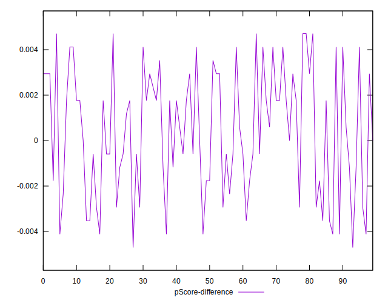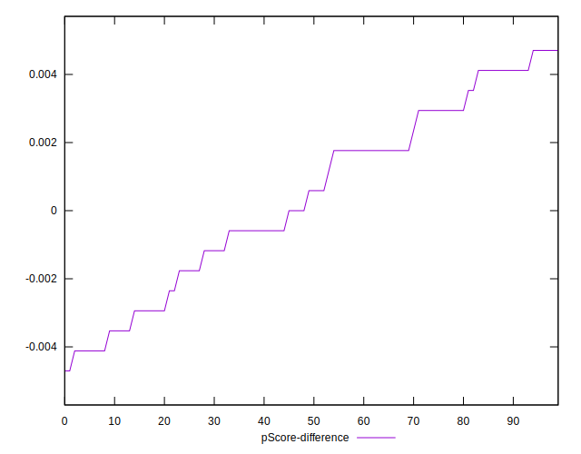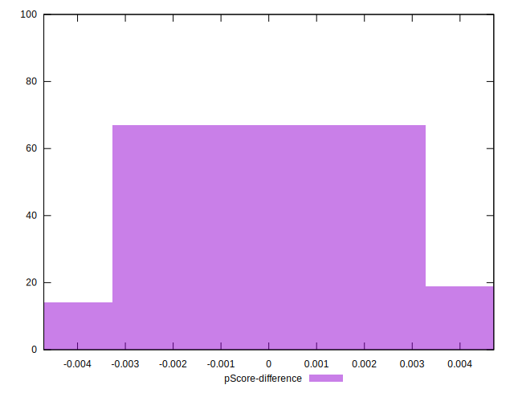