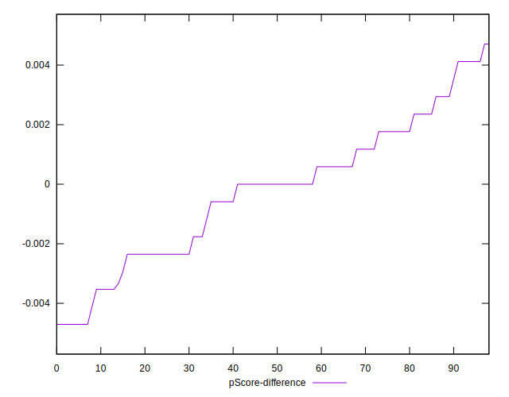

# //unused-javascript/samples/card

[→ Parent](../..)


## Raw


```yaml
p90min: 0
p90max: 3180
p90range: 3180
p90mean: 2265.8064516129034
median: 2770
p90stdev: 1055.5845575973278
mad: 380
stdevBySn: 512.8180000000001
lfitCenter: 2391.748068817112
lfitStdev: 882.8114503473627
mfitCenter: 2391.748068817112
mfitStdev: 1106.4400724176974
mfitConfidence: 111.2014113097927
p90skewness: -1.160158230121736
p90eccentricity: 1.0000000000000002
p90discretization: 2.5135135135135136
outlandishness: 0.9645238854634283

```


## Score


```yaml
p90min: 0.21
p90max: 1
p90range: 0.79
p90mean: 0.3765591397849461
median: 0.26
p90stdev: 0.251500848129808
mad: 0.04000000000000001
stdevBySn: 0.05963000000000002
lfitCenter: 0.3433886791108878
lfitStdev: 0.1668445585505333
mfitCenter: 0.3433886791108878
mfitStdev: 0.20910864417596112
mfitConfidence: 0.021016209489442394
p90skewness: 1.875326542472162
p90eccentricity: 0.9999999999999991
p90discretization: 5.166666666666667
outlandishness: 1.0748855409637037

```


## Raw Estimate


## Score Estimate


## P Score


```yaml
p90min: 0.21411764705882352
p90max: 1
p90range: 0.7858823529411765
p90mean: 0.37621336706725705
median: 0.26235294117647057
p90stdev: 0.2518721211446559
mad: 0.04470588235294115
stdevBySn: 0.06033152941176466
lfitCenter: 0.34319703687522923
lfitStdev: 0.1673511337567401
mfitCenter: 0.34319703687522923
mfitStdev: 0.20974354204415246
mfitConfidence: 0.02108001912607837
p90skewness: 1.8678306916864738
p90eccentricity: 0.9999999999999997
p90discretization: 2.5135135135135136
outlandishness: 1.075496928884294

```


## Score Difference


```yaml
p90min: 0
p90max: 5.551115123125783e-17
p90range: 5.551115123125783e-17
p90mean: 4.775152794086695e-18
median: 0
p90stdev: 1.5565093790210072e-17
mad: 0
stdevBySn: 0
lfitCenter: 3.2990498535261924e-18
lfitStdev: 7.778032464216598e-18
mfitCenter: 3.2990498535261924e-18
mfitStdev: 9.748318057710751e-18
mfitConfidence: 9.79742828317354e-19
p90skewness: 2.9528152070623745
p90eccentricity: 0.9999999999999987
p90discretization: 46.5
outlandishness: 1.6684027777777775

```


## P Score Difference


```yaml
p90min: -0.004705882352941171
p90max: 0.0041176470588235314
p90range: 0.008823529411764702
p90mean: -0.00025722116803710915
median: 0
p90stdev: 0.002304472773252601
mad: 0.0017647058823530015
stdevBySn: 0.0021045882352941896
lfitCenter: -0.0002152733323640168
lfitStdev: 0.0018638879915257077
mfitCenter: -0.0002152733323640168
mfitStdev: 0.0023360371725023826
mfitConfidence: 0.0002347805696216102
p90skewness: -0.08025769673425112
p90eccentricity: 0.9999999999999997
p90discretization: 3.576923076923077
outlandishness: 0.9263942964866483

```

