# //unused-javascript/samples/music

[→ Parent](../..)


## Raw


```yaml
p90min: 2720
p90max: 4580
p90range: 1860
p90mean: 4031.7021276595747
median: 4350
p90stdev: 557.5280515752955
mad: 150
stdevBySn: 196.77900000000002
lfitCenter: 4104.014743021005
lfitStdev: 479.4169739843198
mfitCenter: 4104.014743021005
mfitStdev: 600.8600717681763
mfitConfidence: 60.08600717681763
p90skewness: -1.0827029249777498
p90eccentricity: 1.0000000000000002
p90discretization: 2.292682926829268
outlandishness: 0.9861572692655936

```

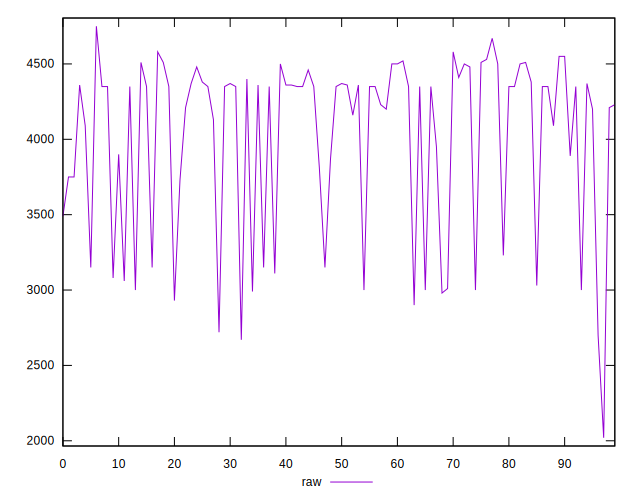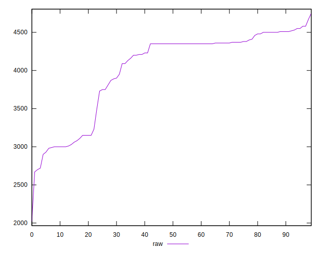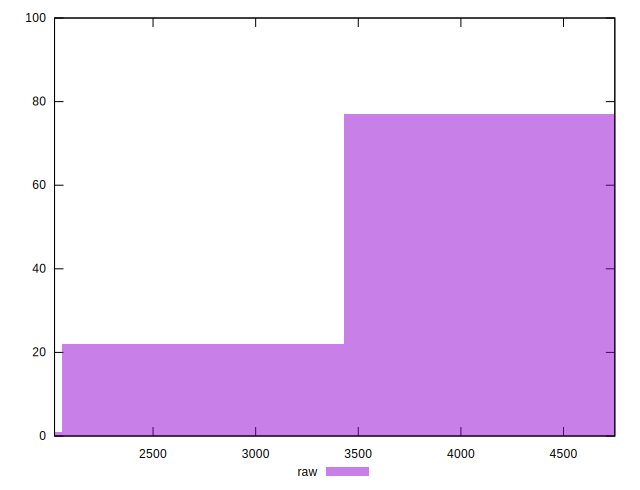
## Score


```yaml
p90min: 0.05
p90max: 0.27
p90range: 0.22000000000000003
p90mean: 0.11531914893617026
median: 0.08
p90stdev: 0.06584479054434665
mad: 0.020000000000000004
stdevBySn: 0.023852000000000005
lfitCenter: 0.10696620035065348
lfitStdev: 0.056172461128617394
mfitCenter: 0.10696620035065348
mfitStdev: 0.0704017397311428
mfitConfidence: 0.00704017397311428
p90skewness: 1.087579132928823
p90eccentricity: 1.0000000000000002
p90discretization: 5.222222222222222
outlandishness: 1.0559268749744692

```

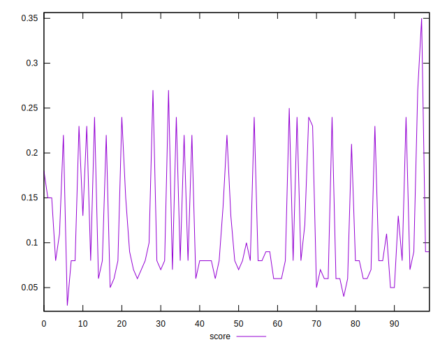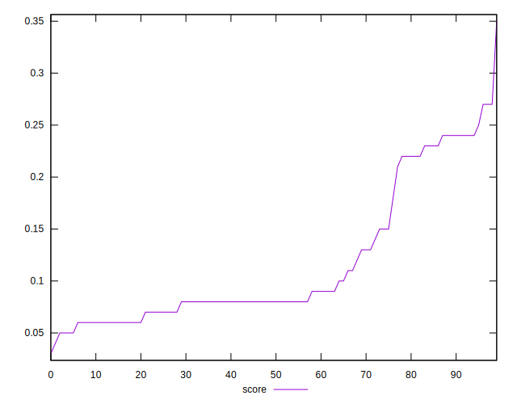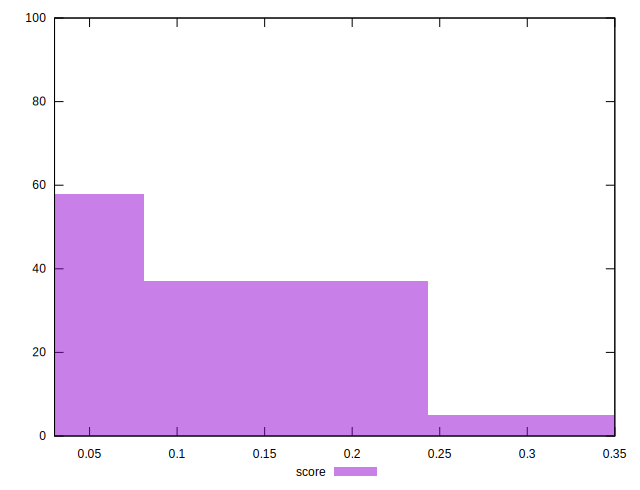
## Raw Estimate

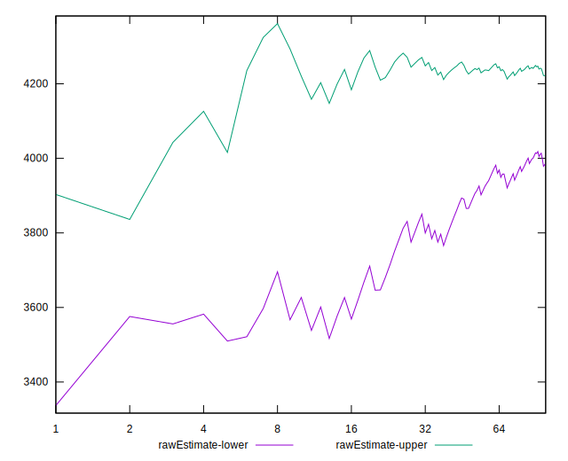
## Score Estimate

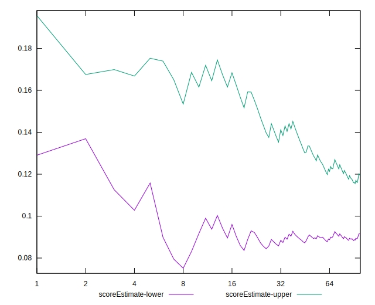
## P Score


```yaml
p90min: 0.04941176470588232
p90max: 0.268235294117647
p90range: 0.2188235294117647
p90mean: 0.1139173967459323
median: 0.07647058823529412
p90stdev: 0.06559153547944652
mad: 0.017647058823529405
stdevBySn: 0.023150470588235328
lfitCenter: 0.1054100302328228
lfitStdev: 0.05640199693933171
mfitCenter: 0.1054100302328228
mfitStdev: 0.07068942020802071
mfitConfidence: 0.007068942020802072
p90skewness: 1.0827029249777513
p90eccentricity: 1.0000000000000002
p90discretization: 2.292682926829268
outlandishness: 1.0586741417092778

```

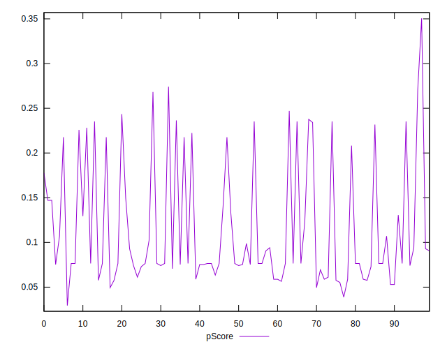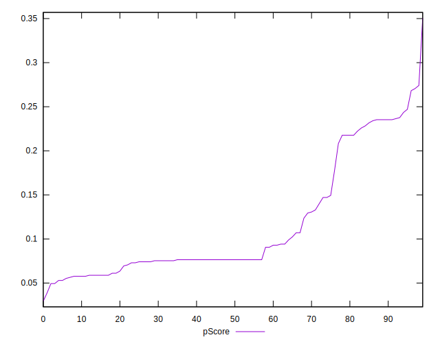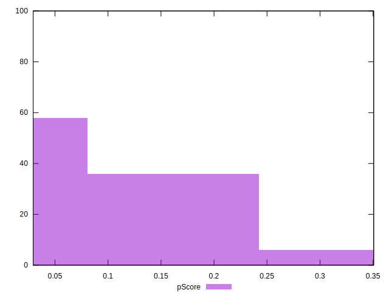
## Score Difference


```yaml
p90min: 0
p90max: 0
p90range: 0
p90mean: 0
median: 0
p90stdev: 0
mad: 0
stdevBySn: 0
lfitCenter: 2.583267684513104e-19
lfitStdev: 6.445158398659724e-19
mfitCenter: 2.583267684513104e-19
mfitStdev: 8.077808146406197e-19
mfitConfidence: 8.077808146406197e-20
p90skewness: .nan
p90eccentricity: .nan
p90discretization: 94
outlandishness: .inf

```

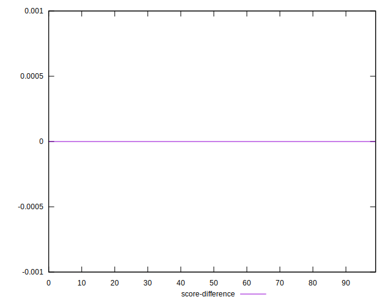
## P Score Difference


```yaml
p90min: -0.0047058823529412125
p90max: 0.004117647058823504
p90range: 0.008823529411764716
p90mean: -0.001351689612015025
median: -0.0023529411764705854
p90stdev: 0.00268719370201559
mad: 0.0011764705882353066
stdevBySn: 0.0028061176470588205
lfitCenter: -0.001572849457361418
lfitStdev: 0.0023289517831834405
mfitCenter: -0.001572849457361418
mfitStdev: 0.0029189081979270792
mfitConfidence: 0.00029189081979270795
p90skewness: 0.7043006270679144
p90eccentricity: 0.9999999999999996
p90discretization: 3.032258064516129
outlandishness: 0.9083148919753097

```

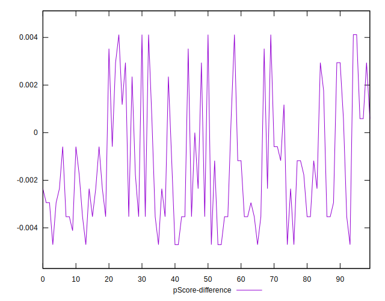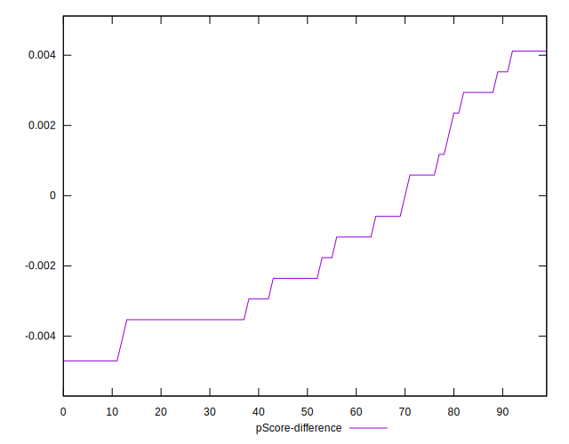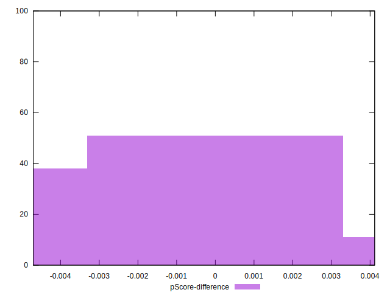