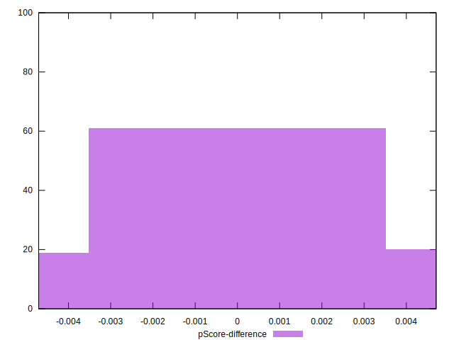

# //uses-http2/samples/agenda

[→ Parent](../..)


## Raw


```yaml
p90min: 790
p90max: 2040
p90range: 1250
p90mean: 1220.7446808510638
median: 1200
p90stdev: 303.44560086525
mad: 220
stdevBySn: 319.0205
lfitCenter: 1209.4267410200284
lfitStdev: 238.70108999806033
mfitCenter: 1209.4267410200284
mfitStdev: 299.16745098822355
mfitConfidence: 29.916745098822354
p90skewness: 0.8852304867536588
p90eccentricity: 0.9999999999999994
p90discretization: 1.6785714285714286
outlandishness: 1.0193519890260632

```


## Score


```yaml
p90min: 0.35
p90max: 0.5
p90range: 0.15000000000000002
p90mean: 0.4445744680851062
median: 0.45
p90stdev: 0.035897753548424866
mad: 0.02999999999999997
stdevBySn: 0.03577799999999997
lfitCenter: 0.4460295518894144
lfitStdev: 0.02919948508752342
mfitCenter: 0.4460295518894144
mfitStdev: 0.03659612749935081
mfitConfidence: 0.003659612749935081
p90skewness: -0.8339511996602642
p90eccentricity: 1.0000000000000002
p90discretization: 6.714285714285714
outlandishness: 0.995620980596645

```


## Raw Estimate


## Score Estimate


## P Score


```yaml
p90min: 0.3482352941176471
p90max: 0.49529411764705883
p90range: 0.14705882352941174
p90mean: 0.44461827284105154
median: 0.4470588235294118
p90stdev: 0.035699482454735296
mad: 0.025882352941176523
stdevBySn: 0.03753182352941178
lfitCenter: 0.4461128232999293
lfitStdev: 0.028279481685939124
mfitCenter: 0.4461128232999293
mfitStdev: 0.03544307422860661
mfitConfidence: 0.003544307422860661
p90skewness: -0.885230486753654
p90eccentricity: 0.9999999999999996
p90discretization: 1.6785714285714286
outlandishness: 0.9953602773804141

```


## Score Difference


```yaml
p90min: 0
p90max: 5.551115123125783e-17
p90range: 5.551115123125783e-17
p90mean: 9.448706592554524e-18
median: 0
p90stdev: 2.0862179280384264e-17
mad: 0
stdevBySn: 0
lfitCenter: 6.345981946454312e-18
lfitStdev: 1.4088542667134215e-17
mfitCenter: 6.345981946454312e-18
mfitStdev: 1.765736971665953e-17
mfitConfidence: 1.765736971665953e-18
p90skewness: 1.7550294029241205
p90eccentricity: 0.9999999999999978
p90discretization: 47
outlandishness: 1.2460140625

```


## P Score Difference


```yaml
p90min: -0.004705882352941171
p90max: 0.004705882352941171
p90range: 0.009411764705882342
p90mean: -0.000015296898901400462
median: 0
p90stdev: 0.002856750004272273
mad: 0.002941176470588225
stdevBySn: 0.0035076470588235173
lfitCenter: -0.000039621715382678774
lfitStdev: 0.002535699605704996
mfitCenter: -0.000039621715382678774
mfitStdev: 0.003178028167013278
mfitConfidence: 0.0003178028167013278
p90skewness: 0.11147857848105241
p90eccentricity: 1.0000000000000002
p90discretization: 3.4814814814814814
outlandishness: 0.8836000000000002

```

