# //uses-http2/samples/astro

[→ Parent](../..)


## Raw


```yaml
p90min: 0
p90max: 940
p90range: 940
p90mean: 263.29787234042556
median: 80
p90stdev: 309.3142322150603
mad: 80
stdevBySn: 95.40800000000002
lfitCenter: 228.93579792605593
lfitStdev: 301.71303166771446
mfitCenter: 228.93579792605593
mfitStdev: 378.1412083819675
mfitConfidence: 37.81412083819675
p90skewness: 0.710090607309078
p90eccentricity: 1.0000000000000002
p90discretization: 2.1363636363636362
outlandishness: 1.116399290913172

```

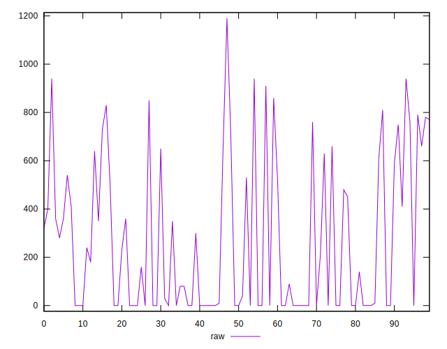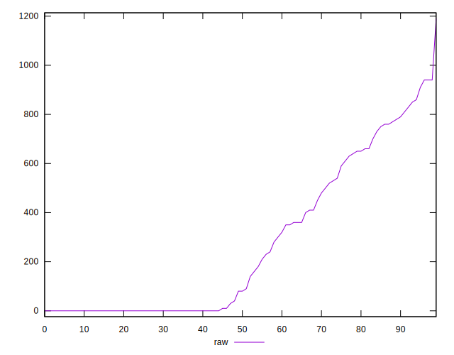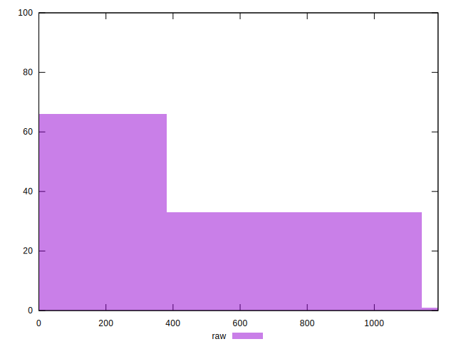
## Score


```yaml
p90min: 0.48
p90max: 1
p90range: 0.52
p90mean: 0.8191489361702126
median: 0.93
p90stdev: 0.2012707479695696
mad: 0.06999999999999995
stdevBySn: 0.08348199999999995
lfitCenter: 0.8396413504583219
lfitStdev: 0.20628550753374053
mfitCenter: 0.8396413504583219
mfitStdev: 0.25854054317549463
mfitConfidence: 0.025854054317549464
p90skewness: -0.49592251241368446
p90eccentricity: 0.9999999999999983
p90discretization: 3.032258064516129
outlandishness: 0.9877107176859509

```

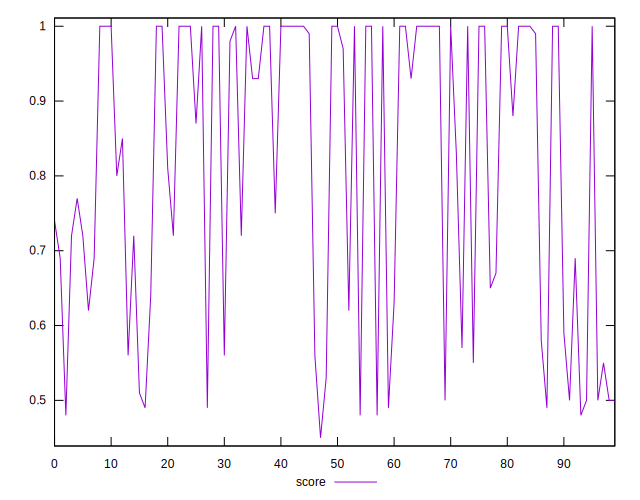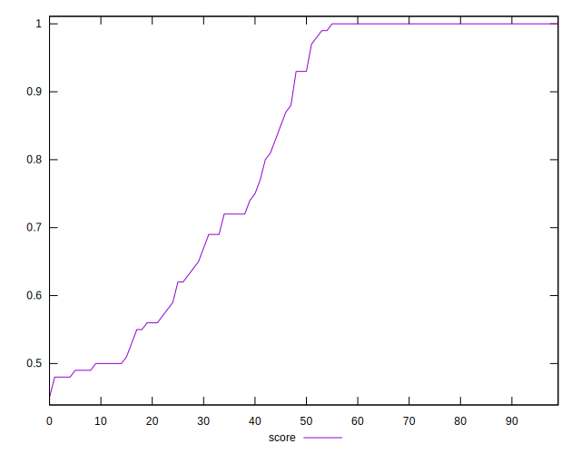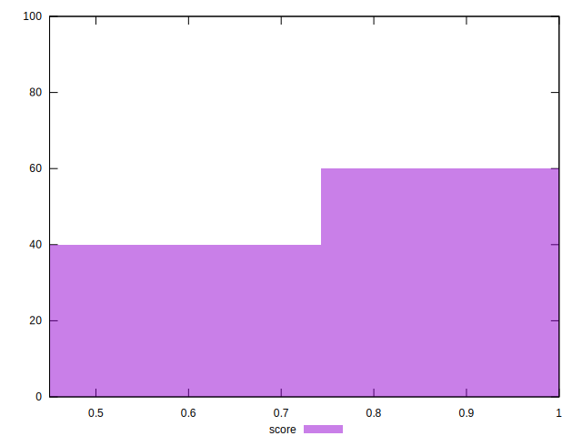
## Raw Estimate

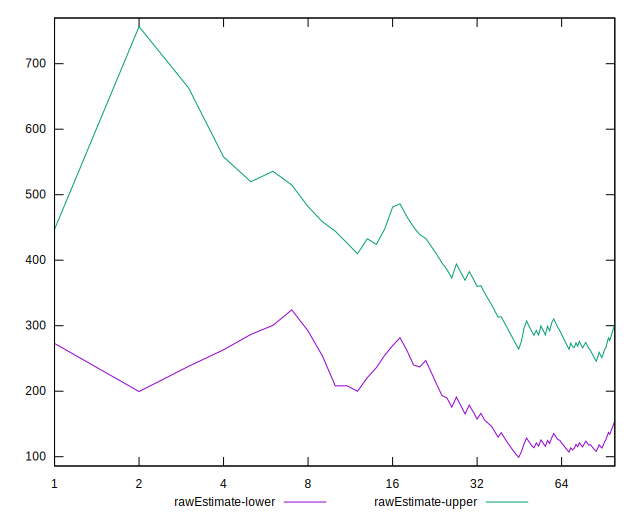
## Score Estimate

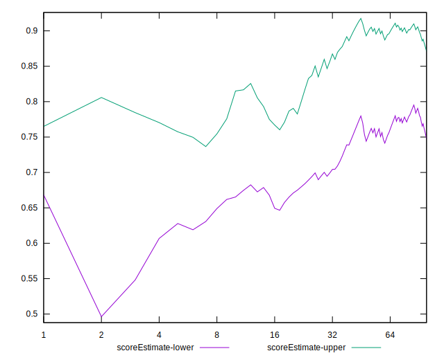
## P Score


```yaml
p90min: 0.4776470588235294
p90max: 1
p90range: 0.5223529411764706
p90mean: 0.8185488805451261
median: 0.9333333333333333
p90stdev: 0.20181537516119316
mad: 0.06666666666666665
stdevBySn: 0.07950666666666666
lfitCenter: 0.8390479265759233
lfitStdev: 0.20701697690093276
mfitCenter: 0.8390479265759233
mfitStdev: 0.25945730407533235
mfitConfidence: 0.025945730407533237
p90skewness: -0.4945137240697461
p90eccentricity: 1.0000000000000002
p90discretization: 2.1363636363636362
outlandishness: 0.9876320401125056

```

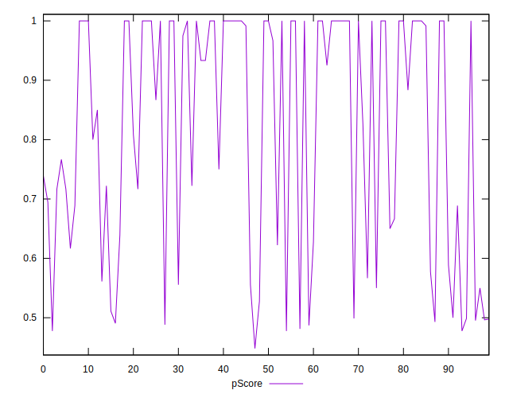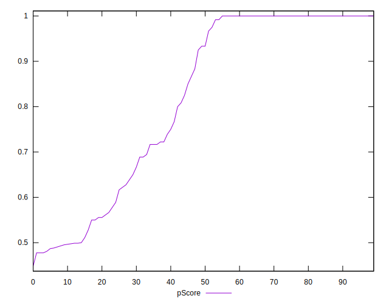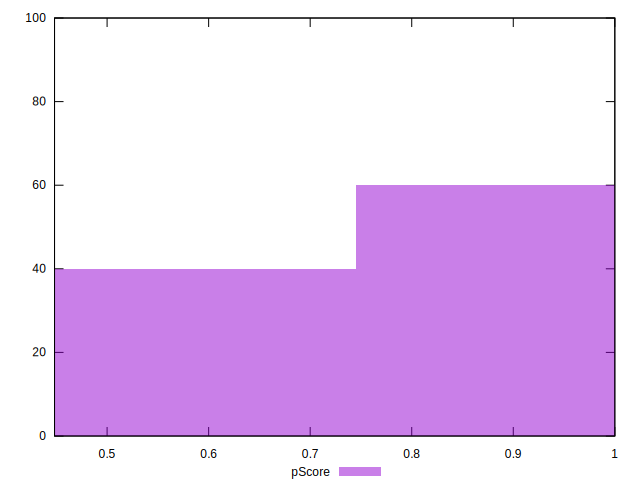
## Score Difference


```yaml
p90min: 0
p90max: 1.1102230246251565e-16
p90range: 1.1102230246251565e-16
p90mean: 2.362176648138631e-18
median: 0
p90stdev: 1.6021061506108986e-17
mad: 0
stdevBySn: 0
lfitCenter: 2.7255820612844e-18
lfitStdev: 6.664295900958648e-18
mfitCenter: 2.7255820612844e-18
mfitStdev: 8.352456276329808e-18
mfitConfidence: 8.352456276329809e-19
p90skewness: 6.634888026970369
p90eccentricity: 0.9999999999999992
p90discretization: 47
outlandishness: 5.522500000000001

```

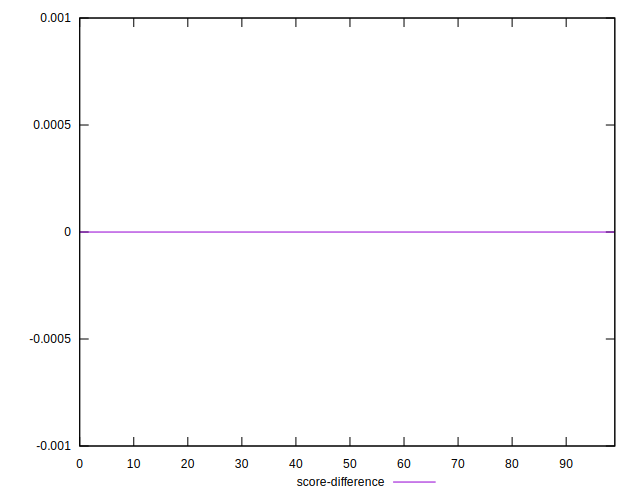
## P Score Difference


```yaml
p90min: -0.004705882352941171
p90max: 0.0033333333333332993
p90range: 0.00803921568627447
p90mean: -0.0006275205117507973
median: 0
p90stdev: 0.0016143696530759527
mad: 0
stdevBySn: 0
lfitCenter: -0.0004705556253919426
lfitStdev: 0.0012887558919339717
mfitCenter: -0.0004705556253919426
mfitStdev: 0.0016152159805347928
mfitConfidence: 0.00016152159805347927
p90skewness: -0.504801577553807
p90eccentricity: 1.000000000000001
p90discretization: 4.2727272727272725
outlandishness: 1.0039484883019643

```

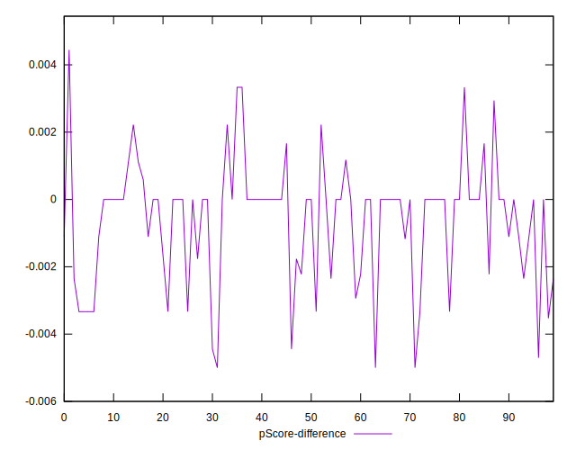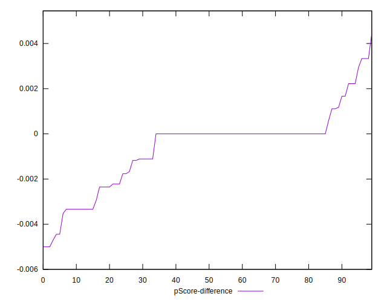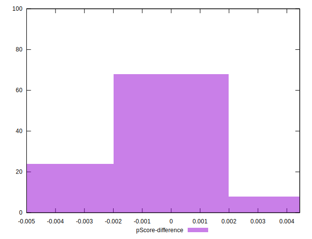