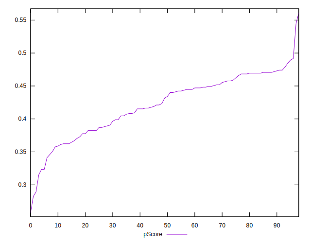

# //uses-http2/samples/card

[→ Parent](../..)


## Raw


```yaml
p90min: 840
p90max: 2320
p90range: 1480
p90mean: 1415.483870967742
median: 1330
p90stdev: 365.2499987239031
mad: 310
stdevBySn: 429.336
lfitCenter: 1402.2796647711791
lfitStdev: 339.99705969990146
mfitCenter: 1402.2796647711791
mfitStdev: 426.1231219963718
mfitConfidence: 42.82698515626682
p90skewness: 0.5090959496462829
p90eccentricity: 1.0000000000000007
p90discretization: 1.603448275862069
outlandishness: 1.0227795784131615

```


## Score


```yaml
p90min: 0.32
p90max: 0.49
p90range: 0.16999999999999998
p90mean: 0.42172043010752697
median: 0.43
p90stdev: 0.043020966529185856
mad: 0.03999999999999998
stdevBySn: 0.05962999999999999
lfitCenter: 0.42368258603220416
lfitStdev: 0.03981886779623006
mfitCenter: 0.42368258603220416
mfitStdev: 0.04990554999112912
mfitConfidence: 0.00501569649323938
p90skewness: -0.5278695357965637
p90eccentricity: 1.0000000000000004
p90discretization: 5.470588235294118
outlandishness: 0.9947221092618079

```


## Raw Estimate


## Score Estimate


## P Score


```yaml
p90min: 0.31529411764705884
p90max: 0.4894117647058824
p90range: 0.17411764705882354
p90mean: 0.4217077798861481
median: 0.43176470588235294
p90stdev: 0.04297058808516509
mad: 0.036470588235294144
stdevBySn: 0.05752541176470587
lfitCenter: 0.423656728977904
lfitStdev: 0.04047424929637297
mfitCenter: 0.423656728977904
mfitStdev: 0.05072694889141979
mfitConfidence: 0.005098250188859826
p90skewness: -0.5090959496462778
p90eccentricity: 1.0000000000000007
p90discretization: 1.603448275862069
outlandishness: 0.9950472514453278

```


## Score Difference


```yaml
p90min: 0
p90max: 5.551115123125783e-17
p90range: 5.551115123125783e-17
p90mean: 1.1937881985216737e-17
median: 0
p90stdev: 2.2807291508842336e-17
mad: 0
stdevBySn: 0
lfitCenter: 8.287993098353483e-18
lfitStdev: 1.7673155926270326e-17
mfitCenter: 8.287993098353483e-18
mfitStdev: 2.2150016195664102e-17
mfitConfidence: 2.2261603885246412e-18
p90skewness: 1.3870733948640683
p90eccentricity: 1.0000000000000022
p90discretization: 46.5
outlandishness: 1.16705463728191

```


## P Score Difference


```yaml
p90min: -0.004705882352941171
p90max: 0.004705882352941171
p90range: 0.009411764705882342
p90mean: 0.00005973715651135223
median: -0.0005882352941176117
p90stdev: 0.002492460042355684
mad: 0.0023529411764705577
stdevBySn: 0.0028061176470588534
lfitCenter: 0.000018286648178660133
lfitStdev: 0.0022182365224433665
mfitCenter: 0.000018286648178660133
mfitStdev: 0.0027801471962853454
mfitConfidence: 0.0002794153064253647
p90skewness: 0.11806309334638578
p90eccentricity: 1
p90discretization: 3.1
outlandishness: 0.8824609733700819

```

