# //uses-http2/samples/music

[→ Parent](../..)


## Raw


```yaml
p90min: 360
p90max: 1700
p90range: 1340
p90mean: 941.8085106382979
median: 955
p90stdev: 328.3970183020801
mad: 255
stdevBySn: 378.6505
lfitCenter: 943.9515600813835
lfitStdev: 279.6987752662249
mfitCenter: 943.9515600813835
mfitStdev: 350.5504295837294
mfitConfidence: 35.05504295837294
p90skewness: 0.28990620428721037
p90eccentricity: 1
p90discretization: 1.46875
outlandishness: 1.0355435998156004

```

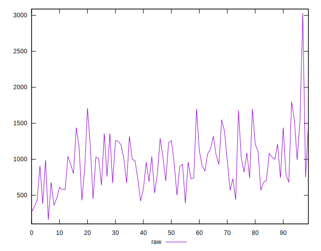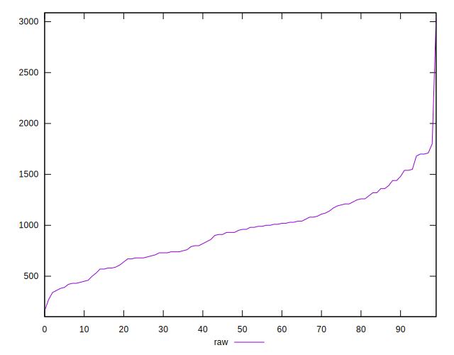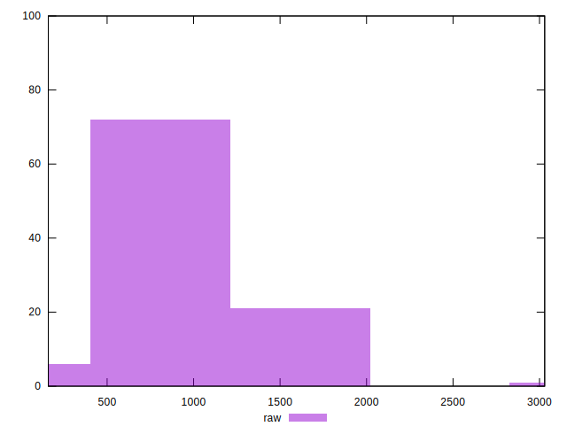
## Score


```yaml
p90min: 0.39
p90max: 0.72
p90range: 0.32999999999999996
p90mean: 0.5019148936170212
median: 0.48
p90stdev: 0.07845959246975859
mad: 0.03999999999999998
stdevBySn: 0.05962999999999999
lfitCenter: 0.4957320568638495
lfitStdev: 0.06096343613658819
mfitCenter: 0.4957320568638495
mfitStdev: 0.07640633644619992
mfitConfidence: 0.007640633644619992
p90skewness: 1.1737864541081426
p90eccentricity: 0.9999999999999999
p90discretization: 3.4814814814814814
outlandishness: 1.0147380945612319

```

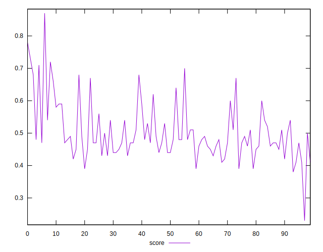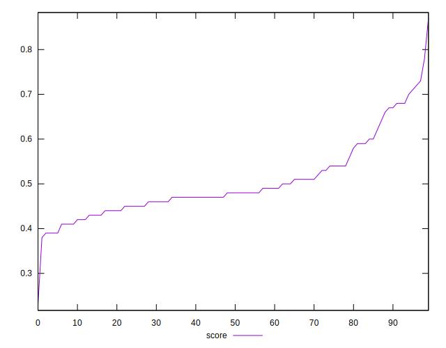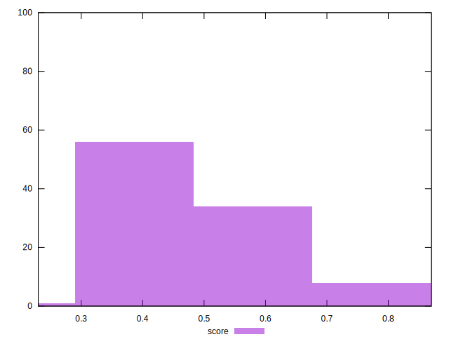
## Raw Estimate

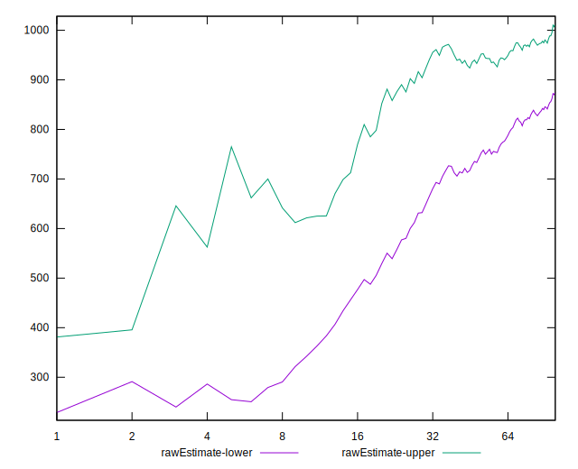
## Score Estimate

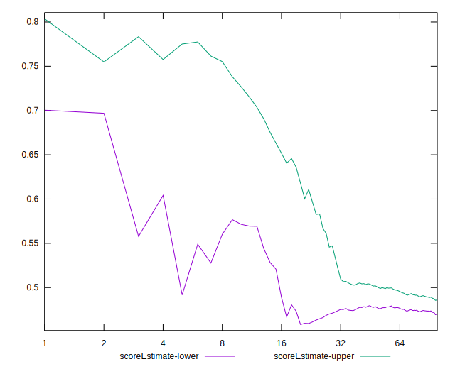
## P Score


```yaml
p90min: 0.38823529411764707
p90max: 0.7166666666666667
p90range: 0.3284313725490196
p90mean: 0.5015658461966347
median: 0.4758823529411764
p90stdev: 0.07855278920408239
mad: 0.03522875816993465
stdevBySn: 0.05627824836601307
lfitCenter: 0.4952851951427343
lfitStdev: 0.06090425645543248
mfitCenter: 0.4952851951427343
mfitStdev: 0.07633216571509102
mfitConfidence: 0.007633216571509102
p90skewness: 1.1559767906831189
p90eccentricity: 1.0000000000000002
p90discretization: 1.46875
outlandishness: 1.0142195580312032

```

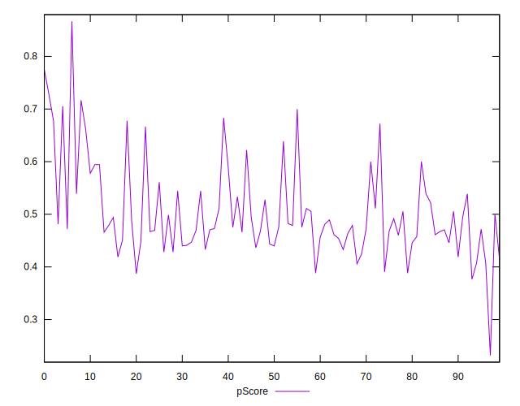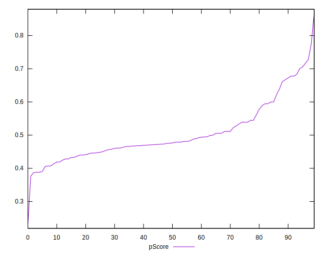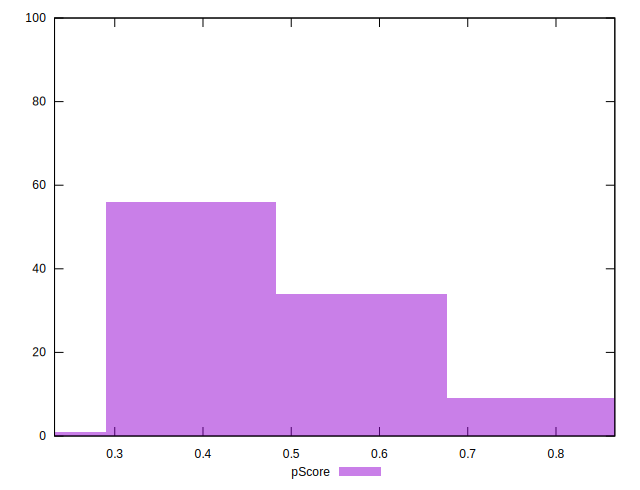
## Score Difference


```yaml
p90min: 0
p90max: 5.551115123125783e-17
p90range: 5.551115123125783e-17
p90mean: 9.448706592554524e-18
median: 0
p90stdev: 2.0862179280384267e-17
mad: 0
stdevBySn: 0
lfitCenter: 6.604308714905622e-18
lfitStdev: 1.4662046930162044e-17
mfitCenter: 6.604308714905622e-18
mfitStdev: 1.8376150718046284e-17
mfitConfidence: 1.8376150718046284e-18
p90skewness: 1.7550294029241187
p90eccentricity: 0.9999999999999972
p90discretization: 47
outlandishness: 1.3806250000000002

```

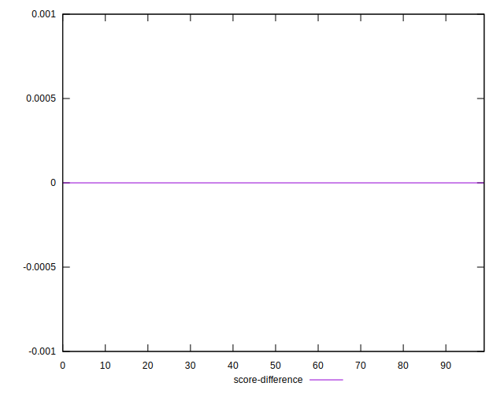
## P Score Difference


```yaml
p90min: -0.004705882352941171
p90max: 0.004444444444444473
p90range: 0.009150326797385644
p90mean: -0.0005027117229870679
median: -0.0011111111111111183
p90stdev: 0.0025469689735077385
mad: 0.002222222222222181
stdevBySn: 0.0028061176470588534
lfitCenter: -0.0005568328633368957
lfitStdev: 0.0022383291105664677
mfitCenter: -0.0005568328633368957
mfitStdev: 0.0028053295210606253
mfitConfidence: 0.0002805329521060625
p90skewness: 0.2194397106082889
p90eccentricity: 1.0000000000000009
p90discretization: 2.6857142857142855
outlandishness: 0.9144173690382567

```

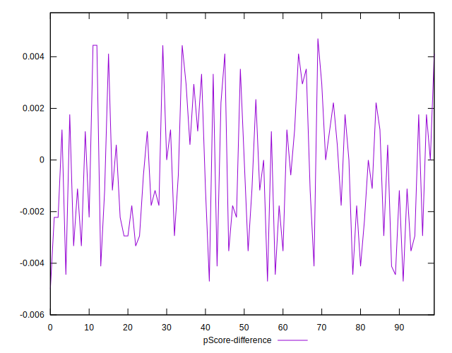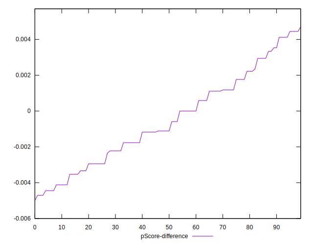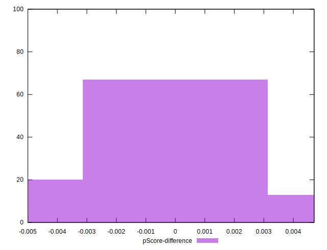