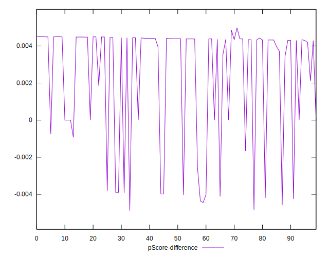

# //uses-long-cache-ttl/samples/agenda

[→ Parent](../..)


## Raw


```yaml
p90min: 0
p90max: 726908.8672222222
p90range: 726908.8672222222
p90mean: 551794.0944200649
median: 725769.5933680555
p90stdev: 262000.34583542502
mad: 931.3311111110961
stdevBySn: 1198.6343903611044
lfitCenter: 592362.1230029529
lfitStdev: 226311.351174183
mfitCenter: 592362.1230029529
mfitStdev: 283639.21614698623
mfitConfidence: 28363.921614698622
p90skewness: -1.247628328955895
p90eccentricity: 1
p90discretization: 1.0804597701149425
outlandishness: 0.9594665589459078

```


## Score


```yaml
p90min: 0.07
p90max: 1
p90range: 0.9299999999999999
p90mean: 0.22925531914893632
median: 0.07
p90stdev: 0.31150027957264254
mad: 0
stdevBySn: 0
lfitCenter: 0.18181695008613546
lfitStdev: 0.2123856701117288
mfitCenter: 0.18181695008613546
mfitStdev: 0.2661859631821034
mfitConfidence: 0.02661859631821034
p90skewness: 1.7562086823700205
p90eccentricity: 0.9999999999999996
p90discretization: 10.444444444444445
outlandishness: 1.1664400931519532

```


## Raw Estimate


## Score Estimate


## P Score


```yaml
p90min: 0.0743011625339054
p90max: 1
p90range: 0.9256988374660946
p90mean: 0.23159145057017816
median: 0.07448722985554418
p90stdev: 0.30996042928614304
mad: 0.00015215412975158604
stdevBySn: 0.00019582376452865634
lfitCenter: 0.18455269111365735
lfitStdev: 0.21135445428059832
mfitCenter: 0.18455269111365735
mfitStdev: 0.26489352580102354
mfitConfidence: 0.026489352580102356
p90skewness: 1.762134232911184
p90eccentricity: 0.9999999999999996
p90discretization: 1.0804597701149425
outlandishness: 1.1645909703503632

```


## Score Difference


```yaml
p90min: 0
p90max: 0
p90range: 0
p90mean: 0
median: 0
p90stdev: 0
mad: 0
stdevBySn: 0
lfitCenter: 0
lfitStdev: 0
mfitCenter: 0
mfitStdev: 0
mfitConfidence: 0
p90skewness: .nan
p90eccentricity: .nan
p90discretization: 94
outlandishness: .nan

```


## P Score Difference


```yaml
p90min: -0.004447183102882946
p90max: 0.004513488084989026
p90range: 0.008960671187871971
p90mean: 0.0024726655866418824
median: 0.004341054819334916
p90stdev: 0.003117551089492403
mad: 0.0001461750362092562
stdevBySn: 0.00019457801859763848
lfitCenter: 0.0029756335600186327
lfitStdev: 0.0026495596214766355
mfitCenter: 0.0029756335600186327
mfitStdev: 0.003320730534598433
mfitConfidence: 0.00033207305345984327
p90skewness: -1.2673593802345893
p90eccentricity: 1
p90discretization: 1.119047619047619
outlandishness: 0.883922920103837

```

