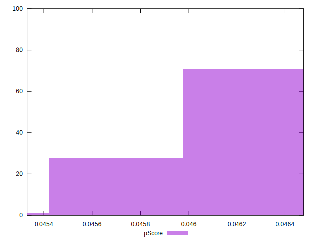

# //uses-long-cache-ttl/samples/astro

[→ Parent](../..)


## Raw


```yaml
p90min: 961243.4292083333
p90max: 968962.2471805557
p90range: 7718.8179722224595
p90mean: 964373.8409916961
median: 962738.5575625001
p90stdev: 2678.6551900468858
mad: 1365.626430555596
stdevBySn: 1779.6259904174506
lfitCenter: 964198.1709887064
lfitStdev: 2908.2880756070367
mfitCenter: 964198.1709887064
mfitStdev: 3644.998564212142
mfitConfidence: 364.4998564212142
p90skewness: 0.3660937178821755
p90eccentricity: 1
p90discretization: 1
outlandishness: 1.000216868428414

```


## Score


```yaml
p90min: 0.05
p90max: 0.05
p90range: 0
p90mean: 0.049999999999999906
median: 0.05
p90stdev: 9.71445146547012e-17
mad: 0
stdevBySn: 0
lfitCenter: 0.049999999999999906
lfitStdev: 0
mfitCenter: 0.049999999999999906
mfitStdev: 0
mfitConfidence: 0
p90skewness: 1
p90eccentricity: 1
p90discretization: 94
outlandishness: 1

```


## Raw Estimate


## Score Estimate


## P Score


```yaml
p90min: 0.04581615291244778
p90max: 0.04646840977001032
p90range: 0.0006522568575625387
p90mean: 0.04620312154292327
median: 0.046341080811352936
p90stdev: 0.0002264861925303336
mad: 0.00011628130564028671
stdevBySn: 0.00015151761976723495
lfitCenter: 0.0462179279999151
lfitStdev: 0.0002459001134563005
mfitCenter: 0.0462179279999151
mfitStdev: 0.0003081900888723809
mfitConfidence: 0.00003081900888723809
p90skewness: -0.3637302988411068
p90eccentricity: 0.9999999999999996
p90discretization: 1
outlandishness: 0.9996233663082681

```


## Score Difference


```yaml
p90min: 0
p90max: 0
p90range: 0
p90mean: 0
median: 0
p90stdev: 0
mad: 0
stdevBySn: 0
lfitCenter: 0
lfitStdev: 0
mfitCenter: 0
mfitStdev: 0
mfitConfidence: 0
p90skewness: .nan
p90eccentricity: .nan
p90discretization: 94
outlandishness: .nan

```


## P Score Difference


```yaml
p90min: -0.00418384708755222
p90max: -0.003531590229989681
p90range: 0.0006522568575625387
p90mean: -0.003796878457076738
median: -0.0036589191886470668
p90stdev: 0.00022648619253033355
mad: 0.00011628130564028671
stdevBySn: 0.00015151761976723495
lfitCenter: -0.003782072000084898
lfitStdev: 0.0002459001134562994
mfitCenter: -0.003782072000084898
mfitStdev: 0.00030819008887237947
mfitConfidence: 0.00003081900888723795
p90skewness: -0.36373029884086
p90eccentricity: 1.0000000000000002
p90discretization: 1
outlandishness: 1.0045888309547804

```

