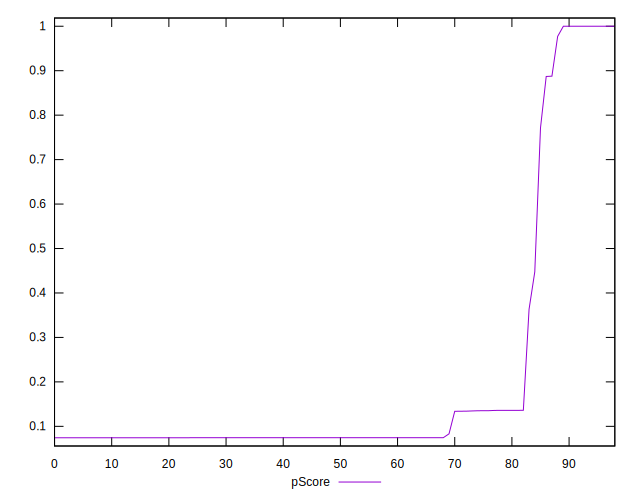

# //uses-long-cache-ttl/samples/card

[→ Parent](../..)


## Raw


```yaml
p90min: 0
p90max: 726895.9927777777
p90range: 726895.9927777777
p90mean: 595558.8433688022
median: 725972.9801388888
p90stdev: 241002.89176092268
mad: 718.3595138889505
stdevBySn: 1092.8293201250501
lfitCenter: 633679.9714636726
lfitStdev: 182375.02501572788
mfitCenter: 633679.9714636726
mfitStdev: 228573.19737547982
mfitConfidence: 22972.47069170649
p90skewness: -1.701115006983264
p90eccentricity: 0.9999999999999999
p90discretization: 1.0689655172413792
outlandishness: 0.9533234455979853

```


## Score


```yaml
p90min: 0.07
p90max: 1
p90range: 0.9299999999999999
p90mean: 0.19161290322580657
median: 0.07
p90stdev: 0.28641007642280586
mad: 0
stdevBySn: 0
lfitCenter: 0.152855720538938
lfitStdev: 0.16899930579592326
mfitCenter: 0.152855720538938
mfitStdev: 0.21180921936366742
mfitConfidence: 0.02128762750810195
p90skewness: 2.271160671504907
p90eccentricity: 0.9999999999999999
p90discretization: 9.3
outlandishness: 1.229019161239282

```


## Raw Estimate


## Score Estimate


## P Score


```yaml
p90min: 0.07430326158802758
p90max: 1
p90range: 0.9256967384119724
p90mean: 0.1944713108167972
median: 0.07445396504515367
p90stdev: 0.2849220857397259
mad: 0.00011732566030120406
stdevBySn: 0.00017853971005211988
lfitCenter: 0.15615300440869098
lfitStdev: 0.1681400076379556
mfitCenter: 0.15615300440869098
mfitStdev: 0.2107322488330337
mfitConfidence: 0.021179387897181285
p90skewness: 2.2771137814813134
p90eccentricity: 1.0000000000000002
p90discretization: 1.0689655172413792
outlandishness: 1.224990943914289

```


## Score Difference


```yaml
p90min: 0
p90max: 0
p90range: 0
p90mean: 0
median: 0
p90stdev: 0
mad: 0
stdevBySn: 0
lfitCenter: 0
lfitStdev: 0
mfitCenter: 0
mfitStdev: 0
mfitConfidence: 0
p90skewness: .nan
p90eccentricity: .nan
p90discretization: 93
outlandishness: .nan

```


## P Score Difference


```yaml
p90min: -0.004175071221945381
p90max: 0.004512619263435325
p90range: 0.008687690485380706
p90mean: 0.003006074702845526
median: 0.00433852448415889
p90stdev: 0.0026507923401362325
mad: 0.00011544056099477285
stdevBySn: 0.00017804294090595905
lfitCenter: 0.0033986010056473804
lfitStdev: 0.001999633260819692
mfitCenter: 0.0033986010056473804
mfitStdev: 0.0025061686377534265
mfitConfidence: 0.00025187942523588594
p90skewness: -1.6927581564894152
p90eccentricity: 0.9999999999999999
p90discretization: 1.1204819277108433
outlandishness: 0.8770768737040598

```

