# //uses-long-cache-ttl/samples/music

[→ Parent](../..)


## Raw


```yaml
p90min: 725709.4943055555
p90max: 726944.6002777778
p90range: 1235.1059722222853
p90mean: 726297.7424479167
median: 726366.2397222222
p90stdev: 396.04030998193656
mad: 380.3722916666884
stdevBySn: 500.64805532633045
lfitCenter: 726301.9320952352
lfitStdev: 359.86291848312544
mfitCenter: 726301.9320952352
mfitStdev: 451.02128368435336
mfitConfidence: 45.10212836843534
p90skewness: -0.009915827843020806
p90eccentricity: 0.9999999999999999
p90discretization: 1
outlandishness: 1.000008103818168

```

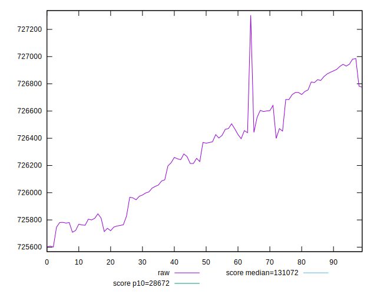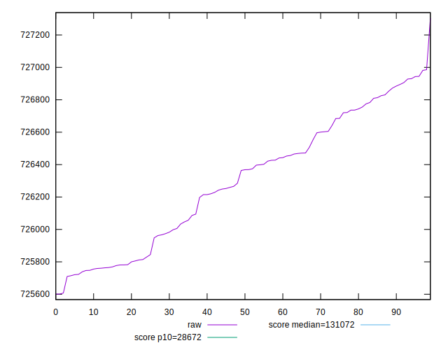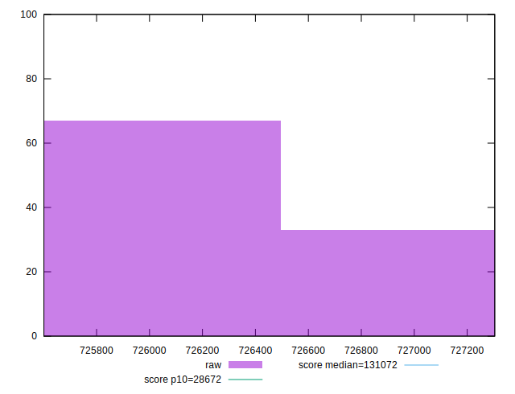
## Score


```yaml
p90min: 0.07
p90max: 0.07
p90range: 0
p90mean: 0.07000000000000008
median: 0.07
p90stdev: 6.938893903907228e-17
mad: 0
stdevBySn: 0
lfitCenter: 0.07000000000000009
lfitStdev: 0
mfitCenter: 0.07000000000000009
mfitStdev: 0
mfitConfidence: 0
p90skewness: -1
p90eccentricity: 1
p90discretization: 94
outlandishness: 1.0000000000000004

```


## Raw Estimate

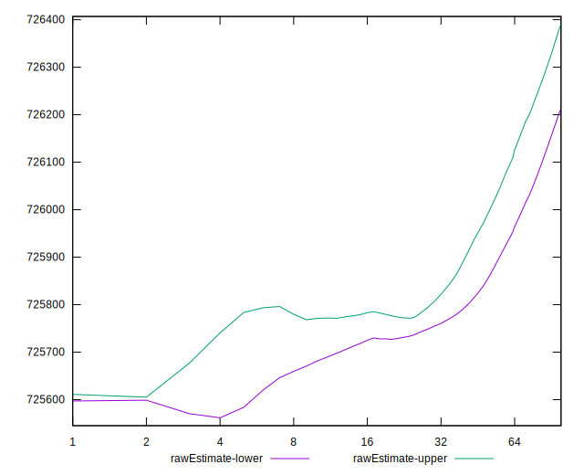
## Score Estimate

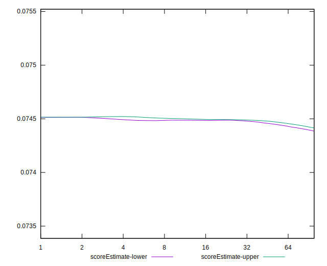
## P Score


```yaml
p90min: 0.07429533703550051
p90max: 0.07449706327005207
p90range: 0.00020172623455155803
p90mean: 0.07440093066487044
median: 0.07438970427536562
p90stdev: 0.0000646902700360169
mad: 0.00006211815472592641
stdevBySn: 0.00008175150975290224
lfitCenter: 0.07440023810318667
lfitStdev: 0.00005878229032703828
mfitCenter: 0.07440023810318667
mfitStdev: 0.00007367267556479384
mfitConfidence: 0.000007367267556479384
p90skewness: 0.01117424506088167
p90eccentricity: 1.0000000000000002
p90discretization: 1
outlandishness: 0.9999872431212147

```

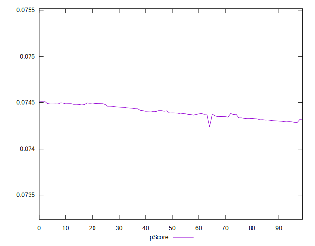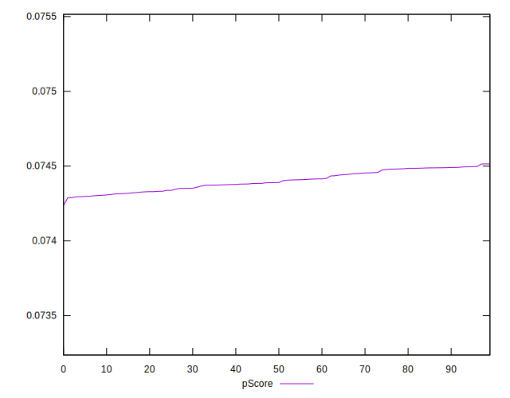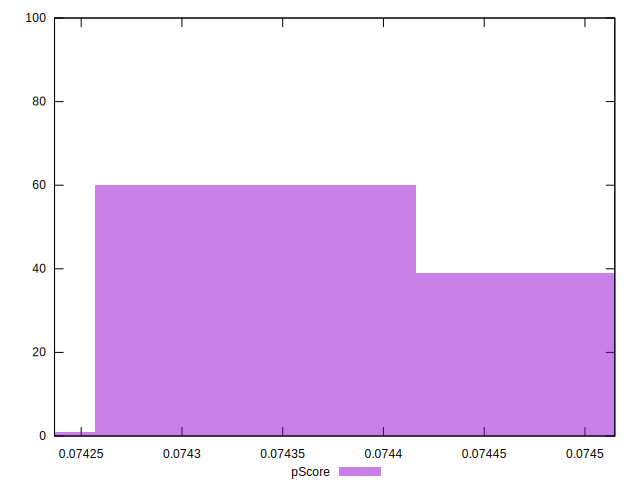
## Score Difference


```yaml
p90min: 0
p90max: 0
p90range: 0
p90mean: 0
median: 0
p90stdev: 0
mad: 0
stdevBySn: 0
lfitCenter: 0
lfitStdev: 0
mfitCenter: 0
mfitStdev: 0
mfitConfidence: 0
p90skewness: .nan
p90eccentricity: .nan
p90discretization: 94
outlandishness: .nan

```


## P Score Difference


```yaml
p90min: 0.004295337035500502
p90max: 0.00449706327005206
p90range: 0.00020172623455155803
p90mean: 0.004400930664870451
median: 0.0043897042753656135
p90stdev: 0.00006469027003601691
mad: 0.00006211815472592641
stdevBySn: 0.00008175150975290224
lfitCenter: 0.004400238103186649
lfitStdev: 0.00005878229032703739
mfitCenter: 0.004400238103186649
mfitStdev: 0.00007367267556479271
mfitConfidence: 0.000007367267556479272
p90skewness: 0.011174245061364099
p90eccentricity: 0.9999999999999992
p90discretization: 1
outlandishness: 0.9997843466348502

```

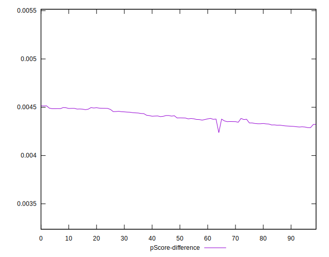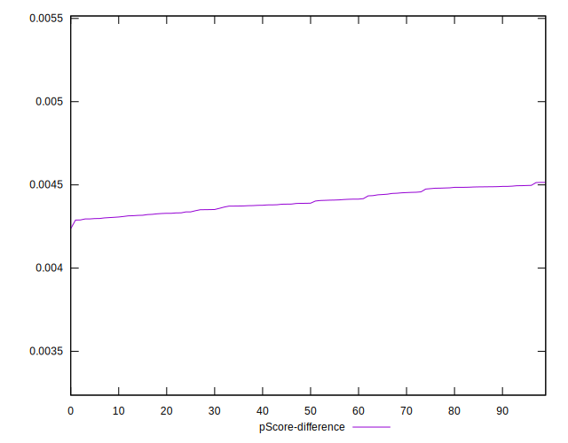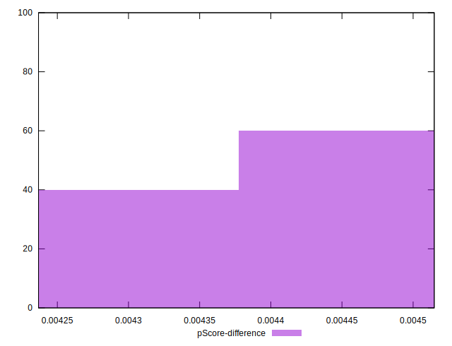