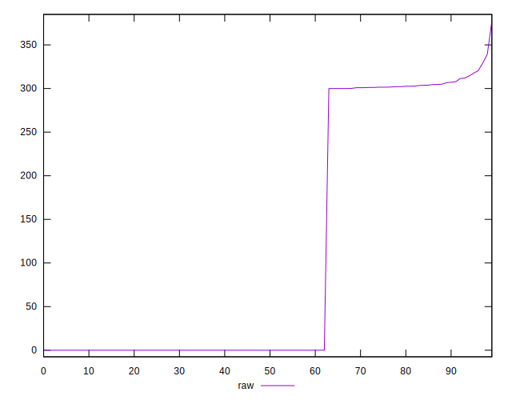

# //uses-rel-preconnect/samples/agenda

[→ Parent](../..)


## Raw


```yaml
p90min: 0
p90max: 320.6
p90range: 320.6
p90mean: 110.07455319148939
median: 0
p90stdev: 146.25801390239334
mad: 0
stdevBySn: 0
lfitCenter: 91.00504555217174
lfitStdev: 160.1331648396509
mfitCenter: 91.00504555217174
mfitStdev: 200.6971595485579
mfitConfidence: 20.069715954855788
p90skewness: 0.5770640737171272
p90eccentricity: 0.9999999999999997
p90discretization: 3.032258064516129
outlandishness: 1.0712836257495162

```


## Score


```yaml
p90min: 0.74
p90max: 1
p90range: 0.26
p90mean: 0.9090425531914894
median: 1
p90stdev: 0.1208486758079916
mad: 0
stdevBySn: 0
lfitCenter: 0.9248495727371524
lfitStdev: 0.1322352588654313
mfitCenter: 0.9248495727371524
mfitStdev: 0.1657323195543868
mfitConfidence: 0.01657323195543868
p90skewness: -0.5766374479854385
p90eccentricity: 0.9999999999999988
p90discretization: 31.333333333333332
outlandishness: 0.9937558282934699

```


## Raw Estimate


## Score Estimate


## P Score


```yaml
p90min: 0.7385555555555555
p90max: 1
p90range: 0.2614444444444445
p90mean: 0.9087056264775417
median: 1
p90stdev: 0.12128958661059208
mad: 0
stdevBySn: 0
lfitCenter: 0.9246067952048845
lfitStdev: 0.13266245204310761
mfitCenter: 0.9246067952048845
mfitStdev: 0.166267726803872
mfitConfidence: 0.0166267726803872
p90skewness: -0.5762805844110658
p90eccentricity: 1.0000000000000004
p90discretization: 3.032258064516129
outlandishness: 0.9937732487343672

```


## Score Difference


```yaml
p90min: 0
p90max: 0
p90range: 0
p90mean: 0
median: 0
p90stdev: 0
mad: 0
stdevBySn: 0
lfitCenter: 0
lfitStdev: 0
mfitCenter: 0
mfitStdev: 0
mfitConfidence: 0
p90skewness: .nan
p90eccentricity: .nan
p90discretization: 94
outlandishness: .nan

```


## P Score Difference


```yaml
p90min: -0.0029944444444444107
p90max: 0.001972222222222264
p90range: 0.004966666666666675
p90mean: -0.000335780141843971
median: 0
p90stdev: 0.0007686155819306815
mad: 0
stdevBySn: 0
lfitCenter: -0.00020845875342898626
lfitStdev: 0.0005852527195466632
mfitCenter: -0.00020845875342898626
mfitStdev: 0.0007335055080482611
mfitConfidence: 0.00007335055080482611
p90skewness: -1.5630333534098404
p90eccentricity: 0.9999999999999999
p90discretization: 3.4814814814814814
outlandishness: 0.9538083290237245

```

