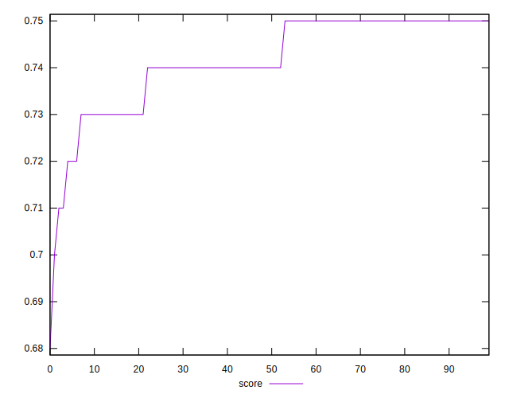

# //uses-rel-preconnect/samples/astro

[→ Parent](../..)


## Raw


```yaml
p90min: 300.202
p90max: 367.59000000000003
p90range: 67.38800000000003
p90mean: 315.5440212740796
median: 310.904
p90stdev: 15.105021568585238
mad: 8.308999999999997
stdevBySn: 12.28258740000001
lfitCenter: 314.680577183399
lfitStdev: 12.665346946288802
mfitCenter: 314.680577183399
mfitStdev: 15.873658397762204
mfitConfidence: 1.5873658397762205
p90skewness: 1.3844701165951858
p90eccentricity: 0.9999999999999997
p90discretization: 1
outlandishness: 1.0115357437104695

```


## Score


```yaml
p90min: 0.71
p90max: 0.75
p90range: 0.040000000000000036
p90mean: 0.742127659574468
median: 0.74
p90stdev: 0.008976605578608087
mad: 0.010000000000000009
stdevBySn: 0.011926000000000011
lfitCenter: 0.7423531682120098
lfitStdev: 0.008576515333500108
mfitCenter: 0.7423531682120098
mfitStdev: 0.010749067927195016
mfitConfidence: 0.0010749067927195016
p90skewness: -1.0479467388667176
p90eccentricity: 1.0000000000000007
p90discretization: 18.8
outlandishness: 0.9969633180406217

```


## Raw Estimate


## Score Estimate


## P Score


```yaml
p90min: 0.71245
p90max: 0.7498877777777778
p90range: 0.03743777777777779
p90mean: 0.7413644326255115
median: 0.7439422222222223
p90stdev: 0.00839167864921402
mad: 0.004616111111111154
stdevBySn: 0.006823659666666684
lfitCenter: 0.7418441237870005
lfitStdev: 0.007036303859049368
mfitCenter: 0.7418441237870005
mfitStdev: 0.008818699109867933
mfitConfidence: 0.0008818699109867933
p90skewness: -1.3844701165951474
p90eccentricity: 1.0000000000000002
p90discretization: 1
outlandishness: 0.9972819415086134

```


## Score Difference


```yaml
p90min: 0
p90max: 0
p90range: 0
p90mean: 0
median: 0
p90stdev: 0
mad: 0
stdevBySn: 0
lfitCenter: 5.166535369026208e-19
lfitStdev: 1.2890316797319448e-18
mfitCenter: 5.166535369026208e-19
mfitStdev: 1.6155616292812394e-18
mfitConfidence: 1.6155616292812395e-19
p90skewness: .nan
p90eccentricity: .nan
p90discretization: 94
outlandishness: .inf

```


## P Score Difference


```yaml
p90min: -0.004708888888888874
p90max: 0.004665000173780687
p90range: 0.00937388906266956
p90mean: -0.000684728134597157
median: -0.0008994444444444527
p90stdev: 0.002382635200460305
mad: 0.0018388888888888344
stdevBySn: 0.0027065394444444335
lfitCenter: -0.0007643484511633907
lfitStdev: 0.0019828846624460575
mfitCenter: -0.0007643484511633907
mfitStdev: 0.0024851773826104085
mfitConfidence: 0.00024851773826104086
p90skewness: 0.42050186276963436
p90eccentricity: 0.9999999999999997
p90discretization: 1
outlandishness: 0.8839966240561665

```

