# //uses-rel-preconnect/samples/card

[→ Parent](../..)


## Raw


```yaml
p90min: 0
p90max: 308.906
p90range: 308.906
p90mean: 81.39636559139787
median: 0
p90stdev: 134.24850343898908
mad: 0
stdevBySn: 0
lfitCenter: 60.170319332882805
lfitStdev: 121.09224799863594
mfitCenter: 60.170319332882805
mfitStdev: 151.76662648871906
mfitConfidence: 15.253119871548307
p90skewness: 1.0432162602342823
p90eccentricity: 1.0000000000000009
p90discretization: 3.576923076923077
outlandishness: 1.1379439855080742

```

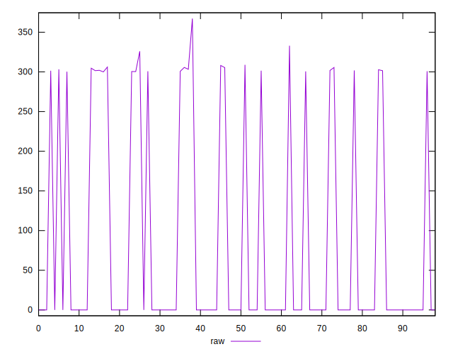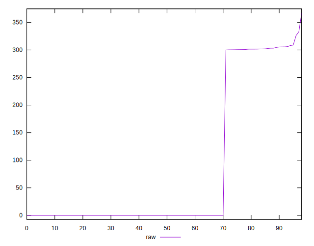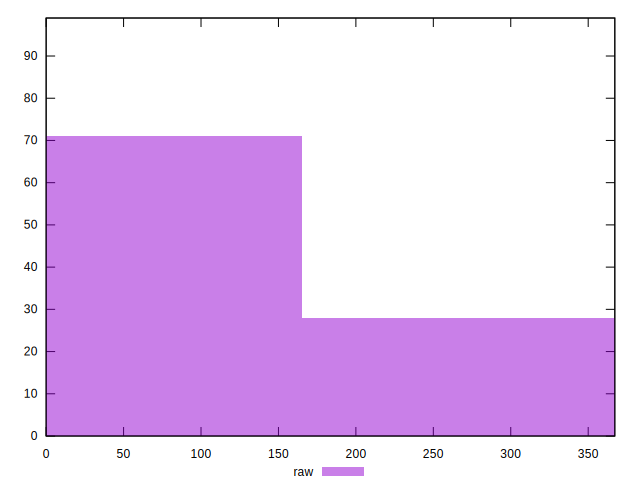
## Score


```yaml
p90min: 0.75
p90max: 1
p90range: 0.25
p90mean: 0.9327956989247311
median: 1
p90stdev: 0.11083617273165751
mad: 0
stdevBySn: 0
lfitCenter: 0.9503828459288731
lfitStdev: 0.09985409405138257
mfitCenter: 0.9503828459288731
mfitStdev: 0.12514854786935917
mfitConfidence: 0.012577902313348367
p90skewness: -1.0429031876562338
p90eccentricity: 1.0000000000000018
p90discretization: 46.5
outlandishness: 0.9909940825454557

```

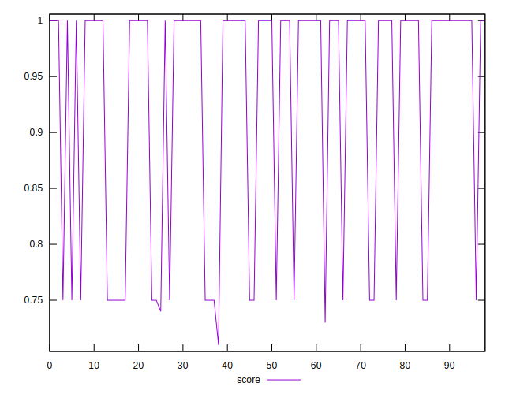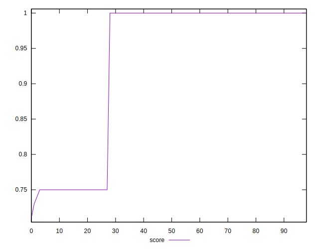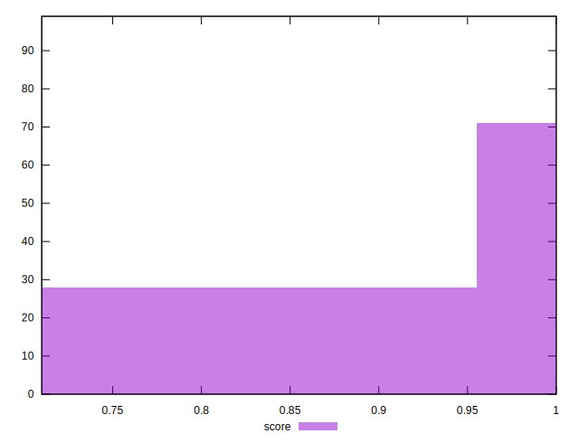
## Raw Estimate

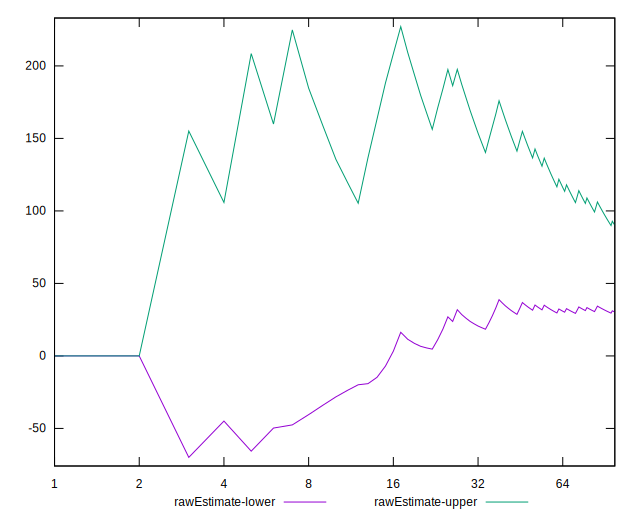
## Score Estimate

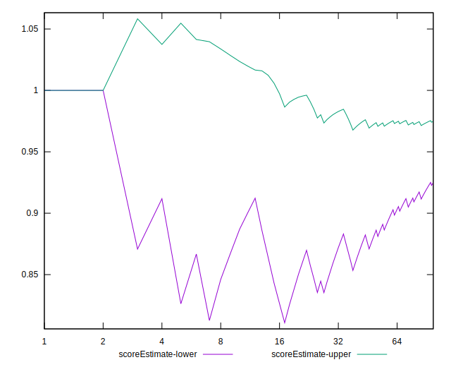
## P Score


```yaml
p90min: 0.7450522222222222
p90max: 1
p90range: 0.2549477777777778
p90mean: 0.9323783632019116
median: 1
p90stdev: 0.11152675578382162
mad: 0
stdevBySn: 0
lfitCenter: 0.9501443692358484
lfitStdev: 0.10033402633649961
mfitCenter: 0.9501443692358484
mfitStdev: 0.12575005378785575
mfitConfidence: 0.012638355932767496
p90skewness: -1.0430429532335155
p90eccentricity: 0.9999999999999987
p90discretization: 3.576923076923077
outlandishness: 0.9910414110186339

```

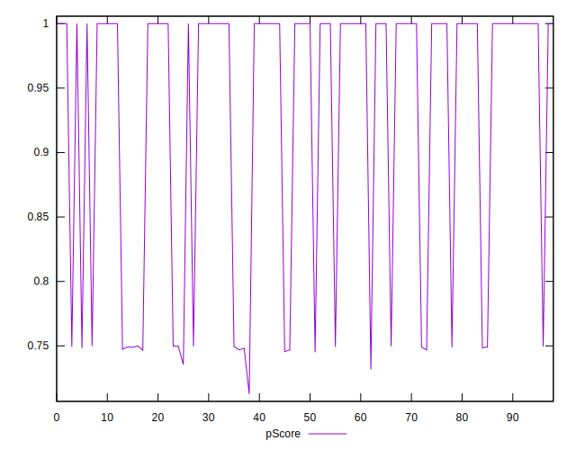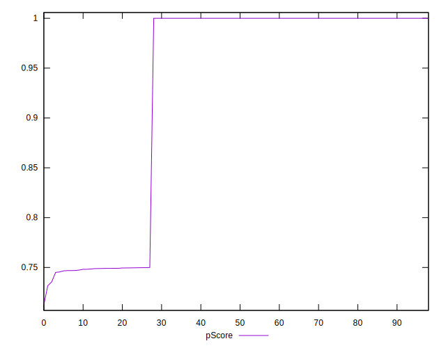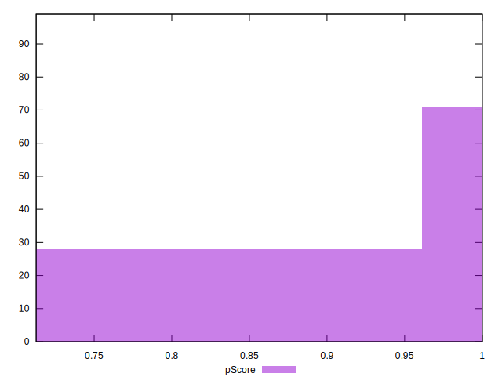
## Score Difference


```yaml
p90min: 0
p90max: 0
p90range: 0
p90mean: 0
median: 0
p90stdev: 0
mad: 0
stdevBySn: 0
lfitCenter: 0
lfitStdev: 0
mfitCenter: 0
mfitStdev: 0
mfitConfidence: 0
p90skewness: .nan
p90eccentricity: .nan
p90discretization: 93
outlandishness: .nan

```


## P Score Difference


```yaml
p90min: -0.0033999999999999586
p90max: 0
p90range: 0.0033999999999999586
p90mean: -0.00031561529271206573
median: 0
p90stdev: 0.0007603407811155172
mad: 0
stdevBySn: 0
lfitCenter: -0.00022437906972921917
lfitStdev: 0.0005213323079285675
mfitCenter: -0.00022437906972921917
mfitStdev: 0.0006533931524236633
mfitConfidence: 0.00006566848264172079
p90skewness: -2.77452521984934
p90eccentricity: 1.000000000000002
p90discretization: 4.043478260869565
outlandishness: 1.5527669764598628

```

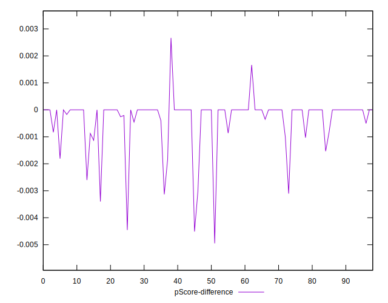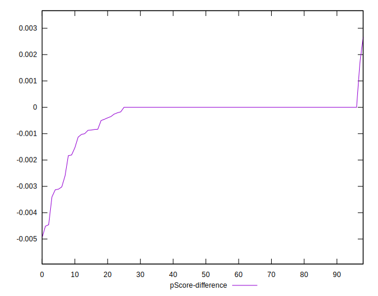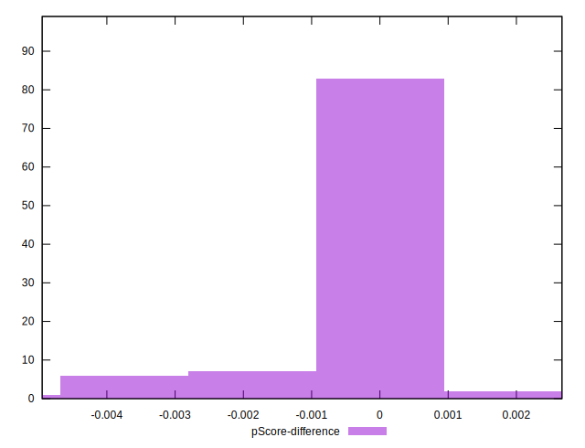