# //uses-rel-preconnect/samples/music

[→ Parent](../..)


## Raw


```yaml
p90min: 0
p90max: 0
p90range: 0
p90mean: 0
median: 0
p90stdev: 0
mad: 0
stdevBySn: 0
lfitCenter: 4.609933495341115
lfitStdev: 11.389723737679944
mfitCenter: 4.609933495341115
mfitStdev: 14.274901794916227
mfitConfidence: 1.4274901794916226
p90skewness: .nan
p90eccentricity: .nan
p90discretization: 94
outlandishness: .inf

```

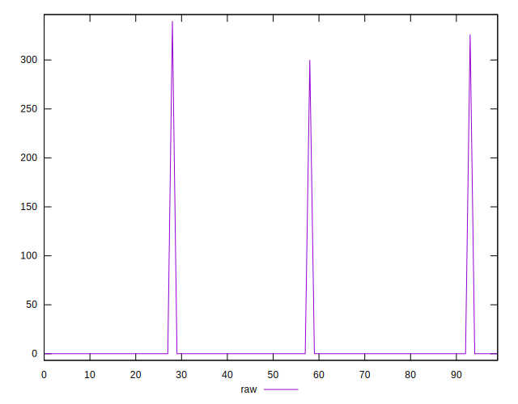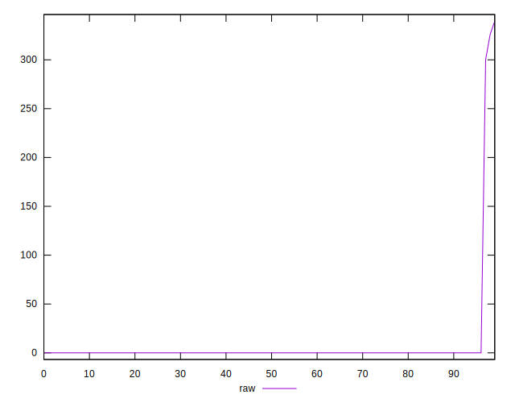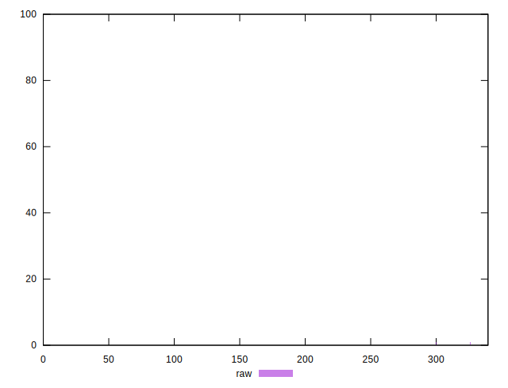
## Score


```yaml
p90min: 1
p90max: 1
p90range: 0
p90mean: 1
median: 1
p90stdev: 0
mad: 0
stdevBySn: 0
lfitCenter: 0.9962749832644823
lfitStdev: 0.0092033673758329
mfitCenter: 0.9962749832644823
mfitStdev: 0.011534710454646347
mfitConfidence: 0.0011534710454646348
p90skewness: .nan
p90eccentricity: .nan
p90discretization: 94
outlandishness: 0.9844608399999999

```

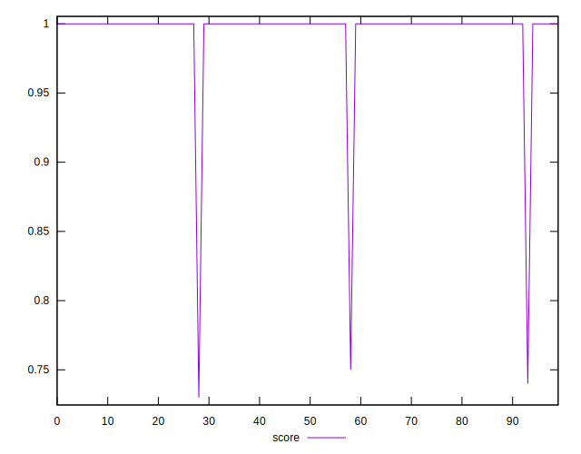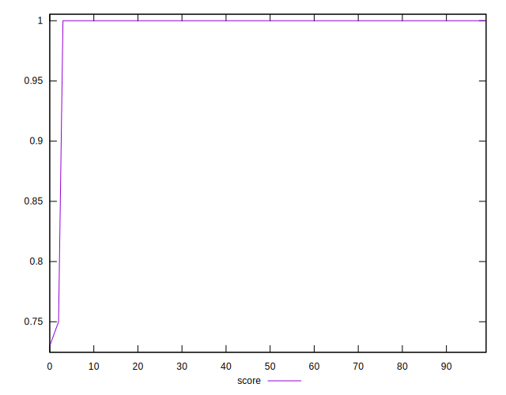
## Raw Estimate

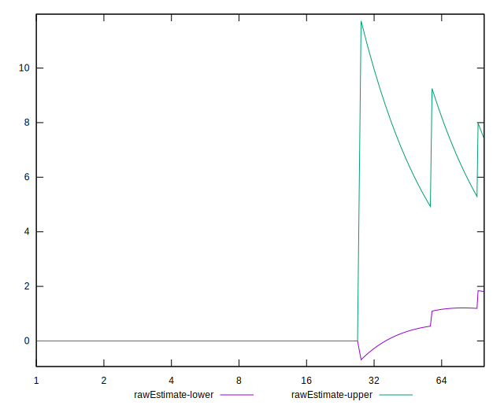
## Score Estimate

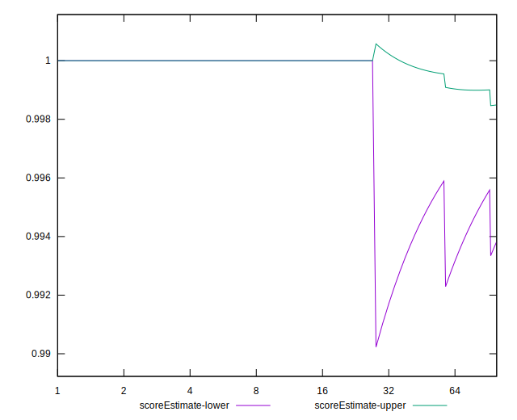
## P Score


```yaml
p90min: 1
p90max: 1
p90range: 0
p90mean: 1
median: 1
p90stdev: 0
mad: 0
stdevBySn: 0
lfitCenter: 0.9962442025474739
lfitStdev: 0.0092794170332797
mfitCenter: 0.9962442025474739
mfitStdev: 0.01163002456555833
mfitConfidence: 0.001163002456555833
p90skewness: .nan
p90eccentricity: .nan
p90discretization: 94
outlandishness: 0.9843319684622254

```

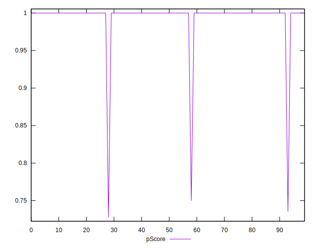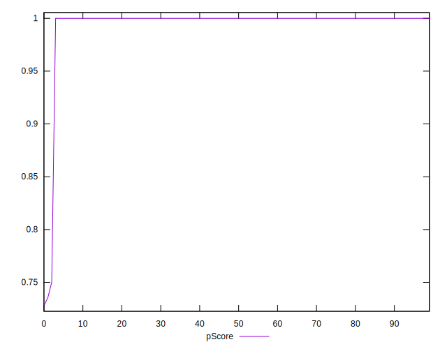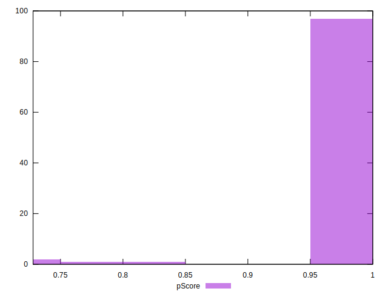
## Score Difference


```yaml
p90min: 0
p90max: 0
p90range: 0
p90mean: 0
median: 0
p90stdev: 0
mad: 0
stdevBySn: 0
lfitCenter: 0
lfitStdev: 0
mfitCenter: 0
mfitStdev: 0
mfitConfidence: 0
p90skewness: .nan
p90eccentricity: .nan
p90discretization: 94
outlandishness: .nan

```


## P Score Difference


```yaml
p90min: 0
p90max: 0
p90range: 0
p90mean: 0
median: 0
p90stdev: 0
mad: 0
stdevBySn: 0
lfitCenter: -0.00003046894489295961
lfitStdev: 0.00007565402610010524
mfitCenter: -0.00003046894489295961
mfitStdev: 0.0000948182605515079
mfitConfidence: 0.00000948182605515079
p90skewness: .nan
p90eccentricity: .nan
p90discretization: 94
outlandishness: .inf

```

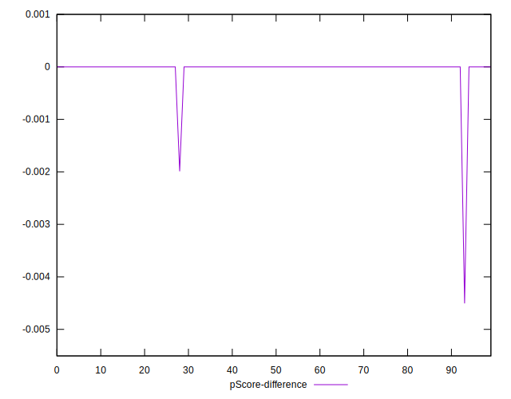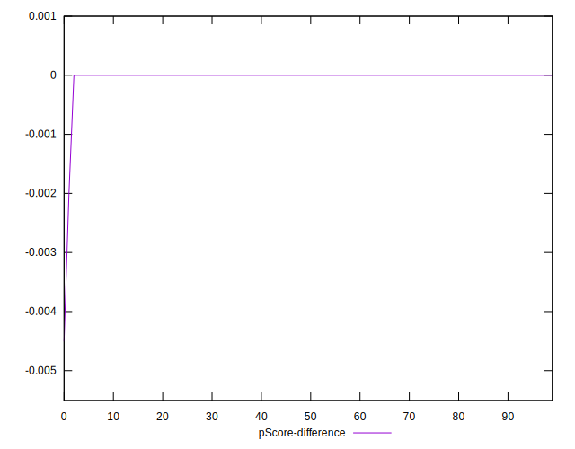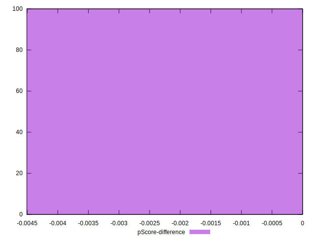