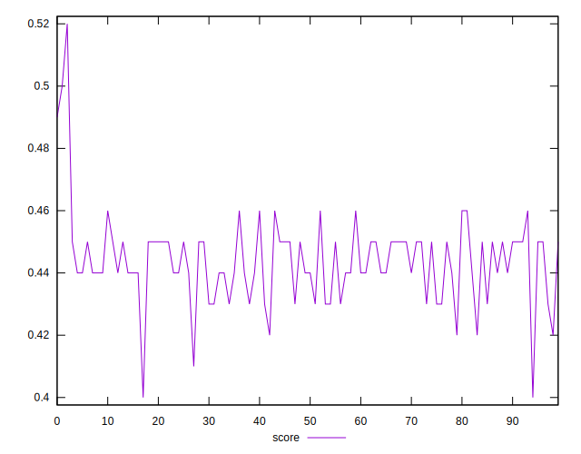

# //uses-rel-preload/samples/agenda

[→ Parent](../..)


## Raw


```yaml
p90min: 1064
p90max: 1457
p90range: 393
p90mean: 1231.904255319149
median: 1221.5
p90stdev: 86.86380500640145
mad: 64
stdevBySn: 91.8302
lfitCenter: 1226.8185063153694
lfitStdev: 77.0580385125835
mfitCenter: 1226.8185063153694
mfitStdev: 96.577929158804
mfitConfidence: 9.6577929158804
p90skewness: 0.4792534901714231
p90eccentricity: 1
p90discretization: 1.146341463414634
outlandishness: 0.9953066881584646

```


## Score


```yaml
p90min: 0.42
p90max: 0.46
p90range: 0.040000000000000036
p90mean: 0.4432978723404258
median: 0.44
p90stdev: 0.009934712180600033
mad: 0.010000000000000009
stdevBySn: 0.011926000000000011
lfitCenter: 0.44393549735609106
lfitStdev: 0.010239727016494591
mfitCenter: 0.44393549735609106
mfitStdev: 0.012833594644937848
mfitConfidence: 0.0012833594644937848
p90skewness: -0.37062855200727485
p90eccentricity: 1.000000000000001
p90discretization: 18.8
outlandishness: 1.0027184276287417

```


## Raw Estimate


## Score Estimate


## P Score


```yaml
p90min: 0.4168235294117647
p90max: 0.46305882352941174
p90range: 0.04623529411764704
p90mean: 0.443305381727159
median: 0.44452941176470584
p90stdev: 0.010219271177223698
mad: 0.007529411764705923
stdevBySn: 0.010803552941176497
lfitCenter: 0.4439811434991303
lfitStdev: 0.009146096282538239
mfitCenter: 0.4439811434991303
mfitStdev: 0.011462931783688405
mfitConfidence: 0.0011462931783688406
p90skewness: -0.4792534901714366
p90eccentricity: 1.0000000000000002
p90discretization: 1.146341463414634
outlandishness: 1.0022882450380746

```


## Score Difference


```yaml
p90min: 0
p90max: 0
p90range: 0
p90mean: 0
median: 0
p90stdev: 0
mad: 0
stdevBySn: 0
lfitCenter: 2.583267684513104e-19
lfitStdev: 6.445158398659724e-19
mfitCenter: 2.583267684513104e-19
mfitStdev: 8.077808146406197e-19
mfitConfidence: 8.077808146406197e-20
p90skewness: .nan
p90eccentricity: .nan
p90discretization: 94
outlandishness: .inf

```


## P Score Difference


```yaml
p90min: -0.004705882352941171
p90max: 0.004588235294117615
p90range: 0.009294117647058786
p90mean: -0.00008955638993186762
median: -0.0002941176470588336
p90stdev: 0.0027328397441078968
mad: 0.002588235294117641
stdevBySn: 0.0031568823529411687
lfitCenter: -0.00011453886199781606
lfitStdev: 0.002492026097888995
mfitCenter: -0.00011453886199781606
mfitStdev: 0.003123291542186247
mfitConfidence: 0.0003123291542186247
p90skewness: 0.03428342264011185
p90eccentricity: 1.0000000000000004
p90discretization: 1.6206896551724137
outlandishness: 0.9592438264341753

```

