# //uses-rel-preload/samples/card

[→ Parent](../..)


## Raw


```yaml
p90min: 1113
p90max: 1494
p90range: 381
p90mean: 1256.52688172043
median: 1234
p90stdev: 94.77064463126078
mad: 68
stdevBySn: 101.37100000000001
lfitCenter: 1250.1553132095733
lfitStdev: 81.99945186896149
mfitCenter: 1250.1553132095733
mfitStdev: 102.77107238290397
mfitConfidence: 10.328881405956015
p90skewness: 0.8191067907328938
p90eccentricity: 1.0000000000000002
p90discretization: 1.1481481481481481
outlandishness: 1.0014770972011595

```

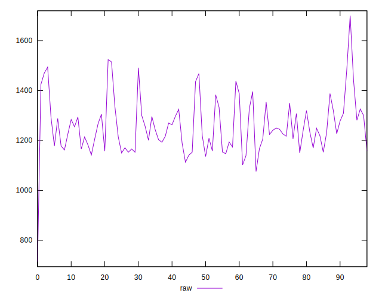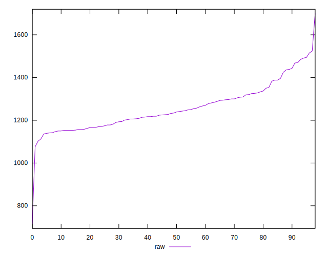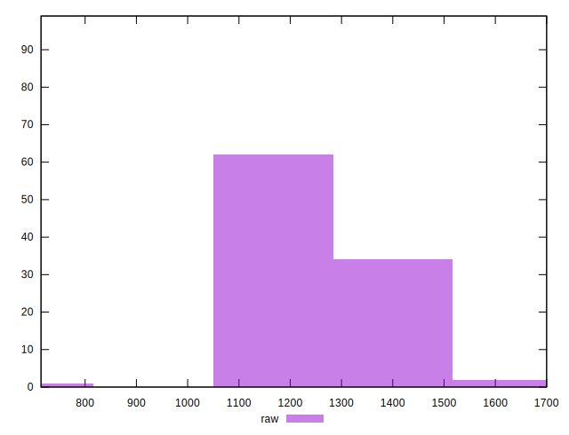
## Score


```yaml
p90min: 0.41
p90max: 0.46
p90range: 0.050000000000000044
p90mean: 0.43999999999999995
median: 0.44
p90stdev: 0.011264178639834673
mad: 0.010000000000000009
stdevBySn: 0.011926000000000011
lfitCenter: 0.44099285421041506
lfitStdev: 0.00964653655460671
mfitCenter: 0.44099285421041506
mfitStdev: 0.01209014065218496
mfitConfidence: 0.0012151048547248558
p90skewness: -0.9028169607911151
p90eccentricity: 1.0000000000000002
p90discretization: 15.5
outlandishness: 1.0004591895244288

```

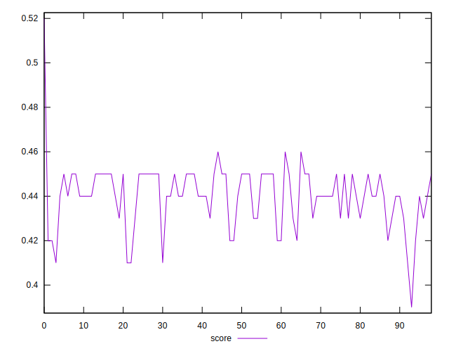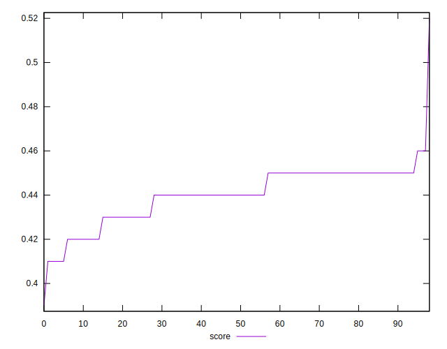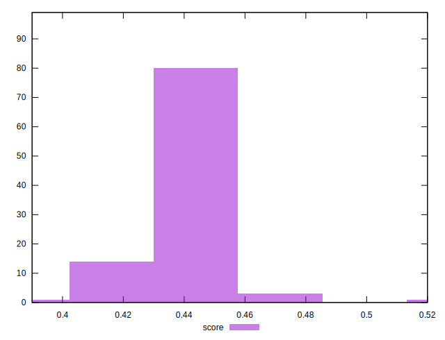
## Raw Estimate

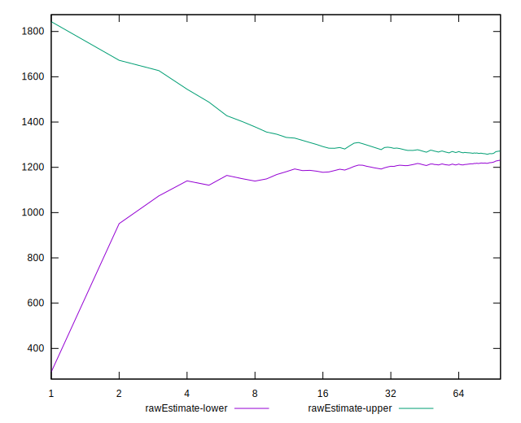
## Score Estimate

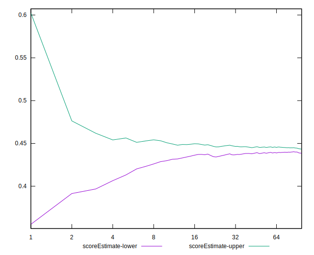
## P Score


```yaml
p90min: 0.41247058823529414
p90max: 0.45729411764705885
p90range: 0.044823529411764707
p90mean: 0.4404086021505377
median: 0.4430588235294118
p90stdev: 0.01114948760367774
mad: 0.007999999999999952
stdevBySn: 0.011926000000000011
lfitCenter: 0.44123229857177304
lfitStdev: 0.00972158638345023
mfitCenter: 0.44123229857177304
mfitStdev: 0.012184201663772301
mfitConfidence: 0.001224558342083537
p90skewness: -0.8191067907328887
p90eccentricity: 1.0000000000000002
p90discretization: 1.1481481481481481
outlandishness: 1.000227540484649

```

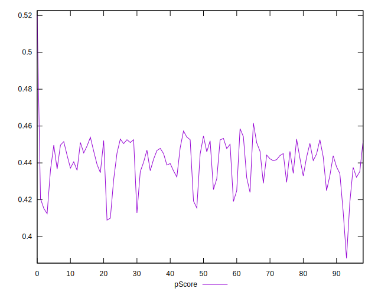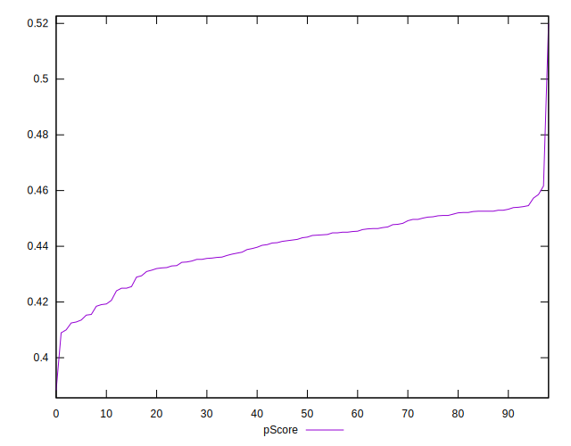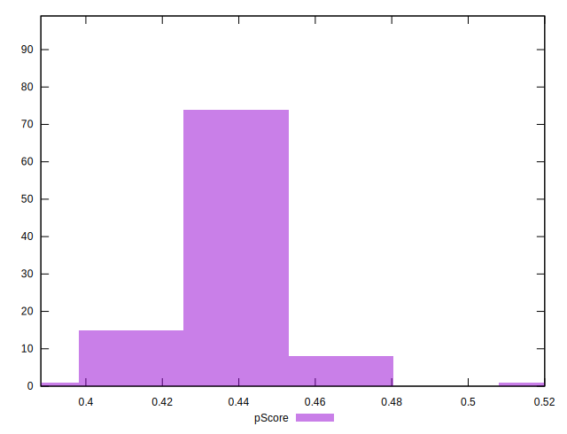
## Score Difference


```yaml
p90min: 0
p90max: 5.551115123125783e-17
p90range: 5.551115123125783e-17
p90mean: 1.1937881985216738e-18
median: 0
p90stdev: 8.052541646169723e-18
mad: 0
stdevBySn: 0
lfitCenter: 1.3772619907040874e-18
lfitStdev: 3.3666308024413447e-18
mfitCenter: 1.3772619907040874e-18
mfitStdev: 4.21944598406735e-18
mfitConfidence: 4.240702773431306e-19
p90skewness: 6.597118918283819
p90eccentricity: 1.0000000000000013
p90discretization: 46.5
outlandishness: 5.5153810835629

```

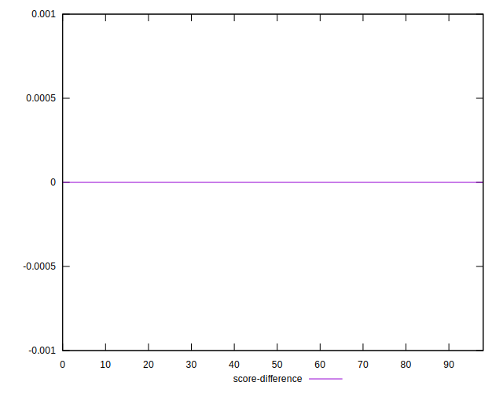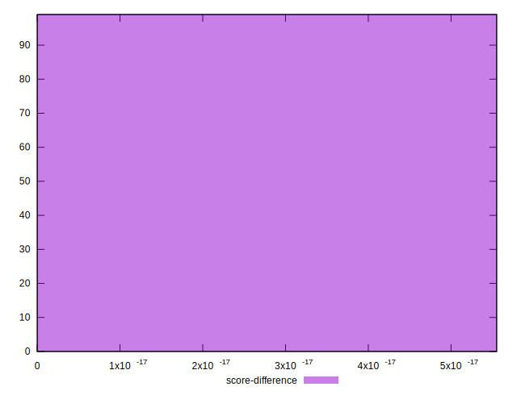
## P Score Difference


```yaml
p90min: -0.004705882352941171
p90max: 0.0048235294117647265
p90range: 0.009529411764705897
p90mean: 0.00037950664136621957
median: 0.0009411764705882231
p90stdev: 0.002828854825699993
mad: 0.0021176470588235574
stdevBySn: 0.0035076470588235173
lfitCenter: 0.0004900686670594475
lfitStdev: 0.002508586225652666
mfitCenter: 0.0004900686670594475
mfitStdev: 0.0031440465844490913
mfitConfidence: 0.00031598857103079026
p90skewness: -0.3114322887389711
p90eccentricity: 1.0000000000000002
p90discretization: 1.5
outlandishness: 0.8883538516477982

```

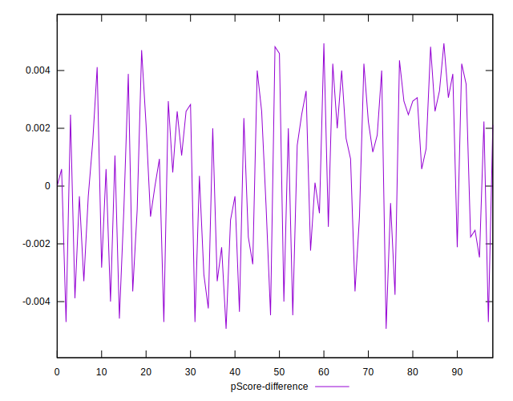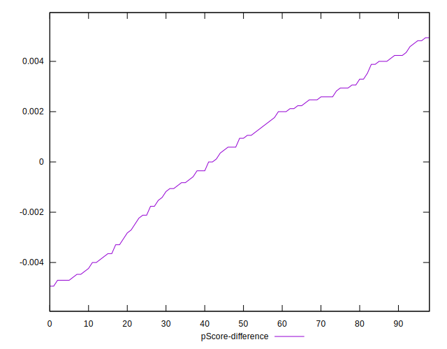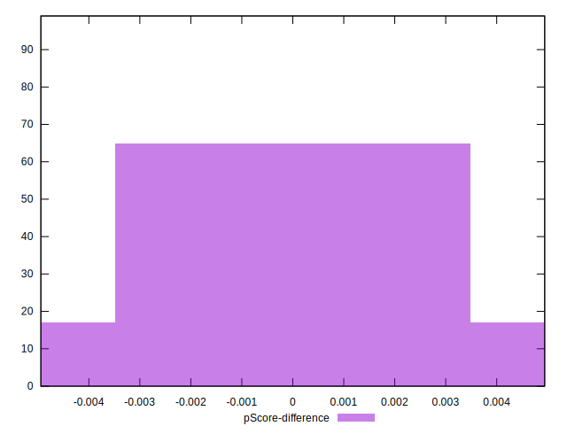