# //uses-rel-preload/samples/music

[→ Parent](../..)


## Raw


```yaml
p90min: 1236
p90max: 2135
p90range: 899
p90mean: 1481.6808510638298
median: 1481.5
p90stdev: 165.93706912535848
mad: 80
stdevBySn: 154.44170000000003
lfitCenter: 1484.5439300401886
lfitStdev: 127.1565622403314
mfitCenter: 1484.5439300401886
mfitStdev: 159.36711726860761
mfitConfidence: 15.93671172686076
p90skewness: 1.0047553300328862
p90eccentricity: 0.9999999999999997
p90discretization: 1.0804597701149425
outlandishness: 1.0229135601622295

```

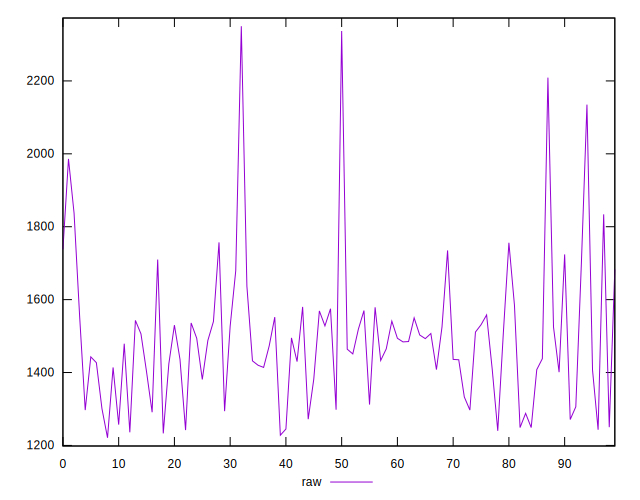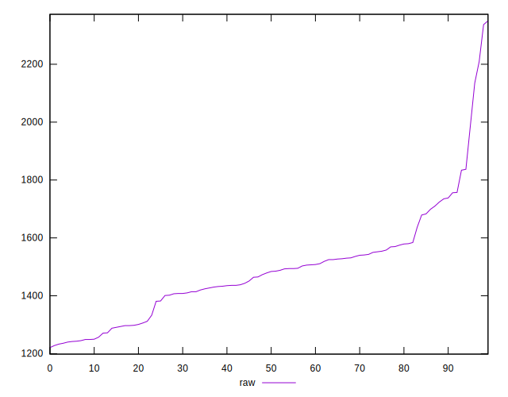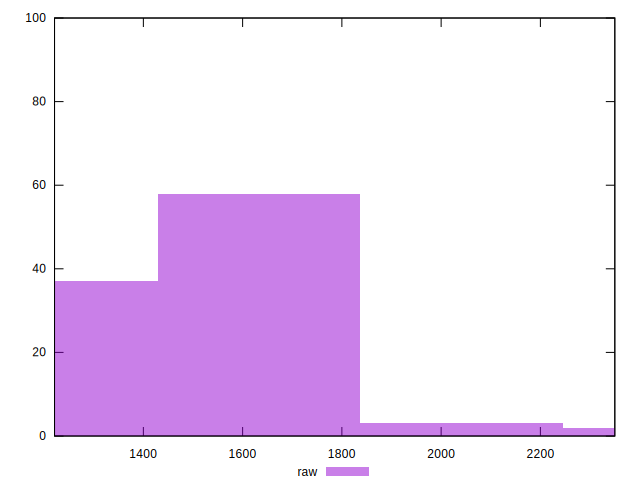
## Score


```yaml
p90min: 0.34
p90max: 0.44
p90range: 0.09999999999999998
p90mean: 0.4137234042553192
median: 0.41
p90stdev: 0.01989247920286905
mad: 0.010000000000000009
stdevBySn: 0.017888999999999985
lfitCenter: 0.4132566317994623
lfitStdev: 0.01549748783381788
mfitCenter: 0.4132566317994623
mfitStdev: 0.019423220614543386
mfitConfidence: 0.0019423220614543386
p90skewness: -0.966769908323264
p90eccentricity: 0.9999999999999992
p90discretization: 9.4
outlandishness: 0.9897614922084761

```

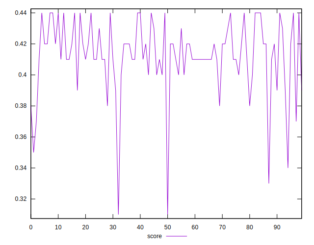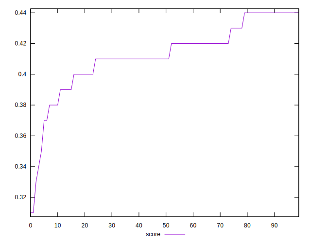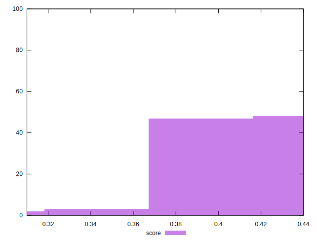
## Raw Estimate

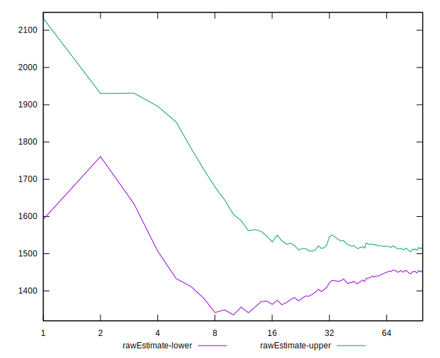
## Score Estimate

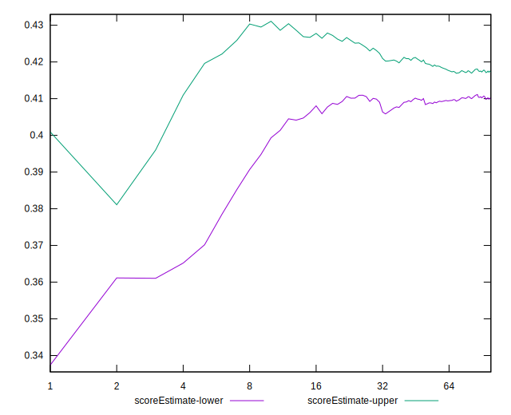
## P Score


```yaml
p90min: 0.33705882352941174
p90max: 0.4428235294117647
p90range: 0.10576470588235298
p90mean: 0.4139198998748433
median: 0.41394117647058826
p90stdev: 0.019522008132395113
mad: 0.009411764705882342
stdevBySn: 0.018169611764705863
lfitCenter: 0.41358306705409564
lfitStdev: 0.01495959555768604
mfitCenter: 0.41358306705409564
mfitStdev: 0.018749072619836184
mfitConfidence: 0.0018749072619836185
p90skewness: -1.0047553300328542
p90eccentricity: 1
p90discretization: 1.0804597701149425
outlandishness: 0.9904280087541235

```

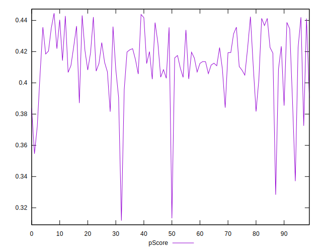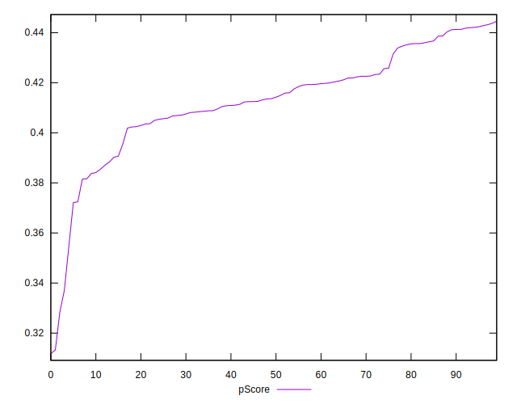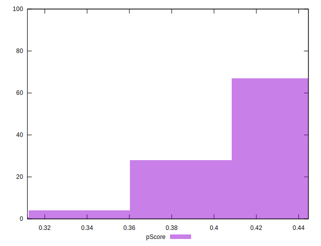
## Score Difference


```yaml
p90min: 0
p90max: 5.551115123125783e-17
p90range: 5.551115123125783e-17
p90mean: 1.5354148212901102e-17
median: 0
p90stdev: 2.4830960032382263e-17
mad: 0
stdevBySn: 0
lfitCenter: 1.1354327653365842e-17
lfitStdev: 2.2639610347521297e-17
mfitCenter: 1.1354327653365842e-17
mfitStdev: 2.83745437404144e-17
mfitConfidence: 2.83745437404144e-18
p90skewness: 0.9988681377244369
p90eccentricity: 0.9999999999999991
p90discretization: 47
outlandishness: 1.0992715976331358

```

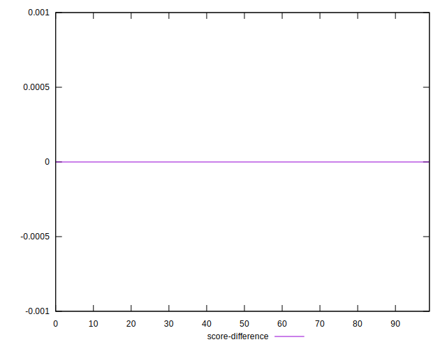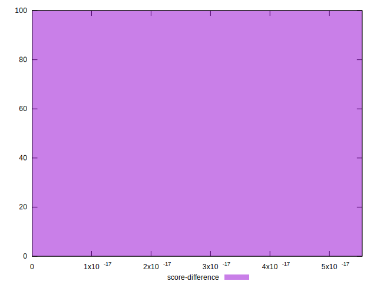
## P Score Difference


```yaml
p90min: -0.004470588235294115
p90max: 0.004588235294117671
p90range: 0.009058823529411786
p90mean: 0.00035043804755945774
median: 0.0010000000000000286
p90stdev: 0.0026550139799758365
mad: 0.0021764705882353075
stdevBySn: 0.0031919588235293952
lfitCenter: 0.0004848622564856975
lfitStdev: 0.002377984550079143
mfitCenter: 0.0004848622564856975
mfitStdev: 0.0029803616579309957
mfitConfidence: 0.0002980361657930996
p90skewness: -0.3768213194402755
p90eccentricity: 1.0000000000000007
p90discretization: 1.4461538461538461
outlandishness: 0.9090260408163287

```

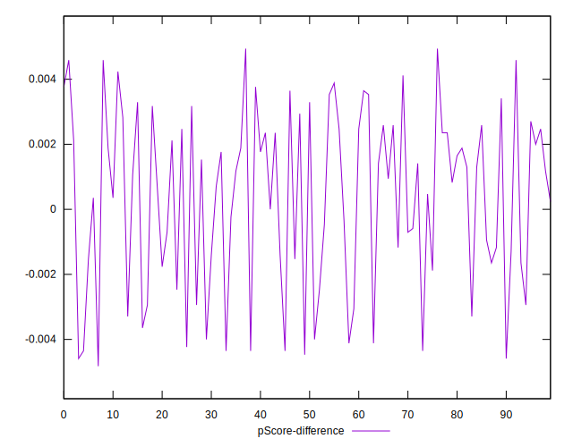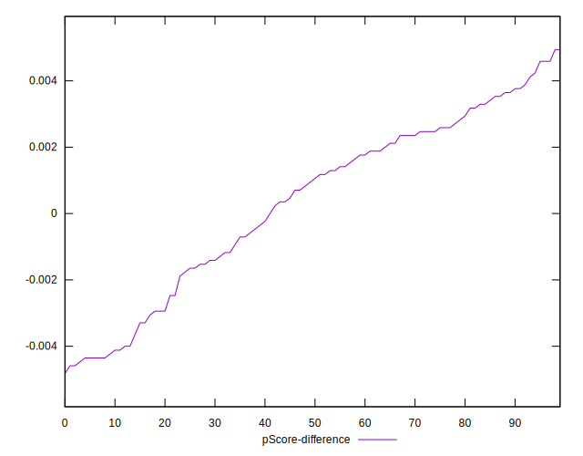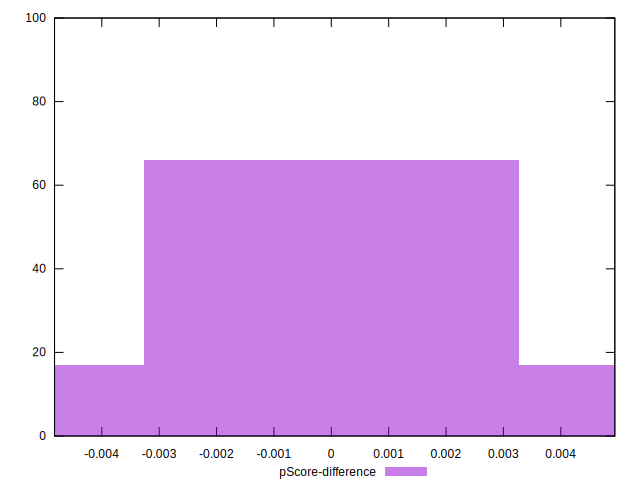