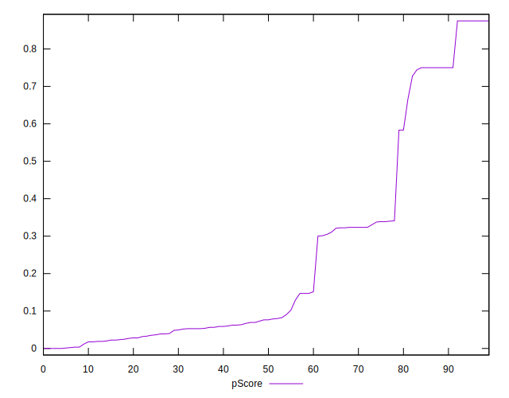

# //uses-text-compression/samples/agenda

[→ Parent](../..)


## Raw


```yaml
p90min: 150
p90max: 5050
p90range: 4900
p90mean: 3300.425531914894
median: 4350
p90stdev: 1725.1992884533763
mad: 600
stdevBySn: 775.19
lfitCenter: 3503.599715610984
lfitStdev: 1650.715220664703
mfitCenter: 3503.599715610984
mfitStdev: 2068.8647248227276
mfitConfidence: 206.88647248227275
p90skewness: -0.7739161786787355
p90eccentricity: 1.0000000000000002
p90discretization: 1.5666666666666667
outlandishness: 0.9763712685130091

```


## Score


```yaml
p90min: 0
p90max: 0.88
p90range: 0.88
p90mean: 0.23957446808510635
median: 0.08
p90stdev: 0.2785368874063068
mad: 0.06999999999999999
stdevBySn: 0.095408
lfitCenter: 0.2034743834305023
lfitStdev: 0.23994663906374936
mfitCenter: 0.2034743834305023
mfitStdev: 0.30072851524254257
mfitConfidence: 0.030072851524254256
p90skewness: 1.1635570264570874
p90eccentricity: 0.9999999999999994
p90discretization: 3.9166666666666665
outlandishness: 1.1029103401278981

```


## Raw Estimate


## Score Estimate


## P Score


```yaml
p90min: 0
p90max: 0.875
p90range: 0.875
p90mean: 0.23974308162981514
median: 0.07647058823529412
p90stdev: 0.2779728600599334
mad: 0.07058823529411762
stdevBySn: 0.09049729411764708
lfitCenter: 0.2036328763044544
lfitStdev: 0.2401935591459823
mfitCenter: 0.2036328763044544
mfitStdev: 0.3010379836727036
mfitConfidence: 0.03010379836727036
p90skewness: 1.156176378057264
p90eccentricity: 1
p90discretization: 1.5932203389830508
outlandishness: 1.1014339002527425

```


## Score Difference


```yaml
p90min: 0
p90max: 0
p90range: 0
p90mean: 0
median: 0
p90stdev: 0
mad: 0
stdevBySn: 0
lfitCenter: 0
lfitStdev: 0
mfitCenter: 0
mfitStdev: 0
mfitConfidence: 0
p90skewness: .nan
p90eccentricity: .nan
p90discretization: 94
outlandishness: .nan

```


## P Score Difference


```yaml
p90min: -0.0050000000000000044
p90max: 0.00411764705882349
p90range: 0.009117647058823494
p90mean: 0.000021207064386024658
median: 0
p90stdev: 0.0024851267519368095
mad: 0.0023529411764705646
stdevBySn: 0.0028061176470588205
lfitCenter: 0.00005941872424782461
lfitStdev: 0.0019855538257325025
mfitCenter: 0.00005941872424782461
mfitStdev: 0.00248852268269548
mfitConfidence: 0.000248852268269548
p90skewness: -0.2728631072381577
p90eccentricity: 0.9999999999999992
p90discretization: 2.1363636363636362
outlandishness: 0.16052502015560624

```

