# //uses-text-compression/samples/card

[→ Parent](../..)


## Raw


```yaml
p90min: 300
p90max: 5220
p90range: 4920
p90mean: 3775.3763440860216
median: 4610
p90stdev: 1610.6637642881697
mad: 340
stdevBySn: 560.522
lfitCenter: 4004.7992513281843
lfitStdev: 1350.1065679681749
mfitCenter: 4004.7992513281843
mfitStdev: 1692.1076502196945
mfitConfidence: 170.06321759602008
p90skewness: -1.2184408789509253
p90eccentricity: 1
p90discretization: 1.453125
outlandishness: 0.9733592675301301

```

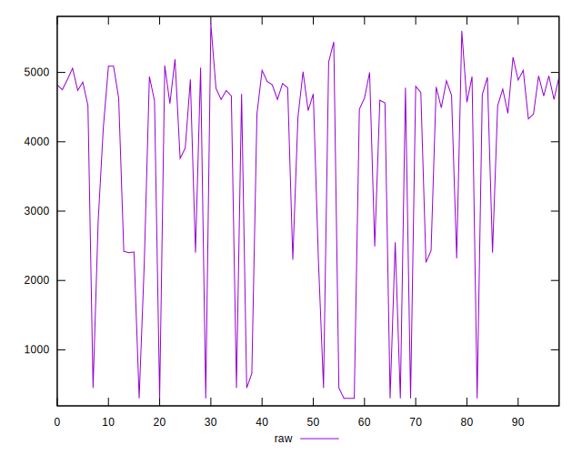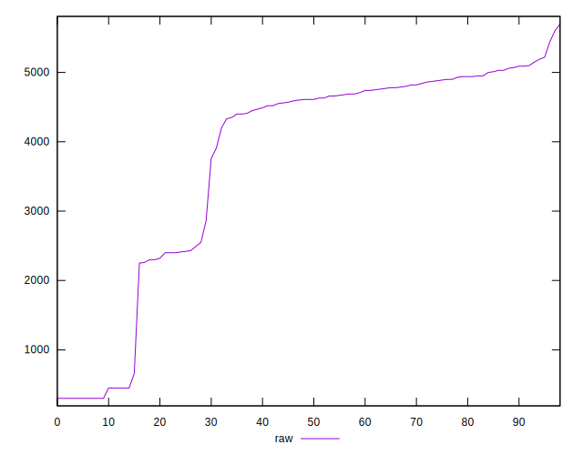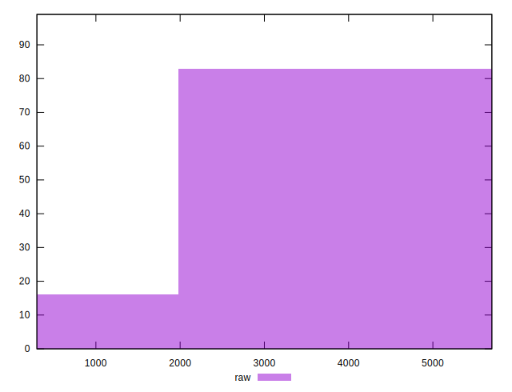
## Score


```yaml
p90min: 0
p90max: 0.75
p90range: 0.75
p90mean: 0.1683870967741935
median: 0.05
p90stdev: 0.23852724793102734
mad: 0.04
stdevBySn: 0.05963000000000001
lfitCenter: 0.1344611923674989
lfitStdev: 0.186919396289081
mfitCenter: 0.1344611923674989
mfitStdev: 0.23426872214331482
mfitConfidence: 0.02354489246864845
p90skewness: 1.5203155281619931
p90eccentricity: 0.9999999999999991
p90discretization: 4.65
outlandishness: 1.1542587199903538

```

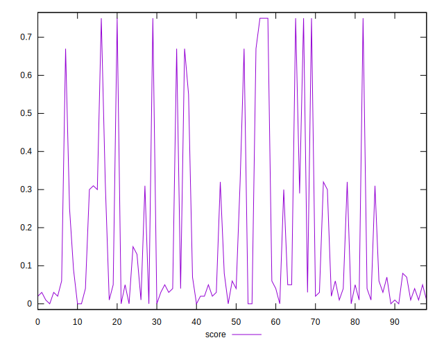
## Raw Estimate

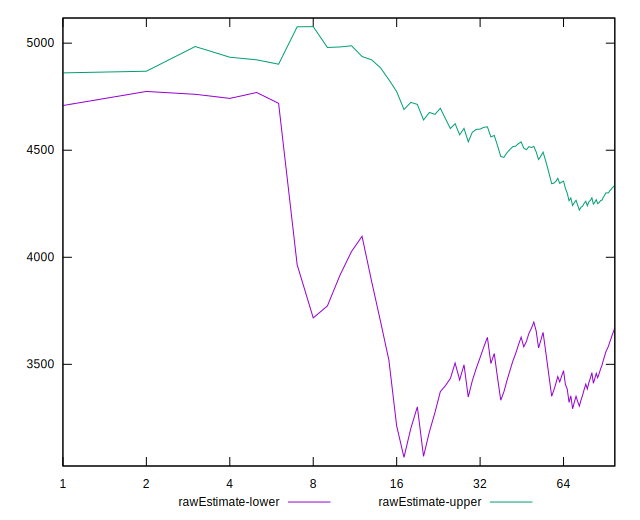
## Score Estimate


## P Score


```yaml
p90min: 0
p90max: 0.75
p90range: 0.75
p90mean: 0.16770820156019398
median: 0.045882352941176485
p90stdev: 0.2382872419561495
mad: 0.040000000000000036
stdevBySn: 0.05471929411764708
lfitCenter: 0.13381955789165043
lfitStdev: 0.18668249571851855
mfitCenter: 0.13381955789165043
mfitStdev: 0.23397181130879202
mfitConfidence: 0.023515051807002894
p90skewness: 1.5215060923359782
p90eccentricity: 1.0000000000000002
p90discretization: 1.690909090909091
outlandishness: 1.1554330197013831

```

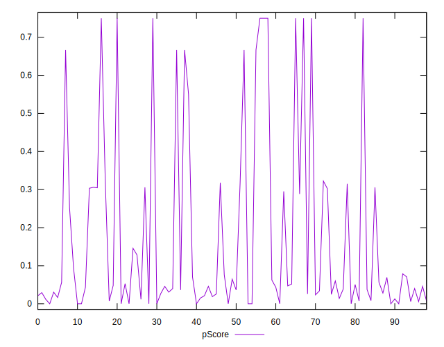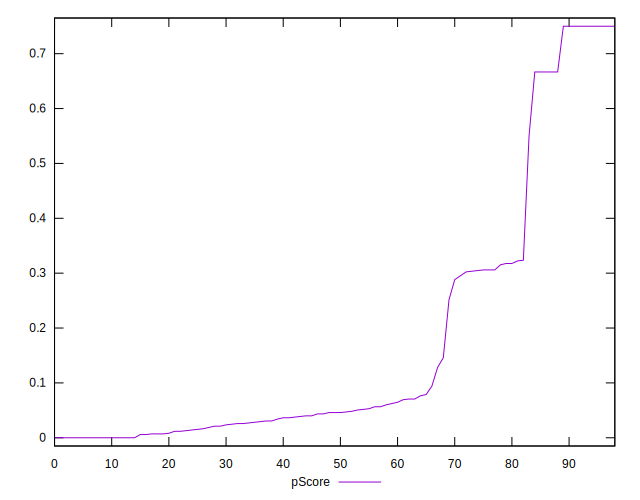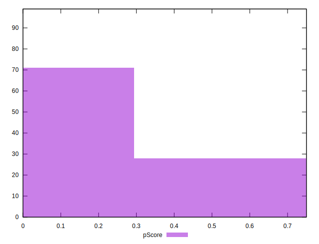
## Score Difference


```yaml
p90min: 0
p90max: 0
p90range: 0
p90mean: 0
median: 0
p90stdev: 0
mad: 0
stdevBySn: 0
lfitCenter: 0
lfitStdev: 0
mfitCenter: 0
mfitStdev: 0
mfitConfidence: 0
p90skewness: .nan
p90eccentricity: .nan
p90discretization: 93
outlandishness: .nan

```


## P Score Difference


```yaml
p90min: -0.0041176470588235505
p90max: 0.0041176470588235314
p90range: 0.008235294117647082
p90mean: -0.0006788952139995879
median: 0
p90stdev: 0.002360582003043134
mad: 0.0017647058823529738
stdevBySn: 0.00280611764705881
lfitCenter: -0.0006245085267851989
lfitStdev: 0.00202118371361881
mfitCenter: -0.0006245085267851989
mfitStdev: 0.0025331781249392895
mfitConfidence: 0.0002545939808351411
p90skewness: 0.1749813015391776
p90eccentricity: 1.0000000000000009
p90discretization: 2.2142857142857144
outlandishness: 0.882460973370065

```

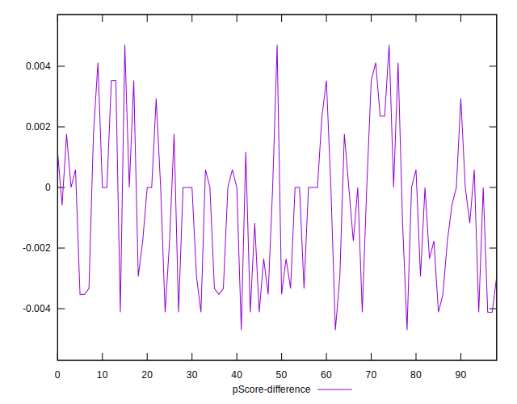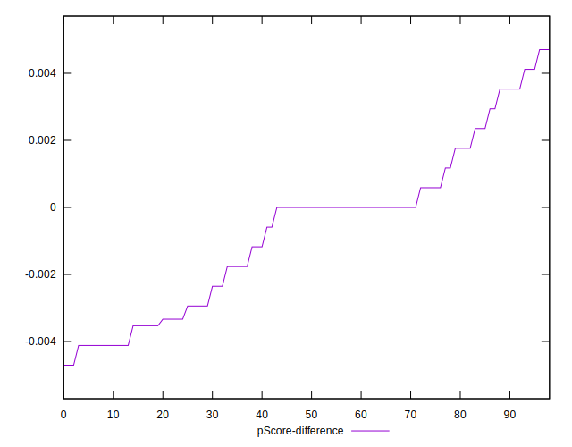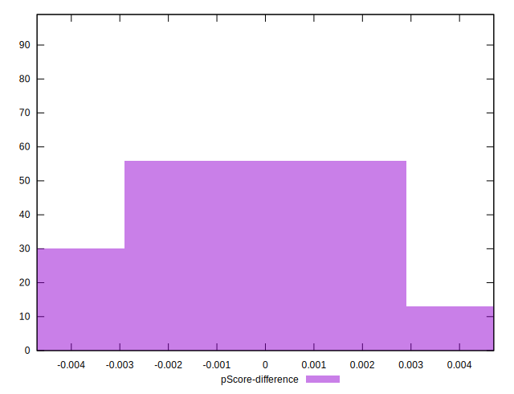