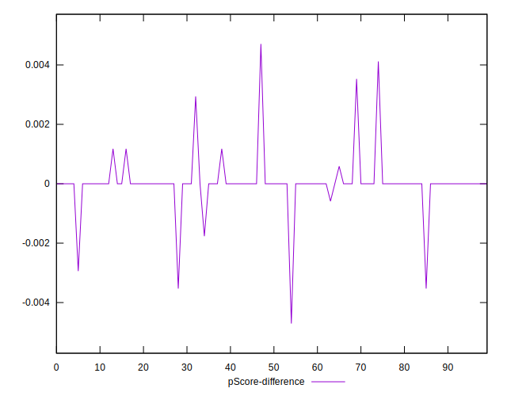

# //uses-text-compression/samples/music

[→ Parent](../..)


## Raw


```yaml
p90min: 4650
p90max: 6360
p90range: 1710
p90mean: 5846.808510638298
median: 6060
p90stdev: 475.8938125029921
mad: 110
stdevBySn: 226.59400000000002
lfitCenter: 5907.8369727167055
lfitStdev: 361.2866657342766
mfitCenter: 5907.8369727167055
mfitStdev: 452.8056862439807
mfitConfidence: 45.28056862439807
p90skewness: -1.36784594077598
p90eccentricity: 0.9999999999999991
p90discretization: 1.6206896551724137
outlandishness: 0.9933379160708914

```


## Score


```yaml
p90min: 0
p90max: 0.04
p90range: 0.04
p90mean: 0.002659574468085106
median: 0
p90stdev: 0.008401561647503102
mad: 0
stdevBySn: 0
lfitCenter: 0.0020981246248978807
lfitStdev: 0.004883284908314161
mfitCenter: 0.0020981246248978807
mfitStdev: 0.00612029001828806
mfitConfidence: 0.000612029001828806
p90skewness: 3.2342122447542487
p90eccentricity: 0.9999999999999984
p90discretization: 18.8
outlandishness: 2.262016000000002

```


## Raw Estimate


## Score Estimate


## P Score


```yaml
p90min: 0
p90max: 0.04117647058823526
p90range: 0.04117647058823526
p90mean: 0.0026282853566958675
median: 0
p90stdev: 0.008280628895106506
mad: 0
stdevBySn: 0
lfitCenter: 0.0021065218403667394
lfitStdev: 0.004867771777989133
mfitCenter: 0.0021065218403667394
mfitStdev: 0.0061008471927181205
mfitConfidence: 0.000610084719271812
p90skewness: 3.300904506316242
p90eccentricity: 1.0000000000000022
p90discretization: 7.833333333333333
outlandishness: 2.3435235918367354

```


## Score Difference


```yaml
p90min: 0
p90max: 0
p90range: 0
p90mean: 0
median: 0
p90stdev: 0
mad: 0
stdevBySn: 0
lfitCenter: 0
lfitStdev: 0
mfitCenter: 0
mfitStdev: 0
mfitConfidence: 0
p90skewness: .nan
p90eccentricity: .nan
p90discretization: 94
outlandishness: .nan

```


## P Score Difference


```yaml
p90min: -0.0029411764705882717
p90max: 0.002941176470588211
p90range: 0.005882352941176483
p90mean: 0.0000187734668335398
median: 0
p90stdev: 0.0005180403533487226
mad: 0
stdevBySn: 0
lfitCenter: 0.000012624055359901696
lfitStdev: 0.00023878137053286538
mfitCenter: 0.000012624055359901696
mfitStdev: 0.0002992680677175472
mfitConfidence: 0.000029926806771754723
p90skewness: -0.15549147061533064
p90eccentricity: 0.9999999999999972
p90discretization: 11.75
outlandishness: 1.5708444444444167

```

