# //bootup-time/samples/agenda

[→ Parent](../..)


## Raw


```yaml
p90min: 76.09999999999997
p90max: 2016.2439999999992
p90range: 1940.1439999999993
p90mean: 846.612425531915
median: 1123.026
p90stdev: 732.8859375820501
mad: 907.1479999999988
stdevBySn: 1103.8359745999987
lfitCenter: 835.8783595065839
lfitStdev: 837.6049336137218
mfitCenter: 835.8783595065839
mfitStdev: 1049.782105839624
mfitConfidence: 104.9782105839624
p90skewness: 0.07747895896491296
p90eccentricity: 0.9999999999999999
p90discretization: 1
outlandishness: 1.0449469771962057

```

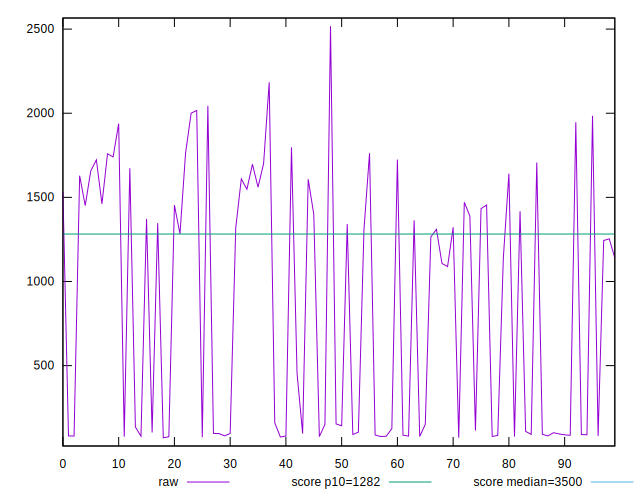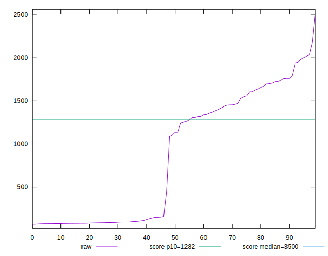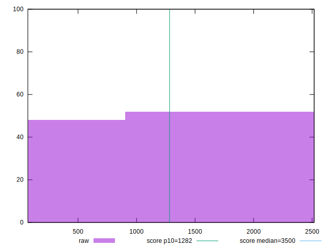
## Score


```yaml
p90min: 0.76
p90max: 1
p90range: 0.24
p90mean: 0.9237234042553192
median: 0.925
p90stdev: 0.08019900835797494
mad: 0.07499999999999996
stdevBySn: 0.09242649999999995
lfitCenter: 0.9283219612421908
lfitStdev: 0.08361616151670619
mfitCenter: 0.9283219612421908
mfitStdev: 0.10479731744239566
mfitConfidence: 0.010479731744239567
p90skewness: -0.41287123963988703
p90eccentricity: 1.0000000000000002
p90discretization: 5.875
outlandishness: 0.9913076966726304

```

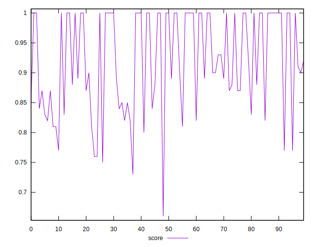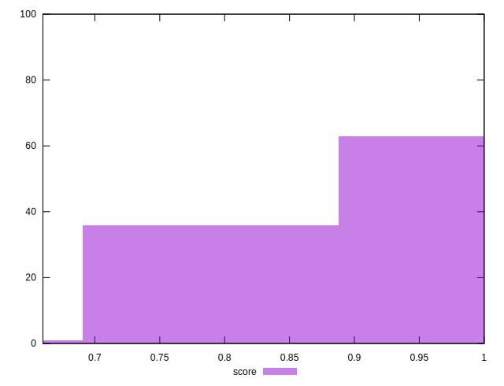
## Raw Estimate

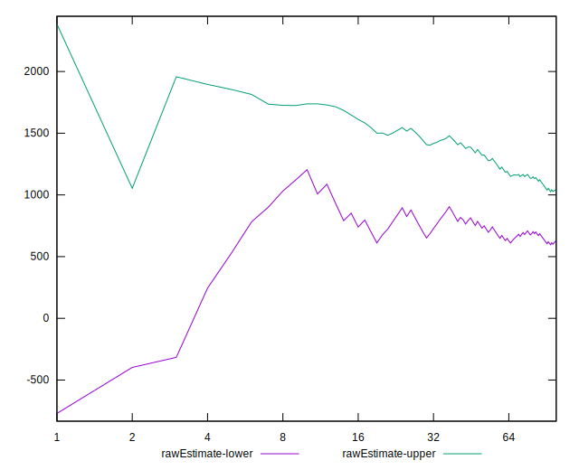
## Score Estimate

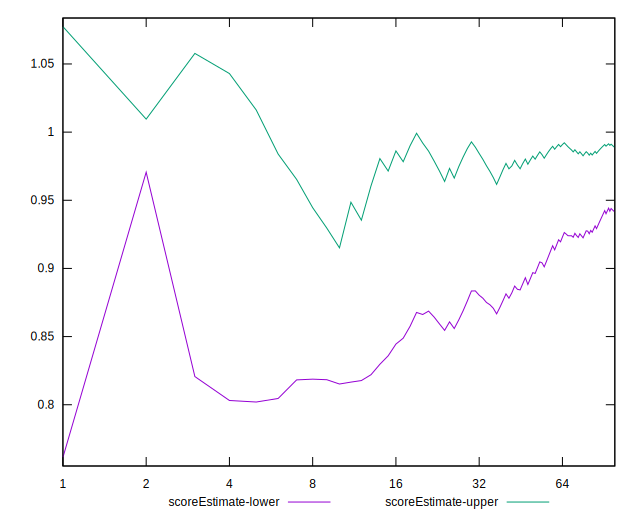
## P Score


```yaml
p90min: 0.7592071834018219
p90max: 0.9999994825785357
p90range: 0.24079229917671374
p90mean: 0.9236800152794893
median: 0.926523247151505
p90stdev: 0.08013316262111224
mad: 0.0734754228591799
stdevBySn: 0.08914688967446396
lfitCenter: 0.9283010678620869
lfitStdev: 0.08347959543221854
mfitCenter: 0.9283010678620869
mfitStdev: 0.10462615723785725
mfitConfidence: 0.010462615723785724
p90skewness: -0.40867745803327143
p90eccentricity: 0.9999999999999999
p90discretization: 1
outlandishness: 0.9913802890012912

```

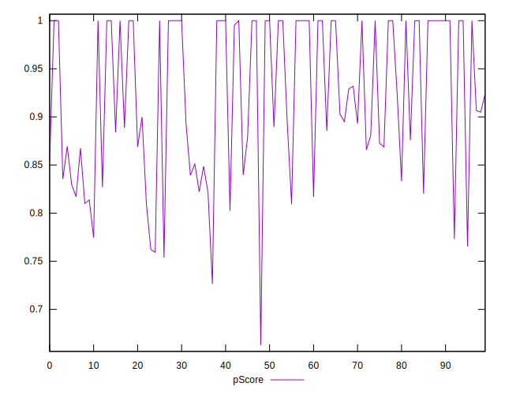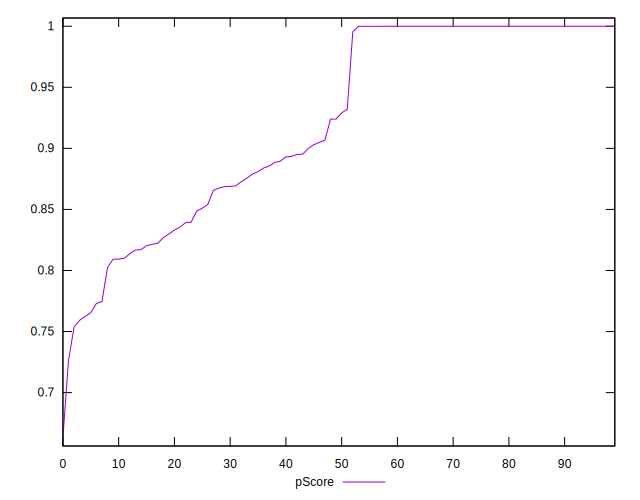
## Score Difference


```yaml
p90min: 0
p90max: 1.1102230246251565e-16
p90range: 1.1102230246251565e-16
p90mean: 5.9054416203465774e-18
median: 0
p90stdev: 2.4915085490873306e-17
mad: 0
stdevBySn: 0
lfitCenter: 4.545807909231485e-18
lfitStdev: 1.0928096704220885e-17
mfitCenter: 4.545807909231485e-18
mfitStdev: 1.3696338107132798e-17
mfitConfidence: 1.3696338107132797e-18
p90skewness: 3.981981890375808
p90eccentricity: 0.9999999999999967
p90discretization: 47
outlandishness: 2.262016

```

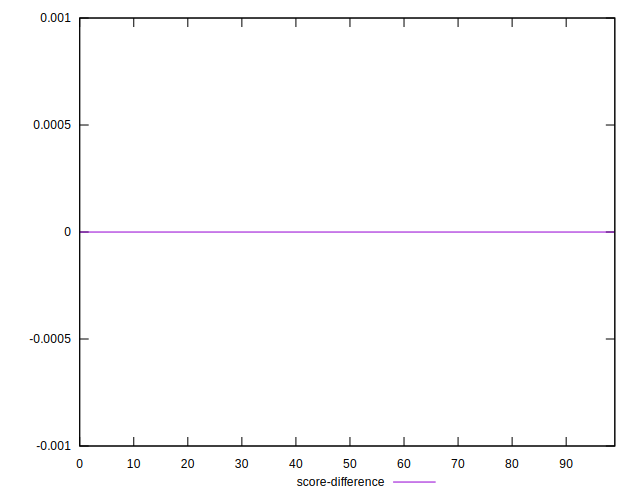
## P Score Difference


```yaml
p90min: -0.004547992198994155
p90max: 0.003974881607568537
p90range: 0.008522873806562692
p90mean: -0.000003428555885901495
median: -0.000001468107648949779
p90stdev: 0.0018845392709849675
mad: 0.0002300708951475383
stdevBySn: 0.0003745037965353085
lfitCenter: -0.000005702032309045926
lfitStdev: 0.0009999103879813542
mfitCenter: -0.000005702032309045926
mfitStdev: 0.001253201826566683
mfitConfidence: 0.0001253201826566683
p90skewness: -0.16861234889434865
p90eccentricity: 0.9999999999999999
p90discretization: 1
outlandishness: 7.722745478489731

```

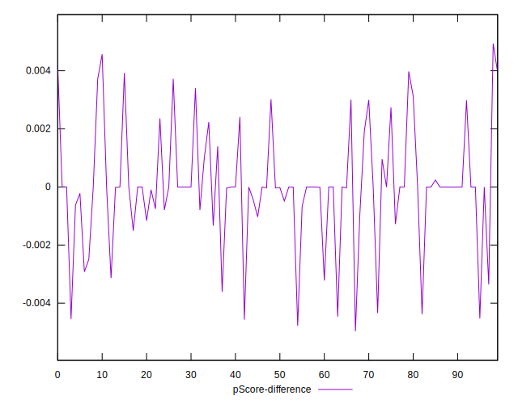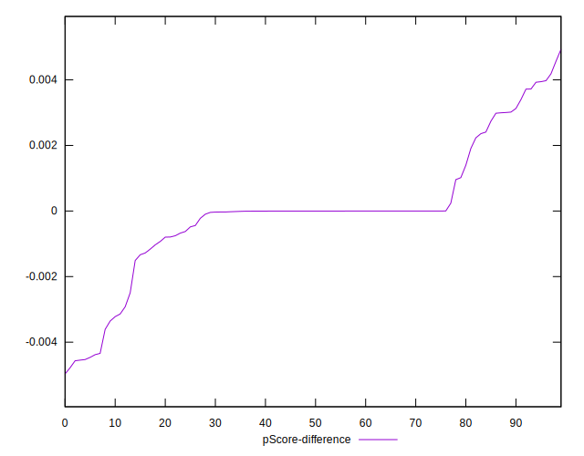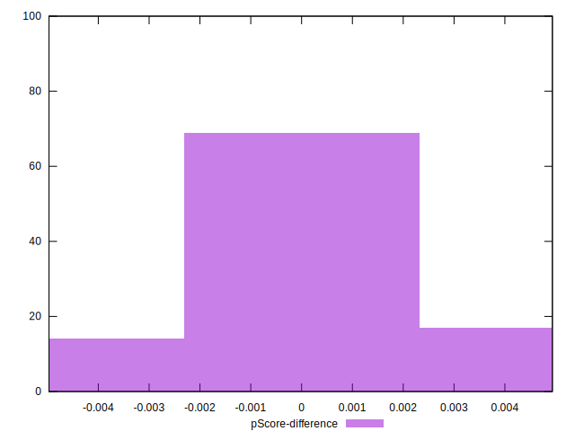