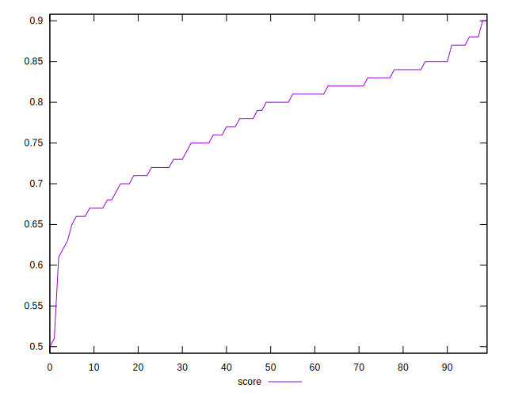

# //bootup-time/samples/astro

[→ Parent](../..)


## Raw


```yaml
p90min: 1386.7479999999996
p90max: 2758.319999999999
p90range: 1371.5719999999992
p90mean: 1929.0562127659562
median: 1822.8619999999994
p90stdev: 338.563484547671
mad: 243.27800000000025
stdevBySn: 351.4437161999997
lfitCenter: 1917.1138774078238
lfitStdev: 313.63114205232864
mfitCenter: 1917.1138774078238
mfitStdev: 393.0783446321215
mfitConfidence: 39.30783446321215
p90skewness: 0.5057546876144026
p90eccentricity: 0.9999999999999996
p90discretization: 1
outlandishness: 1.0216121598451071

```


## Score


```yaml
p90min: 0.62
p90max: 0.88
p90range: 0.26
p90mean: 0.7763829787234043
median: 0.8
p90stdev: 0.06536071863178507
mad: 0.04999999999999993
stdevBySn: 0.07155599999999994
lfitCenter: 0.7789210611945697
lfitStdev: 0.060266138323279164
mfitCenter: 0.7789210611945697
mfitStdev: 0.07553240323798115
mfitConfidence: 0.007553240323798114
p90skewness: -0.4973569840835072
p90eccentricity: 1.0000000000000002
p90discretization: 3.76
outlandishness: 0.9907913718763989

```


## Raw Estimate


## Score Estimate


## P Score


```yaml
p90min: 0.6193868071369977
p90max: 0.8812648079712274
p90range: 0.26187800083422974
p90mean: 0.7767205112767558
median: 0.797411657762406
p90stdev: 0.06576231240215147
mad: 0.04780971977783721
stdevBySn: 0.06812325850073417
lfitCenter: 0.7792356290718858
lfitStdev: 0.06086381388496603
mfitCenter: 0.7792356290718858
mfitStdev: 0.07628147846972502
mfitConfidence: 0.007628147846972503
p90skewness: -0.48699120510948335
p90eccentricity: 0.9999999999999997
p90discretization: 1
outlandishness: 0.9909601695706592

```


## Score Difference


```yaml
p90min: 0
p90max: 1.1102230246251565e-16
p90range: 1.1102230246251565e-16
p90mean: 1.8897413185109047e-17
median: 0
p90stdev: 4.172435856076856e-17
mad: 0
stdevBySn: 0
lfitCenter: 1.2691963892908624e-17
lfitStdev: 2.817708533426843e-17
mfitCenter: 1.2691963892908624e-17
mfitStdev: 3.531473943331906e-17
mfitConfidence: 3.531473943331906e-18
p90skewness: 1.7550294029241151
p90eccentricity: 0.9999999999999968
p90discretization: 47
outlandishness: 1.2460140625

```


## P Score Difference


```yaml
p90min: -0.004739784799687952
p90max: 0.0048009104587970475
p90range: 0.009540695258484999
p90mean: 0.000426519797927288
median: 0.0001557069170753378
p90stdev: 0.002717215156464622
mad: 0.0022790002189704284
stdevBySn: 0.0031999973551698523
lfitCenter: 0.00039761560856024157
lfitStdev: 0.0024658550491239188
mfitCenter: 0.00039761560856024157
mfitStdev: 0.003090490996747598
mfitConfidence: 0.0003090490996747598
p90skewness: -0.0502323600685665
p90eccentricity: 1.0000000000000002
p90discretization: 1
outlandishness: 0.8875788972575257

```

