# //bootup-time/samples/card

[→ Parent](../..)


## Raw


```yaml
p90min: 77.304
p90max: 1953.996
p90range: 1876.692
p90mean: 767.7713617021275
median: 185.21600000000004
p90stdev: 728.8953570912691
mad: 107.79000000000005
stdevBySn: 133.2277312000001
lfitCenter: 716.6162944847639
lfitStdev: 844.8883348400778
mfitCenter: 716.6162944847639
mfitStdev: 1058.9104955735424
mfitConfidence: 105.89104955735425
p90skewness: 0.2733685206704575
p90eccentricity: 1.0000000000000007
p90discretization: 1
outlandishness: 1.052361244114076

```

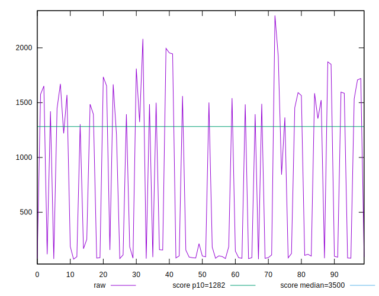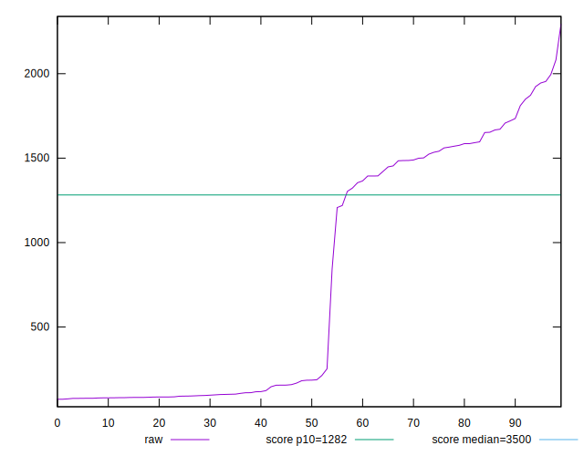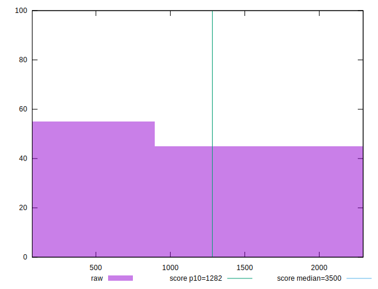
## Score


```yaml
p90min: 0.77
p90max: 1
p90range: 0.22999999999999998
p90mean: 0.9314893617021278
median: 1
p90stdev: 0.07919753712601563
mad: 0
stdevBySn: 0
lfitCenter: 0.9391604029127039
lfitStdev: 0.08807451163144878
mfitCenter: 0.9391604029127039
mfitStdev: 0.11038503067592732
mfitConfidence: 0.011038503067592732
p90skewness: -0.47900292622032
p90eccentricity: 0.9999999999999994
p90discretization: 5.529411764705882
outlandishness: 0.9918804139525234

```

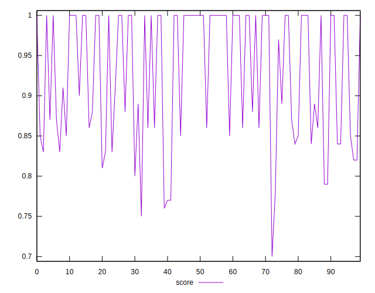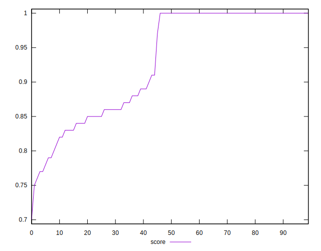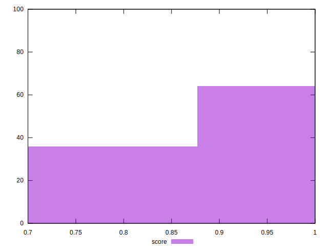
## Raw Estimate

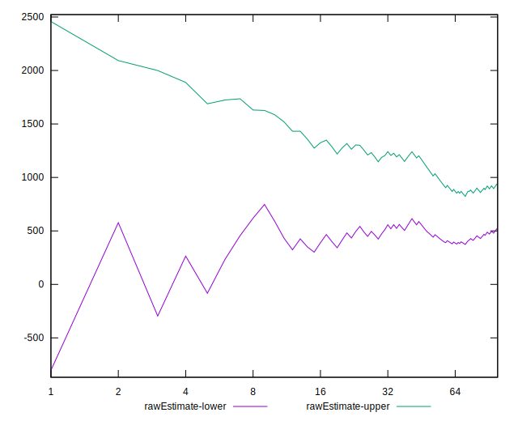
## Score Estimate

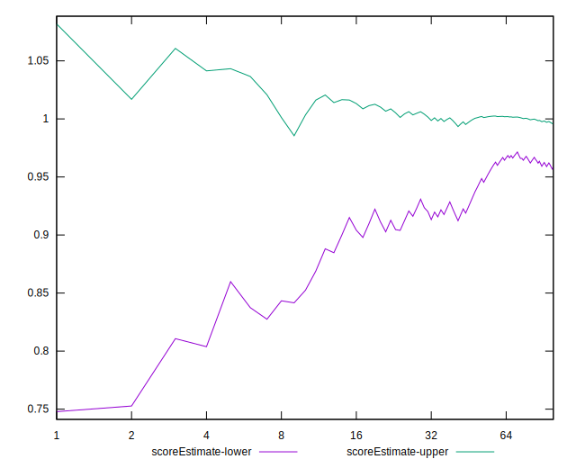
## P Score


```yaml
p90min: 0.7714922216418232
p90max: 0.9999994273365045
p90range: 0.2285072056946813
p90mean: 0.9315702282383689
median: 0.9999116218234354
p90stdev: 0.07897935867948754
mad: 0.00008796374422659348
stdevBySn: 0.0001052768902739849
lfitCenter: 0.9392011084503068
lfitStdev: 0.08777254385599223
mfitCenter: 0.9392011084503068
mfitStdev: 0.1100065701935531
mfitConfidence: 0.01100065701935531
p90skewness: -0.47689563785296085
p90eccentricity: 1.0000000000000004
p90discretization: 1
outlandishness: 0.9919696554217997

```

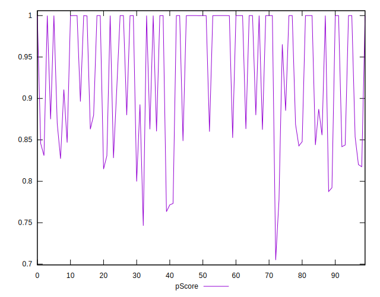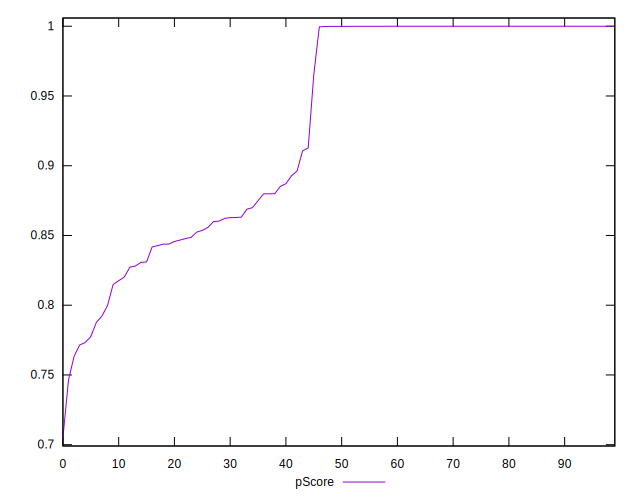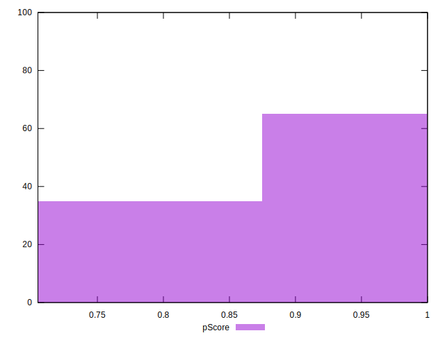
## Score Difference


```yaml
p90min: 0
p90max: 1.1102230246251565e-16
p90range: 1.1102230246251565e-16
p90mean: 4.724353296277262e-18
median: 0
p90stdev: 2.240957533134066e-17
mad: 0
stdevBySn: 0
lfitCenter: 3.922422896608463e-18
lfitStdev: 9.484689165475498e-18
mfitCenter: 3.922422896608463e-18
mfitStdev: 1.1887295031095097e-17
mfitConfidence: 1.1887295031095097e-18
p90skewness: 4.5325979795746685
p90eccentricity: 0.9999999999999987
p90discretization: 47
outlandishness: 2.706025000000001

```

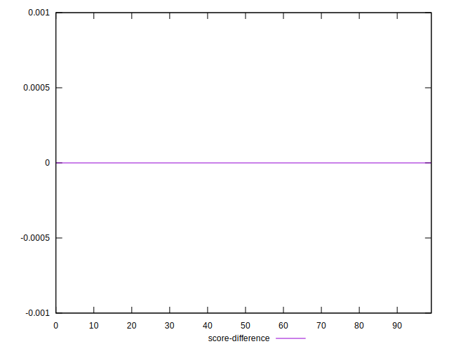
## P Score Difference


```yaml
p90min: -0.004262537785039711
p90max: 0.0038036321669752127
p90range: 0.008066169952014923
p90mean: 0.00012047907915530954
median: -0.000001626575417246201
p90stdev: 0.0015859334576172682
mad: 0.00008155454764219305
stdevBySn: 0.00010017306968384321
lfitCenter: 0.00008397403841579104
lfitStdev: 0.00088695288045677
mfitCenter: 0.00008397403841579104
mfitStdev: 0.0011116305853277446
mfitConfidence: 0.00011116305853277446
p90skewness: 0.011952026474286035
p90eccentricity: 1.0000000000000002
p90discretization: 1
outlandishness: 1.0300143774207837

```

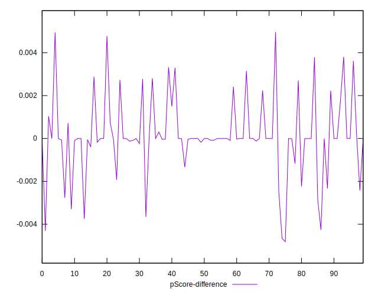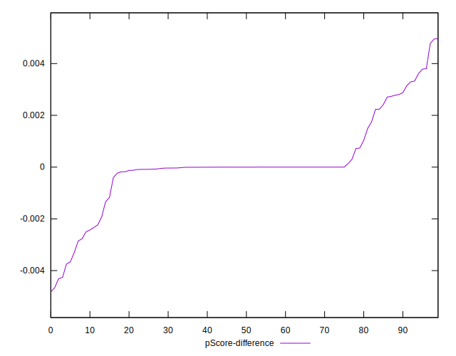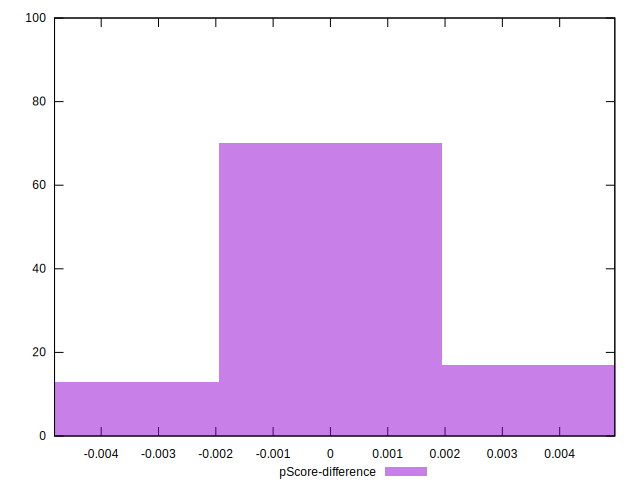