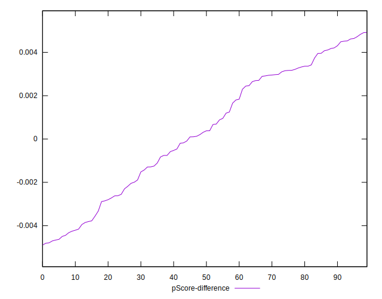

# //bootup-time/samples/music

[→ Parent](../..)


## Raw


```yaml
p90min: 1203.8999999999994
p90max: 2241.9439999999995
p90range: 1038.044
p90mean: 1647.3151914893613
median: 1631.1599999999985
p90stdev: 216.39295625031465
mad: 134.75000000000034
stdevBySn: 213.82363919999992
lfitCenter: 1640.908159945008
lfitStdev: 170.60239874821502
mfitCenter: 1640.908159945008
mfitStdev: 213.81839842622725
mfitConfidence: 21.381839842622725
p90skewness: 0.5117153631973602
p90eccentricity: 0.9999999999999999
p90discretization: 1
outlandishness: 0.9990173676879797

```


## Score


```yaml
p90min: 0.72
p90max: 0.91
p90range: 0.19000000000000006
p90mean: 0.8309574468085105
median: 0.835
p90stdev: 0.04177113807953927
mad: 0.025000000000000022
stdevBySn: 0.04174099999999997
lfitCenter: 0.832293238640995
lfitStdev: 0.03321504605800352
mfitCenter: 0.832293238640995
mfitStdev: 0.04162888683797004
mfitConfidence: 0.004162888683797003
p90skewness: -0.5946810238267192
p90eccentricity: 1.0000000000000007
p90discretization: 4.947368421052632
outlandishness: 0.9991398598574203

```


## Raw Estimate


## Score Estimate


## P Score


```yaml
p90min: 0.7151049709622728
p90max: 0.9133623879419104
p90range: 0.1982574169796376
p90mean: 0.8313129397594844
median: 0.8350210093421306
p90stdev: 0.041779632797608594
mad: 0.02612420555041578
stdevBySn: 0.04135727150918393
lfitCenter: 0.8325144565037047
lfitStdev: 0.032795312210858914
mfitCenter: 0.8325144565037047
mfitStdev: 0.04110282847290454
mfitConfidence: 0.004110282847290455
p90skewness: -0.5821494983957136
p90eccentricity: 0.9999999999999996
p90discretization: 1
outlandishness: 0.9991101801076361

```


## Score Difference


```yaml
p90min: 0
p90max: 1.1102230246251565e-16
p90range: 1.1102230246251565e-16
p90mean: 2.362176648138631e-17
median: 0
p90stdev: 4.5437375048458033e-17
mad: 0
stdevBySn: 0
lfitCenter: 1.635256425389315e-17
lfitStdev: 3.4952379347472356e-17
mfitCenter: 1.635256425389315e-17
mfitStdev: 4.3806311213081194e-17
mfitConfidence: 4.3806311213081194e-18
p90skewness: 1.4036631612571027
p90eccentricity: 1.000000000000002
p90discretization: 47
outlandishness: 1.168561

```


## P Score Difference


```yaml
p90min: -0.004703403650914928
p90max: 0.0047233292549979655
p90range: 0.009426732905912893
p90mean: 0.00036310717580232625
median: 0.00034442597773171046
p90stdev: 0.0029278190044646534
mad: 0.0028155730533476198
stdevBySn: 0.0036055504820678356
lfitCenter: 0.0004215851992779678
lfitStdev: 0.002657038456532334
mfitCenter: 0.0004215851992779678
mfitStdev: 0.003330103864313823
mfitConfidence: 0.0003330103864313823
p90skewness: -0.1880207451475775
p90eccentricity: 1
p90discretization: 1
outlandishness: 0.892305644181995

```

