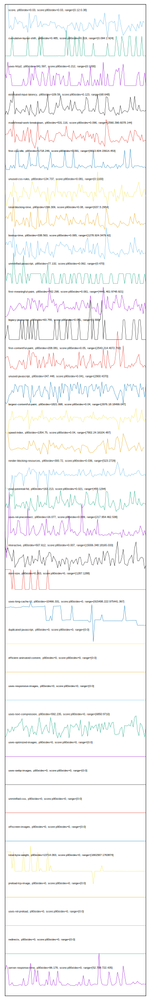

# //correlation/astro

[→ Parent](../..)

[0. score, p90stdev=0.03, score:p90stdev=0.03, range=[0.12:0.38]](../../meta/score/samples/astro)  
[1. cumulative-layout-shift, p90stdev=0.485, score:p90stdev=0.319, range=[0.094:1.924]](../../cumulative-layout-shift/samples/astro/)  
[2. uses-http2, p90stdev=341.597, score:p90stdev=0.212, range=[0:1330]](../../uses-http2/samples/astro/)  
[3. estimated-input-latency, p90stdev=109.59, score:p90stdev=0.123, range=[68:648]](../../estimated-input-latency/samples/astro/)  
[4. mainthread-work-breakdown, p90stdev=531.116, score:p90stdev=0.096, range=[2590.396:6078.144]](../../mainthread-work-breakdown/samples/astro/)  
[5. first-cpu-idle, p90stdev=1718.246, score:p90stdev=0.091, range=[6613.604:15614.453]](../../first-cpu-idle/samples/astro/)  
[6. unused-css-rules, p90stdev=134.737, score:p90stdev=0.081, range=[0:1100]](../../unused-css-rules/samples/astro/)  
[7. total-blocking-time, p90stdev=299.309, score:p90stdev=0.08, range=[637.5:2954]](../../total-blocking-time/samples/astro/)  
[8. bootup-time, p90stdev=338.563, score:p90stdev=0.065, range=[1278.924:3479.42]](../../bootup-time/samples/astro/)  
[9. unminified-javascript, p90stdev=77.132, score:p90stdev=0.062, range=[0:470]](../../unminified-javascript/samples/astro/)  
[10. first-meaningful-paint, p90stdev=762.298, score:p90stdev=0.061, range=[4441.461:9748.921]](../../first-meaningful-paint/samples/astro/)  
[11. legacy-javascript, p90stdev=63.755, score:p90stdev=0.051, range=[0:300]](../../legacy-javascript/samples/astro/)  
[12. first-contentful-paint, p90stdev=208.081, score:p90stdev=0.05, range=[2543.214:4072.702]](../../first-contentful-paint/samples/astro/)  
[13. unused-javascript, p90stdev=347.448, score:p90stdev=0.041, range=[2900:4370]](../../unused-javascript/samples/astro/)  
[14. largest-contentful-paint, p90stdev=1821.998, score:p90stdev=0.04, range=[2976.18:18499.047]](../../largest-contentful-paint/samples/astro/)  
[15. speed-index, p90stdev=1354.75, score:p90stdev=0.04, range=[7902.24:16104.487]](../../speed-index/samples/astro/)  
[16. render-blocking-resources, p90stdev=300.72, score:p90stdev=0.036, range=[523:2729]](../../render-blocking-resources/samples/astro/)  
[17. max-potential-fid, p90stdev=163.213, score:p90stdev=0.021, range=[455:1294]](../../max-potential-fid/samples/astro/)  
[18. uses-rel-preconnect, p90stdev=16.077, score:p90stdev=0.009, range=[217.954:462.538]](../../uses-rel-preconnect/samples/astro/)  
[19. interactive, p90stdev=507.612, score:p90stdev=0.007, range=[15006.348:18165.033]](../../interactive/samples/astro/)  
[20. dom-size, p90stdev=0.263, score:p90stdev=0, range=[1287:1288]](../../dom-size/samples/astro/)  
[21. uses-long-cache-ttl, p90stdev=10466.331, score:p90stdev=0, range=[915498.222:975441.367]](../../uses-long-cache-ttl/samples/astro/)  
[22. uses-passive-event-listeners, p90stdev=NaN, score:p90stdev=0, range=[NaN:NaN]](../../uses-passive-event-listeners/samples/astro/)  
[23. no-document-write, p90stdev=NaN, score:p90stdev=0, range=[NaN:NaN]](../../no-document-write/samples/astro/)  
[24. duplicated-javascript, p90stdev=0, score:p90stdev=0, range=[0:0]](../../duplicated-javascript/samples/astro/)  
[25. efficient-animated-content, p90stdev=0, score:p90stdev=0, range=[0:0]](../../efficient-animated-content/samples/astro/)  
[26. uses-responsive-images, p90stdev=0, score:p90stdev=0, range=[0:0]](../../uses-responsive-images/samples/astro/)  
[27. uses-text-compression, p90stdev=592.235, score:p90stdev=0, range=[6850:9710]](../../uses-text-compression/samples/astro/)  
[28. uses-optimized-images, p90stdev=0, score:p90stdev=0, range=[0:0]](../../uses-optimized-images/samples/astro/)  
[29. uses-webp-images, p90stdev=0, score:p90stdev=0, range=[0:0]](../../uses-webp-images/samples/astro/)  
[30. unminified-css, p90stdev=0, score:p90stdev=0, range=[0:0]](../../unminified-css/samples/astro/)  
[31. offscreen-images, p90stdev=0, score:p90stdev=0, range=[0:0]](../../offscreen-images/samples/astro/)  
[32. total-byte-weight, p90stdev=13714.063, score:p90stdev=0, range=[1661567:1763874]](../../total-byte-weight/samples/astro/)  
[33. preload-lcp-image, p90stdev=0, score:p90stdev=0, range=[0:0]](../../preload-lcp-image/samples/astro/)  
[34. unsized-images, p90stdev=NaN, score:p90stdev=0, range=[NaN:NaN]](../../unsized-images/samples/astro/)  
[35. third-party-summary, p90stdev=NaN, score:p90stdev=0, range=[NaN:NaN]](../../third-party-summary/samples/astro/)  
[36. font-display, p90stdev=NaN, score:p90stdev=0, range=[NaN:NaN]](../../font-display/samples/astro/)  
[37. uses-rel-preload, p90stdev=0, score:p90stdev=0, range=[0:0]](../../uses-rel-preload/samples/astro/)  
[38. redirects, p90stdev=0, score:p90stdev=0, range=[0:0]](../../redirects/samples/astro/)  
[39. server-response-time, p90stdev=96.178, score:p90stdev=0, range=[52.708:722.435]](../../server-response-time/samples/astro/)  
[40. timing-budget, p90stdev=NaN, score:p90stdev=NaN, range=[NaN:NaN]](../../timing-budget/samples/astro/)  
[41. metrics, p90stdev=NaN, score:p90stdev=NaN, range=[NaN:NaN]](../../metrics/samples/astro/)  
[42. screenshot-thumbnails, p90stdev=NaN, score:p90stdev=NaN, range=[NaN:NaN]](../../screenshot-thumbnails/samples/astro/)  
