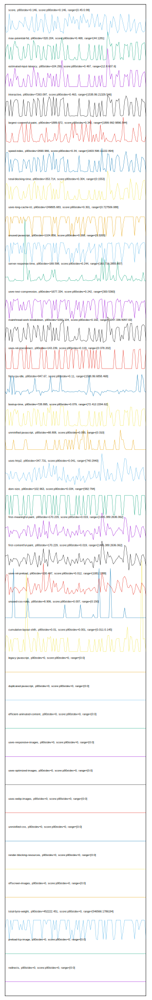

# //correlation/card

[→ Parent](../..)

[0. score, p90stdev=0.146, score:p90stdev=0.146, range=[0.45:0.99]](../../meta/score/samples/card)  
[1. third-party-summary, p90stdev=NaN, score:p90stdev=0.5, range=[NaN:NaN]](../../third-party-summary/samples/card/)  
[2. max-potential-fid, p90stdev=320.204, score:p90stdev=0.468, range=[44:1281]](../../max-potential-fid/samples/card/)  
[3. estimated-input-latency, p90stdev=104.293, score:p90stdev=0.467, range=[12.8:637.6]](../../estimated-input-latency/samples/card/)  
[4. interactive, p90stdev=7263.097, score:p90stdev=0.463, range=[1538.86:21329.546]](../../interactive/samples/card/)  
[5. largest-contentful-paint, p90stdev=1889.872, score:p90stdev=0.342, range=[1899.992:9896.544]](../../largest-contentful-paint/samples/card/)  
[6. speed-index, p90stdev=2690.966, score:p90stdev=0.34, range=[1603.596:11222.894]](../../speed-index/samples/card/)  
[7. total-blocking-time, p90stdev=353.714, score:p90stdev=0.304, range=[0:1553]](../../total-blocking-time/samples/card/)  
[8. uses-long-cache-ttl, p90stdev=249805.683, score:p90stdev=0.301, range=[0:727509.088]](../../uses-long-cache-ttl/samples/card/)  
[9. unused-javascript, p90stdev=1104.856, score:p90stdev=0.268, range=[0:3200]](../../unused-javascript/samples/card/)  
[10. server-response-time, p90stdev=169.598, score:p90stdev=0.244, range=[163.716:2893.657]](../../server-response-time/samples/card/)  
[11. uses-text-compression, p90stdev=1677.334, score:p90stdev=0.242, range=[300:5360]](../../uses-text-compression/samples/card/)  
[12. mainthread-work-breakdown, p90stdev=1091.104, score:p90stdev=0.192, range=[1047.336:5057.02]](../../mainthread-work-breakdown/samples/card/)  
[13. uses-rel-preconnect, p90stdev=143.239, score:p90stdev=0.119, range=[0:378.202]](../../uses-rel-preconnect/samples/card/)  
[14. first-cpu-idle, p90stdev=947.67, score:p90stdev=0.11, range=[1538.86:6858.468]](../../first-cpu-idle/samples/card/)  
[15. bootup-time, p90stdev=728.895, score:p90stdev=0.079, range=[72.412:2294.62]](../../bootup-time/samples/card/)  
[16. unminified-javascript, p90stdev=68.808, score:p90stdev=0.055, range=[0:310]](../../unminified-javascript/samples/card/)  
[17. uses-http2, p90stdev=347.731, score:p90stdev=0.041, range=[740:2940]](../../uses-http2/samples/card/)  
[18. dom-size, p90stdev=102.963, score:p90stdev=0.034, range=[582:794]](../../dom-size/samples/card/)  
[19. first-meaningful-paint, p90stdev=170.229, score:p90stdev=0.019, range=[1445.389:2636.062]](../../first-meaningful-paint/samples/card/)  
[20. first-contentful-paint, p90stdev=170.229, score:p90stdev=0.019, range=[1445.389:2636.062]](../../first-contentful-paint/samples/card/)  
[21. uses-rel-preload, p90stdev=100.497, score:p90stdev=0.012, range=[1081:1788]](../../uses-rel-preload/samples/card/)  
[22. unused-css-rules, p90stdev=8.906, score:p90stdev=0.007, range=[0:150]](../../unused-css-rules/samples/card/)  
[23. cumulative-layout-shift, p90stdev=0.01, score:p90stdev=0.001, range=[0.011:0.145]](../../cumulative-layout-shift/samples/card/)  
[24. uses-passive-event-listeners, p90stdev=NaN, score:p90stdev=0, range=[NaN:NaN]](../../uses-passive-event-listeners/samples/card/)  
[25. no-document-write, p90stdev=NaN, score:p90stdev=0, range=[NaN:NaN]](../../no-document-write/samples/card/)  
[26. legacy-javascript, p90stdev=0, score:p90stdev=0, range=[0:0]](../../legacy-javascript/samples/card/)  
[27. duplicated-javascript, p90stdev=0, score:p90stdev=0, range=[0:0]](../../duplicated-javascript/samples/card/)  
[28. efficient-animated-content, p90stdev=0, score:p90stdev=0, range=[0:0]](../../efficient-animated-content/samples/card/)  
[29. uses-responsive-images, p90stdev=0, score:p90stdev=0, range=[0:0]](../../uses-responsive-images/samples/card/)  
[30. uses-optimized-images, p90stdev=0, score:p90stdev=0, range=[0:0]](../../uses-optimized-images/samples/card/)  
[31. uses-webp-images, p90stdev=0, score:p90stdev=0, range=[0:0]](../../uses-webp-images/samples/card/)  
[32. unminified-css, p90stdev=0, score:p90stdev=0, range=[0:0]](../../unminified-css/samples/card/)  
[33. render-blocking-resources, p90stdev=0, score:p90stdev=0, range=[0:0]](../../render-blocking-resources/samples/card/)  
[34. offscreen-images, p90stdev=0, score:p90stdev=0, range=[0:0]](../../offscreen-images/samples/card/)  
[35. total-byte-weight, p90stdev=452222.451, score:p90stdev=0, range=[546566:1786194]](../../total-byte-weight/samples/card/)  
[36. preload-lcp-image, p90stdev=0, score:p90stdev=0, range=[0:0]](../../preload-lcp-image/samples/card/)  
[37. unsized-images, p90stdev=NaN, score:p90stdev=0, range=[NaN:NaN]](../../unsized-images/samples/card/)  
[38. font-display, p90stdev=NaN, score:p90stdev=0, range=[NaN:NaN]](../../font-display/samples/card/)  
[39. redirects, p90stdev=0, score:p90stdev=0, range=[0:0]](../../redirects/samples/card/)  
