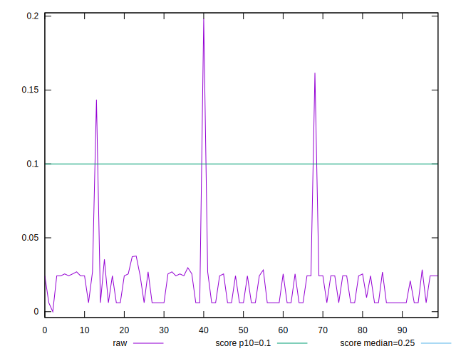

# //cumulative-layout-shift/samples/agenda

[→ Parent](../..)


## Raw


```yaml
p90min: 0.006063152419196235
p90max: 0.037679363356696235
p90range: 0.0316162109375
p90mean: 0.01679949878237209
median: 0.024251628981696235
p90stdev: 0.010053773428663435
mad: 0.013206787109375
stdevBySn: 0.017531497412787547
lfitCenter: 0.018929669004634258
lfitStdev: 0.013820496130514644
mfitCenter: 0.018929669004634258
mfitStdev: 0.017321423202517724
mfitConfidence: 0.0017321423202517725
p90skewness: 0.0192368079886157
p90eccentricity: 1.0000000000000004
p90discretization: 5.875
outlandishness: 1.5547896632139708

```


## Score


```yaml
p90min: 1
p90max: 1
p90range: 0
p90mean: 1
median: 1
p90stdev: 0
mad: 0
stdevBySn: 0
lfitCenter: 0.9959090160999988
lfitStdev: 0.010107559357071106
mfitCenter: 0.9959090160999988
mfitStdev: 0.012667947048719812
mfitConfidence: 0.0012667947048719812
p90skewness: .nan
p90eccentricity: .nan
p90discretization: 94
outlandishness: 0.9828739600000002

```


## Raw Estimate


## Score Estimate


## P Score


```yaml
p90min: 0.9959358257940262
p90max: 0.9999999011422622
p90range: 0.004064075348236051
p90mean: 0.9995392279193357
median: 0.9994486861417509
p90stdev: 0.0006927738620662211
mad: 0.0005512150005113625
stdevBySn: 0.000657379009609851
lfitCenter: 0.9955065942283442
lfitStdev: 0.010124742945651358
mfitCenter: 0.9955065942283442
mfitStdev: 0.012689483483238926
mfitConfidence: 0.0012689483483238925
p90skewness: -3.3277213590712154
p90eccentricity: 0.9999999999999991
p90discretization: 5.875
outlandishness: 0.9828663412052414

```


## Score Difference


```yaml
p90min: 0
p90max: 0
p90range: 0
p90mean: 0
median: 0
p90stdev: 0
mad: 0
stdevBySn: 0
lfitCenter: 0
lfitStdev: 0
mfitCenter: 0
mfitStdev: 0
mfitConfidence: 0
p90skewness: .nan
p90eccentricity: .nan
p90discretization: 94
outlandishness: .nan

```


## P Score Difference


```yaml
p90min: -0.002928604422192338
p90max: -9.885773777362772e-8
p90range: 0.0029285055644545643
p90mean: -0.00038558271912119183
median: -0.0005513138582491361
p90stdev: 0.00045497502293524386
mad: 0.0005512150005113625
stdevBySn: 0.000657379009609851
lfitCenter: -0.0003923174933388727
lfitStdev: 0.0004601711993008478
mfitCenter: -0.0003923174933388727
mfitStdev: 0.0005767390702495206
mfitConfidence: 0.000057673907024952055
p90skewness: -2.0157637396025265
p90eccentricity: 1.0000000000000024
p90discretization: 6.266666666666667
outlandishness: 1.4272736702243036

```

