# //cumulative-layout-shift/samples/astro

[→ Parent](../..)


## Raw


```yaml
p90min: 0.11342529296875001
p90max: 1.5089617156982422
p90range: 1.3955364227294922
p90mean: 0.33186433868768944
median: 0.11494140625
p90stdev: 0.48510236847487403
mad: 0.001516113281249995
stdevBySn: 0.0018081166992187441
lfitCenter: 0.2624086977507022
lfitStdev: 0.325950652811059
mfitCenter: 0.2624086977507022
mfitStdev: 0.4085185616463853
mfitConfidence: 0.04085185616463853
p90skewness: 1.8635303475749796
p90eccentricity: 1.0000000000000002
p90discretization: 2.5405405405405403
outlandishness: 1.2076297621766634

```

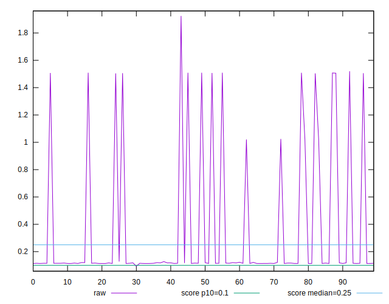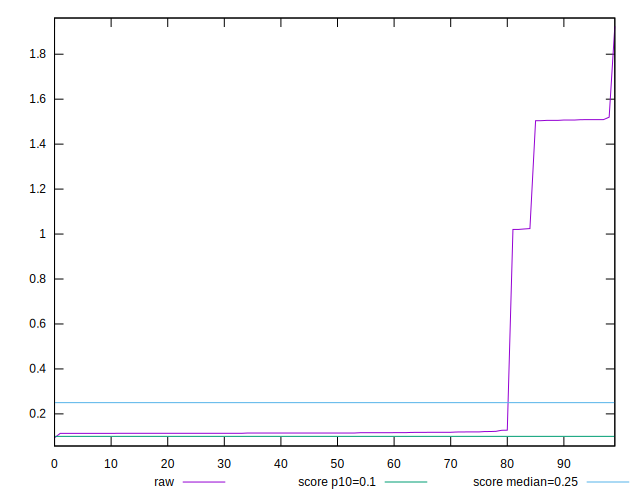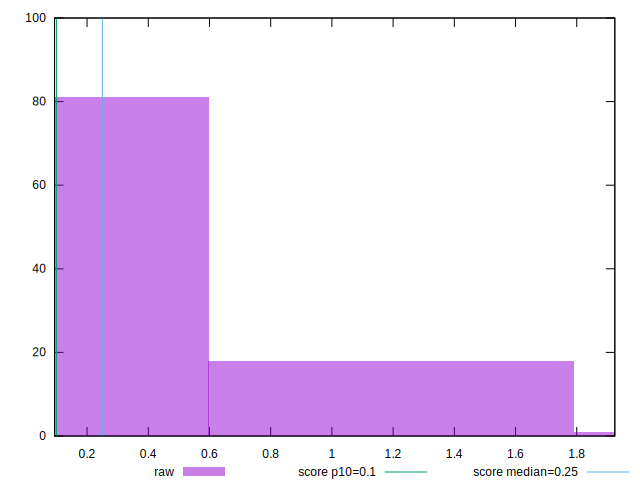
## Score


```yaml
p90min: 0.01
p90max: 0.87
p90range: 0.86
p90mean: 0.7163829787234042
median: 0.86
p90stdev: 0.31892389228776546
mad: 0.010000000000000009
stdevBySn: 0.011926000000000011
lfitCenter: 0.763451302951246
lfitStdev: 0.21528600707017617
mfitCenter: 0.763451302951246
mfitStdev: 0.2698209964987619
mfitConfidence: 0.02698209964987619
p90skewness: -1.7521102576656993
p90eccentricity: 1.0000000000000002
p90discretization: 13.428571428571429
outlandishness: 0.9550577616533363

```

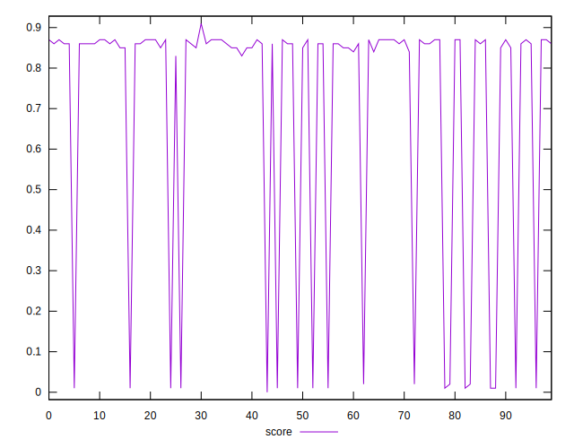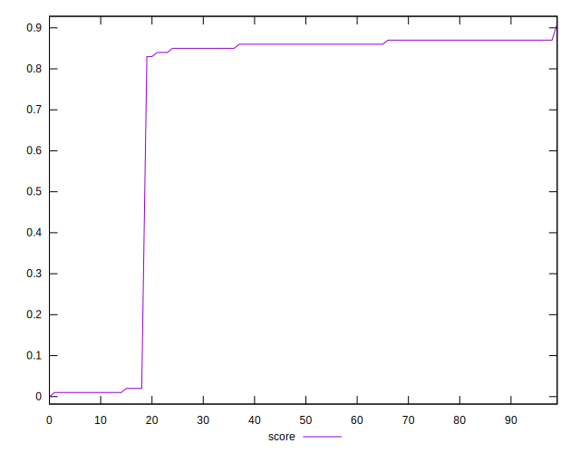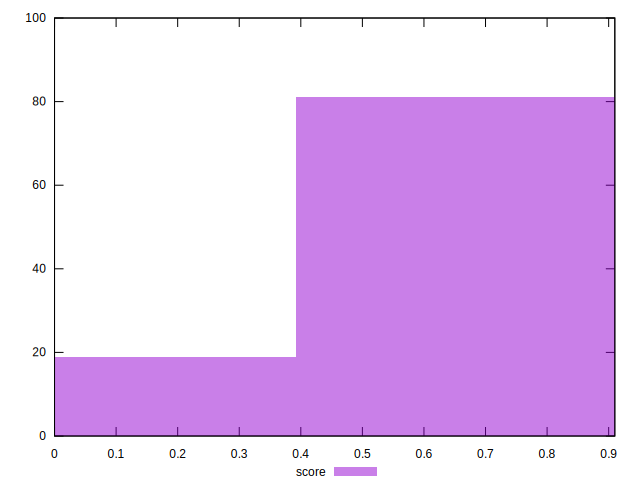
## Raw Estimate

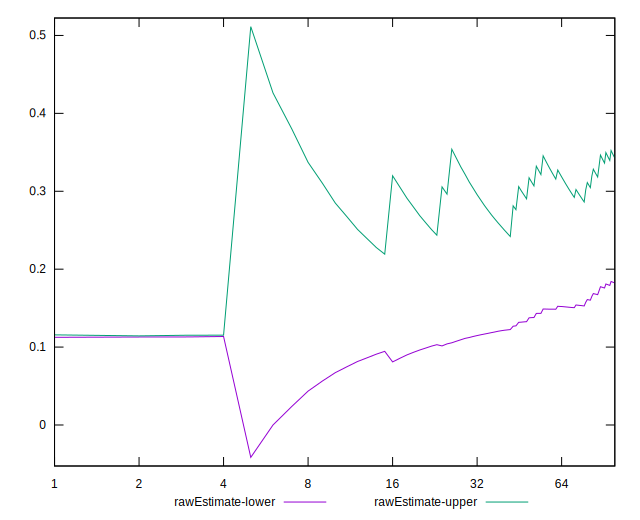
## Score Estimate

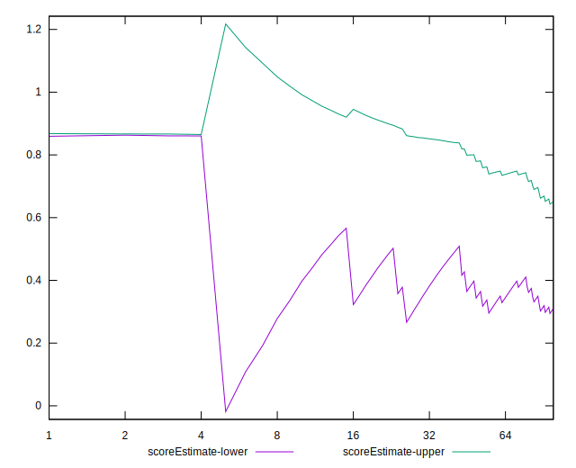
## P Score


```yaml
p90min: 0.0059627964056422345
p90max: 0.8654981956894828
p90range: 0.8595353992838406
p90mean: 0.714897950236204
median: 0.8614349555156592
p90stdev: 0.3190802801857225
mad: 0.004063240173823646
stdevBySn: 0.004845820231302081
lfitCenter: 0.7625711230231919
lfitStdev: 0.21548902117382962
mfitCenter: 0.7625711230231919
mfitStdev: 0.2700754369452012
mfitConfidence: 0.02700754369452012
p90skewness: -1.75339216775853
p90eccentricity: 0.9999999999999994
p90discretization: 2.5405405405405403
outlandishness: 0.9549341252993212

```

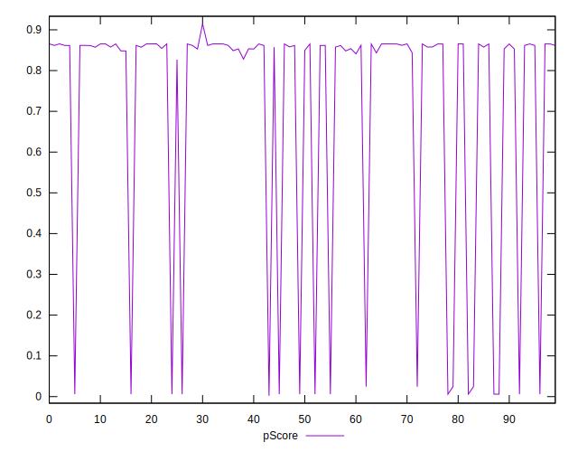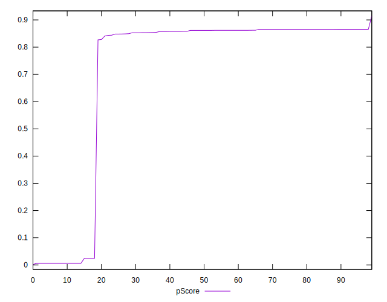
## Score Difference


```yaml
p90min: 0
p90max: 0
p90range: 0
p90mean: 0
median: 0
p90stdev: 0
mad: 0
stdevBySn: 0
lfitCenter: 1.0470608452365924e-18
lfitStdev: 2.5998395675404994e-18
mfitCenter: 1.0470608452365924e-18
mfitStdev: 3.2584156880294808e-18
mfitConfidence: 3.258415688029481e-19
p90skewness: .nan
p90eccentricity: .nan
p90discretization: 94
outlandishness: .inf

```

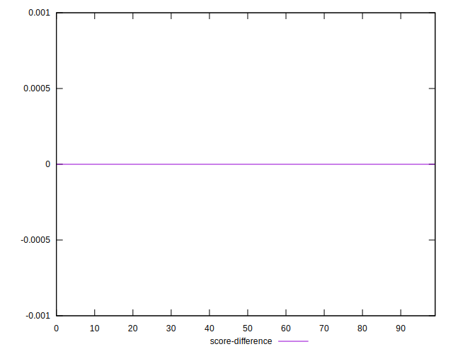
## P Score Difference


```yaml
p90min: -0.004658299055735227
p90max: 0.004409187807626298
p90range: 0.009067486863361524
p90mean: -0.0015931136448775602
median: -0.0027289667531306128
p90stdev: 0.0031234043710595015
mad: 0.0019293323026046139
stdevBySn: 0.002300921704086263
lfitCenter: -0.0018391947549677833
lfitStdev: 0.0030807968443502913
mfitCenter: -0.0018391947549677833
mfitStdev: 0.0038612062431065105
mfitConfidence: 0.000386120624310651
p90skewness: 0.49470642550171573
p90eccentricity: 1.0000000000000002
p90discretization: 2.41025641025641
outlandishness: 0.8823859009024466

```

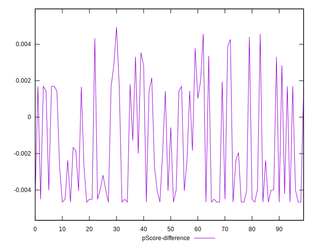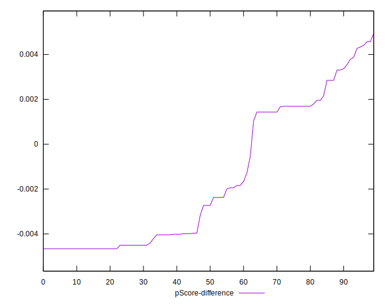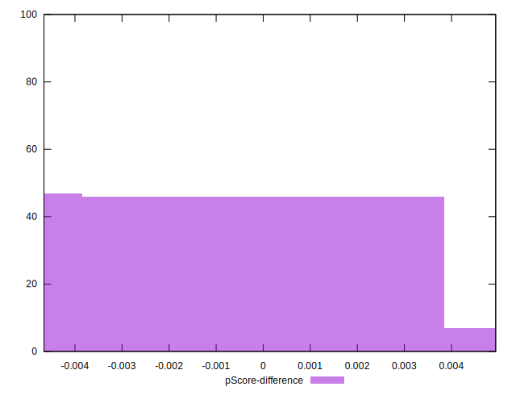