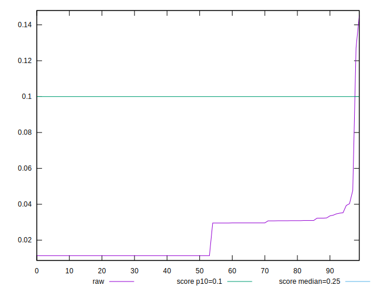
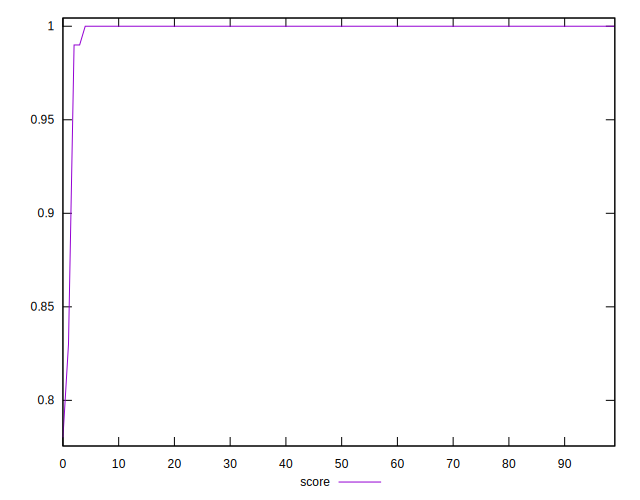

# //cumulative-layout-shift/samples/card

[→ Parent](../..)


## Raw


```yaml
p90min: 0.011352840529547797
p90max: 0.040315242873297796
p90range: 0.02896240234375
p90mean: 0.02048795937928182
median: 0.011352840529547797
p90stdev: 0.010084522141254817
mad: 0
stdevBySn: 0
lfitCenter: 0.020766671976741504
lfitStdev: 0.013432899163418527
mfitCenter: 0.020766671976741504
mfitStdev: 0.016835642443586735
mfitConfidence: 0.0016835642443586735
p90skewness: 0.264067603443704
p90eccentricity: 0.9999999999999991
p90discretization: 5.222222222222222
outlandishness: 1.2383954715014638

```


## Score


```yaml
p90min: 0.99
p90max: 1
p90range: 0.010000000000000009
p90mean: 0.9998936170212765
median: 1
p90stdev: 0.0010259202937226563
mad: 0
stdevBySn: 0
lfitCenter: 0.9980645986225737
lfitStdev: 0.004757338428941628
mfitCenter: 0.9980645986225737
mfitStdev: 0.0059624395149865134
mfitConfidence: 0.0005962439514986513
p90skewness: -9.53995559151974
p90eccentricity: 0.9999999999999949
p90discretization: 47
outlandishness: 0.9920278685321472

```


## Raw Estimate


## Score Estimate


## P Score


```yaml
p90min: 0.994646548985289
p90max: 0.9999923522960321
p90range: 0.00534580331074308
p90mean: 0.9991188126280716
median: 0.9999923522960321
p90stdev: 0.001104279300764247
mad: 0
stdevBySn: 0
lfitCenter: 0.9973608040028902
lfitStdev: 0.0047789797226855295
mfitCenter: 0.9973608040028902
mfitStdev: 0.005989562854412836
mfitConfidence: 0.0005989562854412836
p90skewness: -1.3682650411941024
p90eccentricity: 0.9999999999999987
p90discretization: 5.222222222222222
outlandishness: 0.9919920028079564

```


## Score Difference


```yaml
p90min: 0
p90max: 0
p90range: 0
p90mean: 0
median: 0
p90stdev: 0
mad: 0
stdevBySn: 0
lfitCenter: 5.166535369026208e-19
lfitStdev: 1.2890316797319448e-18
mfitCenter: 5.166535369026208e-19
mfitStdev: 1.6155616292812394e-18
mfitConfidence: 1.6155616292812395e-19
p90skewness: .nan
p90eccentricity: .nan
p90discretization: 94
outlandishness: .inf

```


## P Score Difference


```yaml
p90min: -0.002998058766915279
p90max: -0.000007647703967883501
p90range: 0.0029904110629473957
p90mean: -0.0007630610071180708
median: -0.000007647703967883501
p90stdev: 0.0008938320257551823
mad: 0
stdevBySn: 0
lfitCenter: -0.0006694103871672577
lfitStdev: 0.0010431343848874984
mfitCenter: -0.0006694103871672577
mfitStdev: 0.0013073750730149465
mfitConfidence: 0.00013073750730149464
p90skewness: -0.5667814847953757
p90eccentricity: 1.0000000000000004
p90discretization: 5.529411764705882
outlandishness: 1.0710370698350797

```

