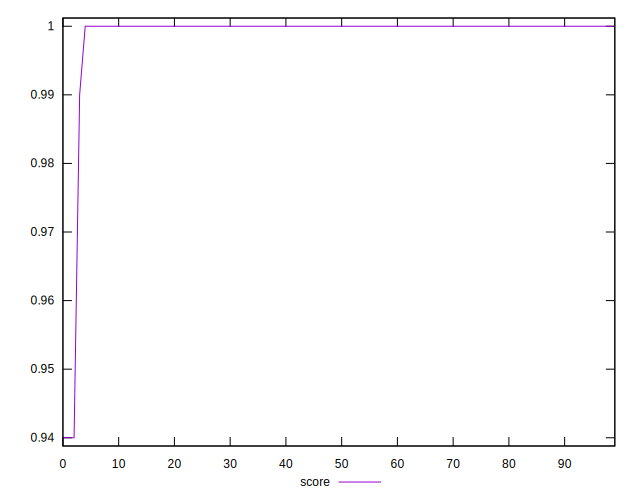
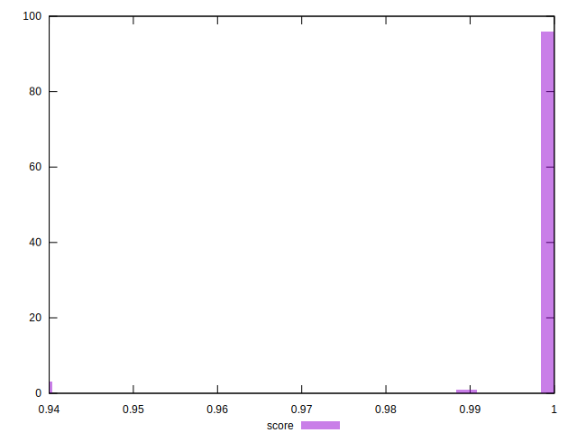

# //cumulative-layout-shift/samples/music

[→ Parent](../..)


## Raw


```yaml
p90min: 0.024215007887946234
p90max: 0.04338492976294624
p90range: 0.019169921875000002
p90mean: 0.025779168390495006
median: 0.024310222731696238
p90stdev: 0.002909818972513102
mad: 0.0006286621093750024
stdevBySn: 0.0011311647949218797
lfitCenter: 0.025983870344672783
lfitStdev: 0.00301337707322396
mfitCenter: 0.025983870344672783
mfitStdev: 0.0037767080907342787
mfitConfidence: 0.00037767080907342786
p90skewness: 3.8203585926128087
p90eccentricity: 1.0000000000000007
p90discretization: 3.9166666666666665
outlandishness: 1.0976464015600107

```


## Score


```yaml
p90min: 0.99
p90max: 1
p90range: 0.010000000000000009
p90mean: 0.9998936170212765
median: 1
p90stdev: 0.0010259202937226563
mad: 0
stdevBySn: 0
lfitCenter: 0.9990894184235138
lfitStdev: 0.00223826684068223
mfitCenter: 0.9990894184235138
mfitStdev: 0.0028052514773343027
mfitConfidence: 0.00028052514773343025
p90skewness: -9.53995559152008
p90eccentricity: 0.9999999999999982
p90discretization: 47
outlandishness: 0.9964156020428111

```


## Raw Estimate


## Score Estimate


## P Score


```yaml
p90min: 0.992847035407938
p90max: 0.9994527833197606
p90range: 0.006605747911822668
p90mean: 0.999159540758363
median: 0.9994420846479737
p90stdev: 0.0008377900184067743
mad: 0.00007686675283508082
stdevBySn: 0.0001382535958927343
lfitCenter: 0.9984685354522258
lfitStdev: 0.002108785347809503
mfitCenter: 0.9984685354522258
mfitStdev: 0.002642970491632904
mfitConfidence: 0.0002642970491632904
p90skewness: -5.680066786617923
p90eccentricity: 1.0000000000000002
p90discretization: 3.9166666666666665
outlandishness: 0.9967093356651148

```


## Score Difference


```yaml
p90min: 0
p90max: 0
p90range: 0
p90mean: 0
median: 0
p90stdev: 0
mad: 0
stdevBySn: 0
lfitCenter: 1.5916911634687915e-18
lfitStdev: 3.932577909407442e-18
mfitCenter: 1.5916911634687915e-18
mfitStdev: 4.928755494914505e-18
mfitConfidence: 4.928755494914504e-19
p90skewness: .nan
p90eccentricity: .nan
p90discretization: 94
outlandishness: .inf

```


## P Score Difference


```yaml
p90min: -0.001414706984852132
p90max: 0.0019194785917668877
p90range: 0.00333418557661902
p90mean: -0.0006452295599977587
median: -0.0005579153520263169
p90stdev: 0.0003415432476720408
mad: 0.00007686675283508082
stdevBySn: 0.0001382535958927343
lfitCenter: -0.0006055570056104352
lfitStdev: 0.00028328903405676814
mfitCenter: -0.0006055570056104352
mfitStdev: 0.00035505015168706627
mfitConfidence: 0.00003550501516870663
p90skewness: 4.241053118067253
p90eccentricity: 0.9999999999999983
p90discretization: 4.2727272727272725
outlandishness: 0.8241678990369131

```

