# //dom-size/samples/agenda

[→ Parent](../..)


## Raw


```yaml
p90min: 569
p90max: 781
p90range: 212
p90mean: 699.8085106382979
median: 781
p90stdev: 103.05599351764772
mad: 0
stdevBySn: 0
lfitCenter: 712.1326280490133
lfitStdev: 116.54837677569898
mfitCenter: 712.1326280490133
mfitStdev: 146.07172844114064
mfitConfidence: 14.607172844114064
p90skewness: -0.48145692048565164
p90eccentricity: 1.0000000000000007
p90discretization: 47
outlandishness: 0.9957504729778079

```

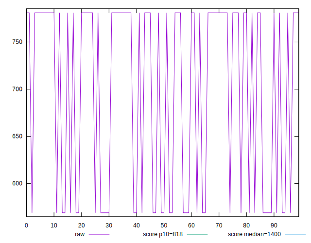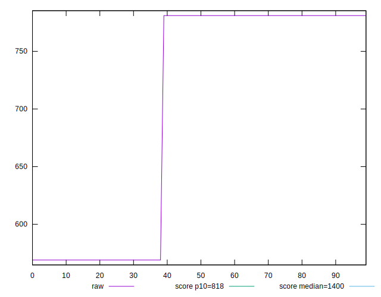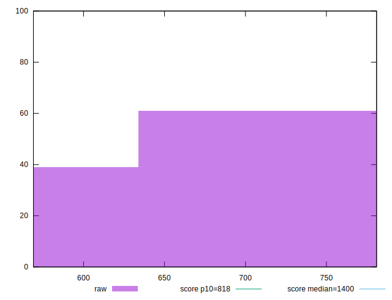
## Score


```yaml
p90min: 0.92
p90max: 0.98
p90range: 0.05999999999999994
p90mean: 0.942978723404256
median: 0.92
p90stdev: 0.02916679061820215
mad: 0
stdevBySn: 0
lfitCenter: 0.9394907656465055
lfitStdev: 0.03298538965349958
mfitCenter: 0.9394907656465055
mfitStdev: 0.04134105521919058
mfitConfidence: 0.004134105521919057
p90skewness: 0.4814569204855789
p90eccentricity: 1.0000000000000027
p90discretization: 47
outlandishness: 1.0008937013914234

```

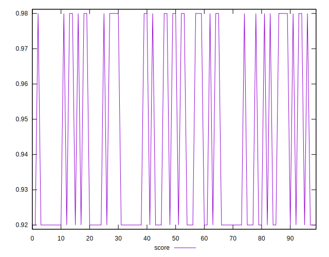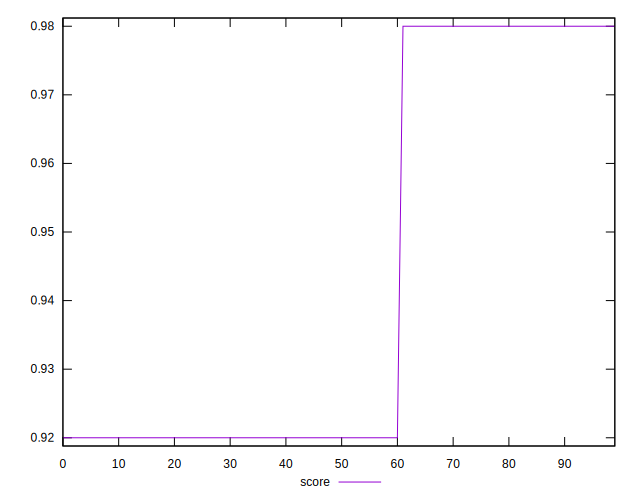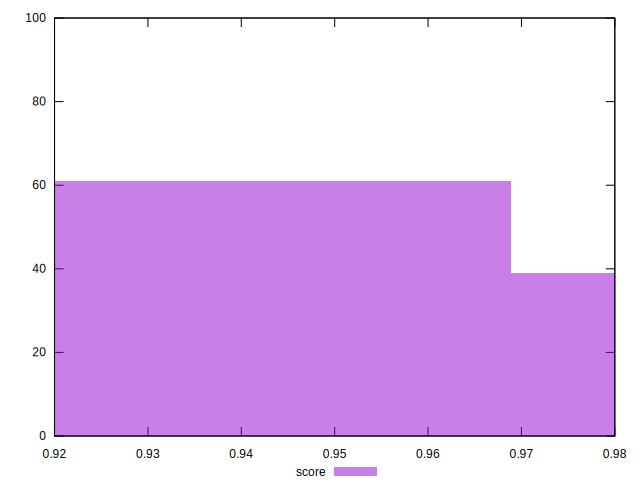
## Raw Estimate

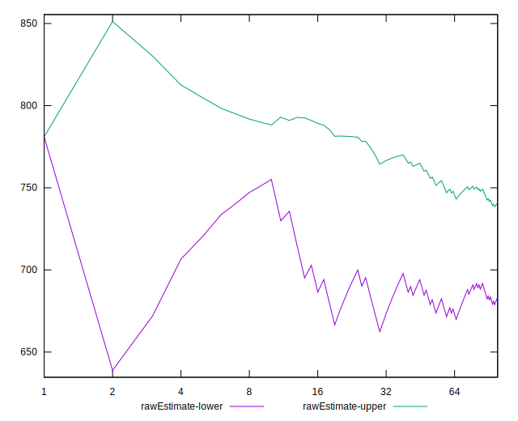
## Score Estimate

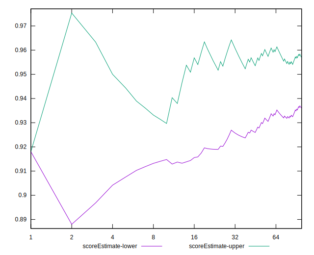
## P Score


```yaml
p90min: 0.9180298053112792
p90max: 0.9841121673367461
p90range: 0.06608236202546691
p90mean: 0.9433379439593301
median: 0.9180298053112792
p90stdev: 0.03212350694588387
mad: 0
stdevBySn: 0
lfitCenter: 0.9394964025047111
lfitStdev: 0.036329207677227596
mfitCenter: 0.9394964025047111
mfitStdev: 0.0455319096251563
mfitConfidence: 0.00455319096251563
p90skewness: 0.4814569204857001
p90eccentricity: 0.9999999999999978
p90discretization: 47
outlandishness: 1.0009839456796912

```

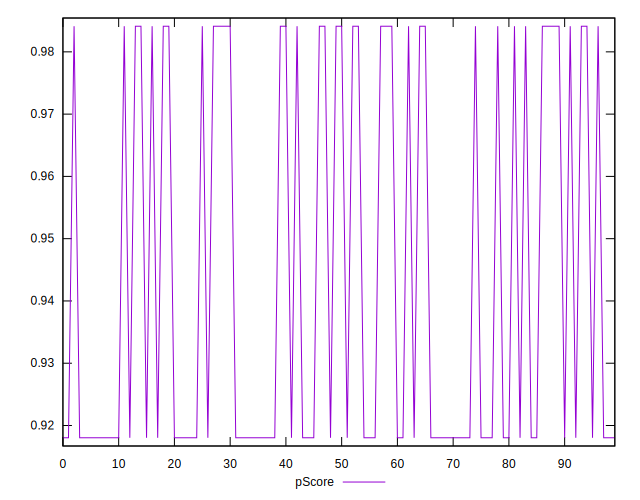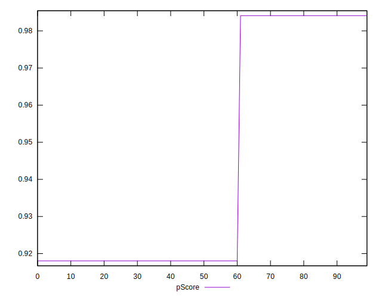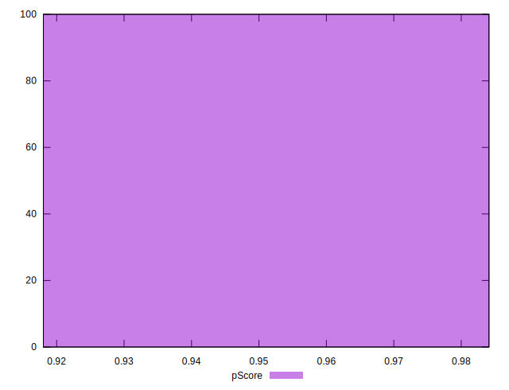
## Score Difference


```yaml
p90min: 0
p90max: 0
p90range: 0
p90mean: 0
median: 0
p90stdev: 0
mad: 0
stdevBySn: 0
lfitCenter: 0
lfitStdev: 0
mfitCenter: 0
mfitStdev: 0
mfitConfidence: 0
p90skewness: .nan
p90eccentricity: .nan
p90discretization: 94
outlandishness: .nan

```


## P Score Difference


```yaml
p90min: -0.001970194688720839
p90max: 0.004112167336746131
p90range: 0.00608236202546697
p90mean: 0.0003592205550750219
median: -0.001970194688720839
p90stdev: 0.002956716327681653
mad: 0
stdevBySn: 0
lfitCenter: 0.0000056368582055345245
lfitStdev: 0.003343818023727964
mfitCenter: 0.0000056368582055345245
mfitStdev: 0.00419085440596565
mfitConfidence: 0.000419085440596565
p90skewness: 0.48145692048565053
p90eccentricity: 1.0000000000000013
p90discretization: 47
outlandishness: 1.251903708299538

```

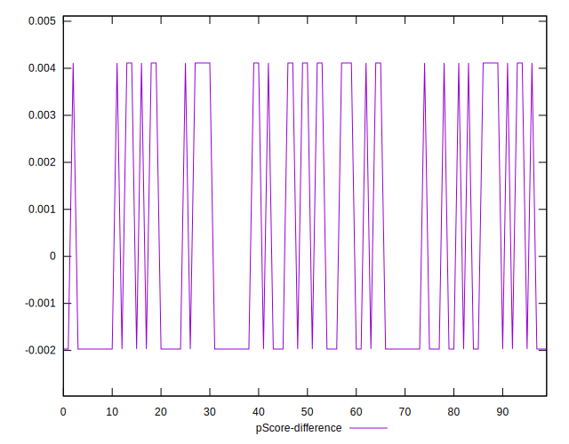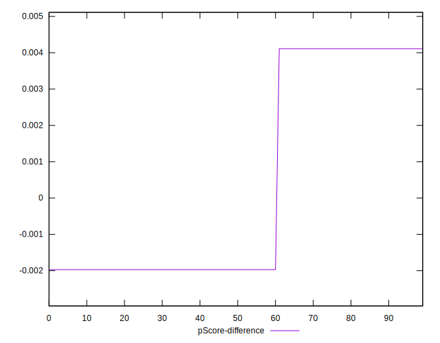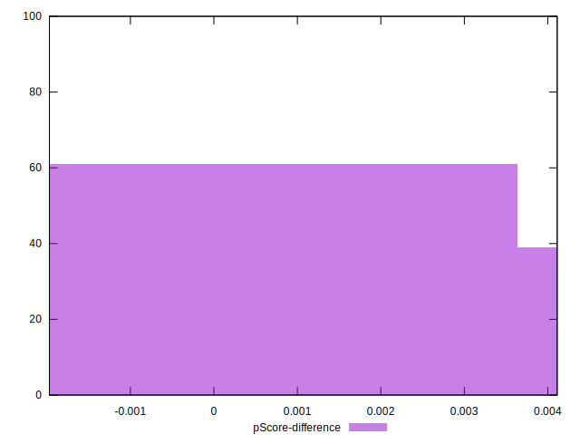