# //dom-size/samples/astro

[→ Parent](../..)


## Raw


```yaml
p90min: 1287
p90max: 1288
p90range: 1
p90mean: 1287.0744680851064
median: 1287
p90stdev: 0.26253112083517155
mad: 0
stdevBySn: 0
lfitCenter: 1287.0526505504347
lfitStdev: 0.1250267832560982
mfitCenter: 1287.0526505504347
mfitStdev: 0.15669783515562477
mfitConfidence: 0.015669783515562478
p90skewness: 3.2417635938917306
p90eccentricity: 1.0000000000000044
p90discretization: 47
outlandishness: 1.0000396747333071

```

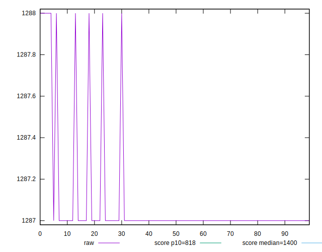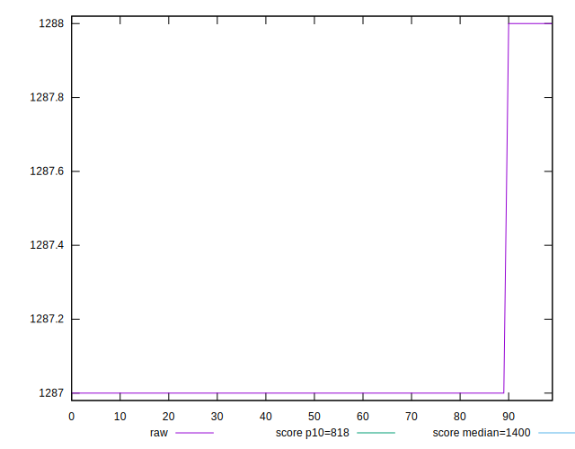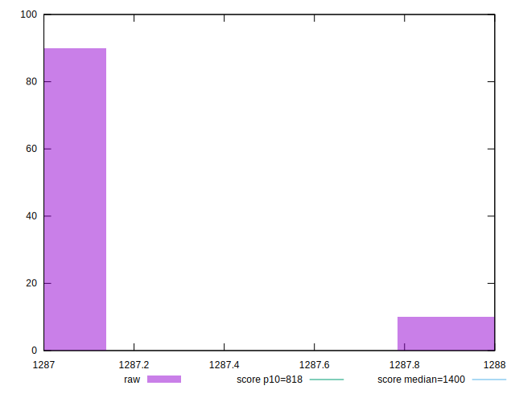
## Score


```yaml
p90min: 0.58
p90max: 0.58
p90range: 0
p90mean: 0.5799999999999988
median: 0.58
p90stdev: 1.1102230246251565e-15
mad: 0
stdevBySn: 0
lfitCenter: 0.5799999999999987
lfitStdev: 0
mfitCenter: 0.5799999999999987
mfitStdev: 0
mfitConfidence: 0
p90skewness: 1
p90eccentricity: 1
p90discretization: 94
outlandishness: 0.9999999999999996

```

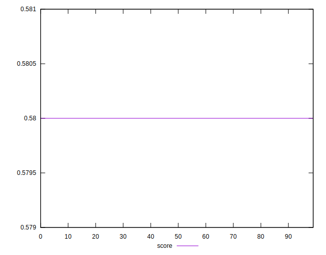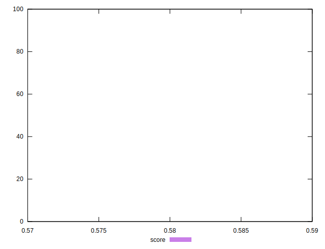
## Raw Estimate

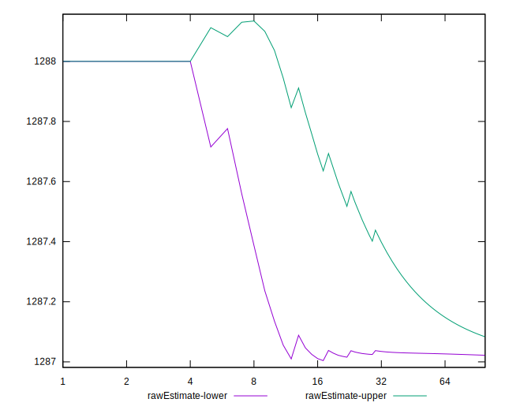
## Score Estimate

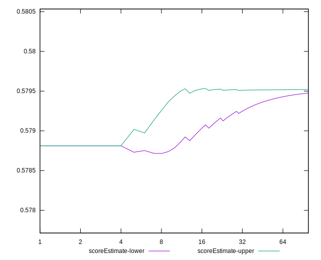
## P Score


```yaml
p90min: 0.5788119477894059
p90max: 0.579536319721314
p90range: 0.0007243719319081077
p90mean: 0.5794823771306397
median: 0.579536319721314
p90stdev: 0.0001901701751853741
mad: 0
stdevBySn: 0
lfitCenter: 0.5794981811403805
lfitStdev: 0.00009056589252645137
mfitCenter: 0.5794981811403805
mfitStdev: 0.00011350751357621379
mfitConfidence: 0.000011350751357621379
p90skewness: -3.2417635938849405
p90eccentricity: 0.9999999999999949
p90discretization: 47
outlandishness: 0.9999361695605856

```

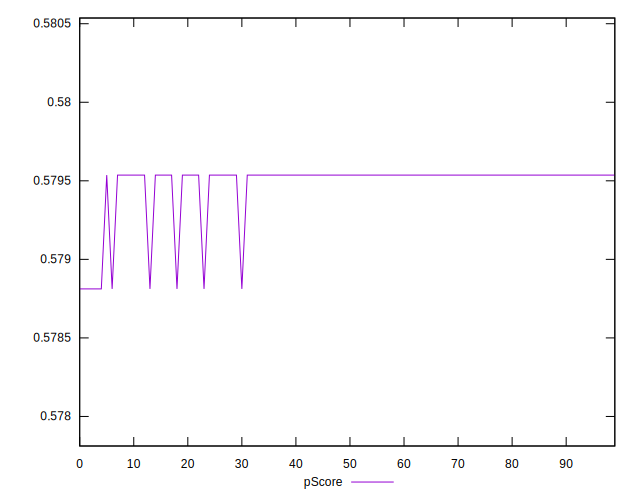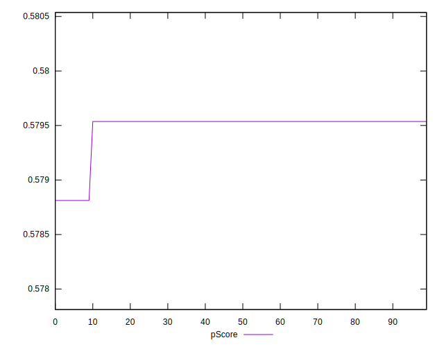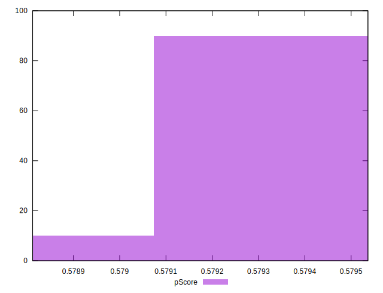
## Score Difference


```yaml
p90min: 0
p90max: 0
p90range: 0
p90mean: 0
median: 0
p90stdev: 0
mad: 0
stdevBySn: 0
lfitCenter: 0
lfitStdev: 0
mfitCenter: 0
mfitStdev: 0
mfitConfidence: 0
p90skewness: .nan
p90eccentricity: .nan
p90discretization: 94
outlandishness: .nan

```


## P Score Difference


```yaml
p90min: -0.0011880522105940372
p90max: -0.00046368027868592954
p90range: 0.0007243719319081077
p90mean: -0.0005176228693599376
median: -0.00046368027868592954
p90stdev: 0.00019017017518537413
mad: 0
stdevBySn: 0
lfitCenter: -0.0005018188596197463
lfitStdev: 0.000090565892526819
mfitCenter: -0.0005018188596197463
mfitStdev: 0.00011350751357667455
mfitConfidence: 0.000011350751357667455
p90skewness: -3.2417635938924514
p90eccentricity: 0.9999999999999994
p90discretization: 47
outlandishness: 1.0727363823611624

```

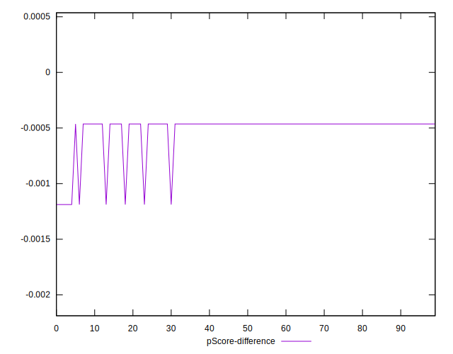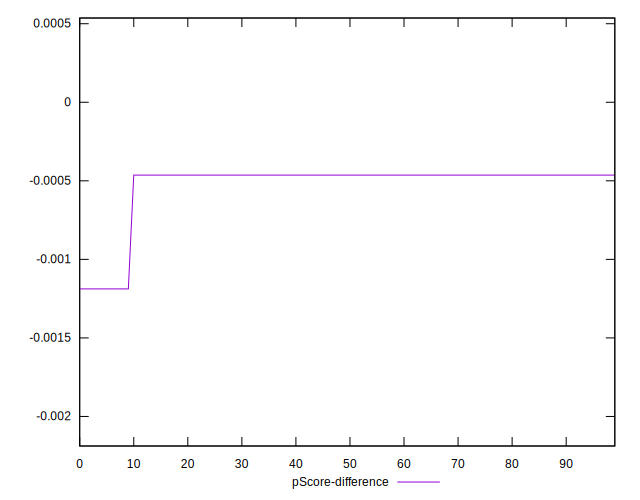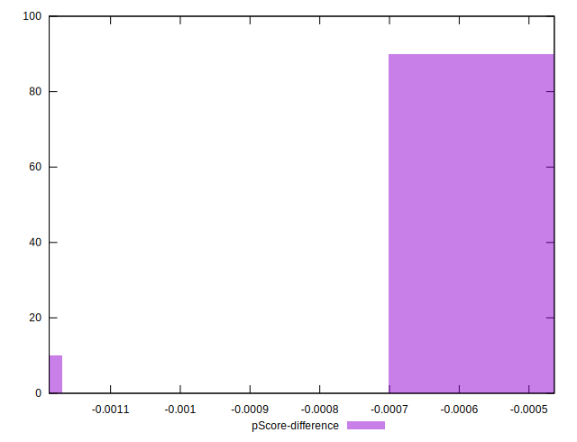