# //dom-size/samples/card

[→ Parent](../..)


## Raw


```yaml
p90min: 582
p90max: 794
p90range: 212
p90mean: 712.6808510638298
median: 794
p90stdev: 102.96272954749898
mad: 0
stdevBySn: 0
lfitCenter: 724.9649944623237
lfitStdev: 116.41187804240462
mfitCenter: 724.9649944623237
mfitStdev: 145.90065264880502
mfitConfidence: 14.590065264880502
p90skewness: -0.4810347252515101
p90eccentricity: 1.0000000000000018
p90discretization: 31.333333333333332
outlandishness: 0.995848597416378

```

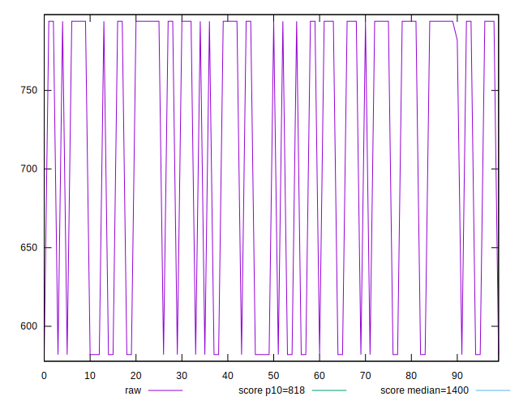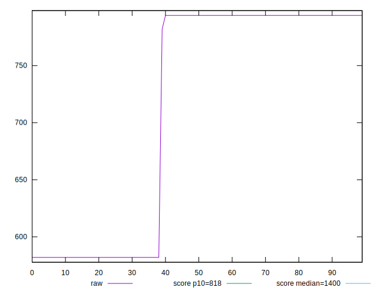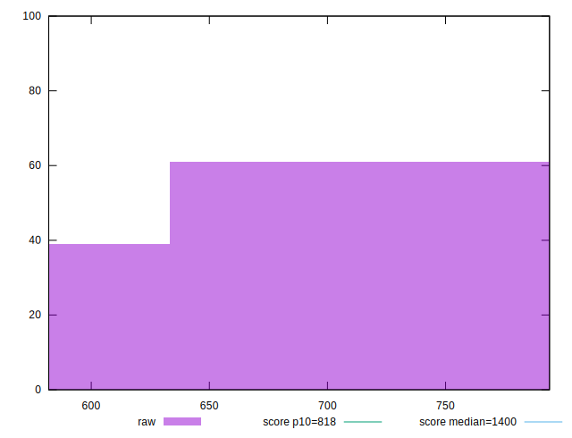
## Score


```yaml
p90min: 0.91
p90max: 0.98
p90range: 0.06999999999999995
p90mean: 0.93691489361702
median: 0.91
p90stdev: 0.03395950641650306
mad: 0
stdevBySn: 0
lfitCenter: 0.9328789212431646
lfitStdev: 0.038369205651337696
mfitCenter: 0.9328789212431646
mfitStdev: 0.04808866792877618
mfitConfidence: 0.004808866792877618
p90skewness: 0.4789184166871084
p90eccentricity: 0.9999999999999987
p90discretization: 31.333333333333332
outlandishness: 1.001035807997161

```

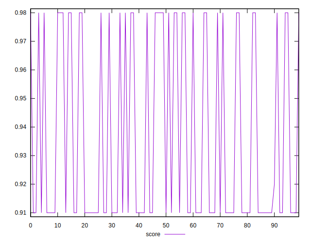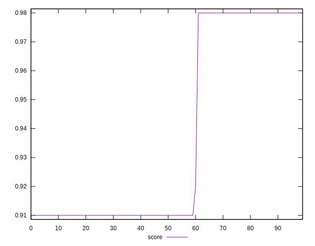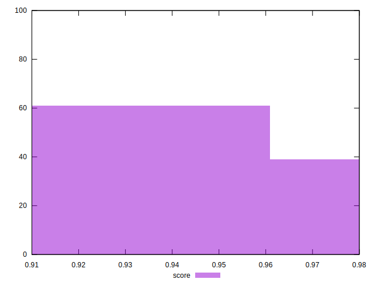
## Raw Estimate

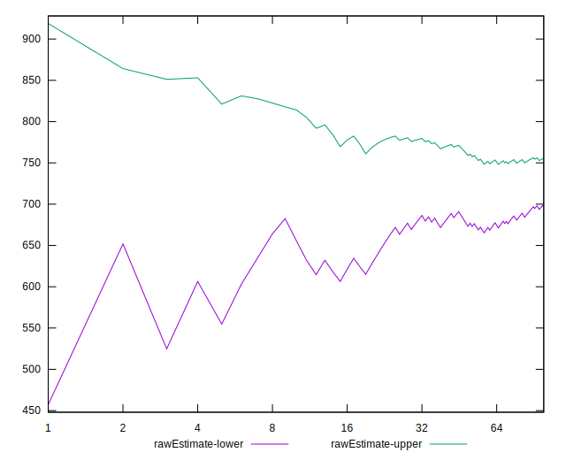
## Score Estimate

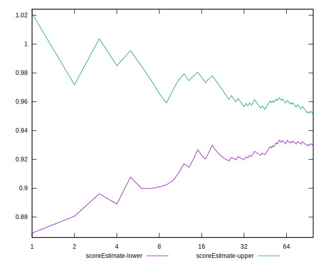
## P Score


```yaml
p90min: 0.9119035147238882
p90max: 0.9818408984193125
p90range: 0.06993738369542435
p90mean: 0.9387482916666643
median: 0.9119035147238882
p90stdev: 0.033954956773765275
mad: 0
stdevBySn: 0
lfitCenter: 0.9347015128004559
lfitStdev: 0.03838411235068097
mfitCenter: 0.9347015128004559
mfitStdev: 0.048107350705822616
mfitConfidence: 0.004810735070582261
p90skewness: 0.48060645457701384
p90eccentricity: 0.9999999999999967
p90discretization: 31.333333333333332
outlandishness: 1.001038747971681

```

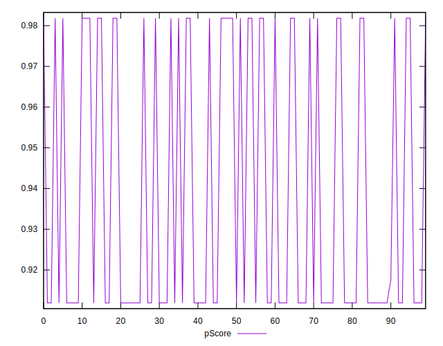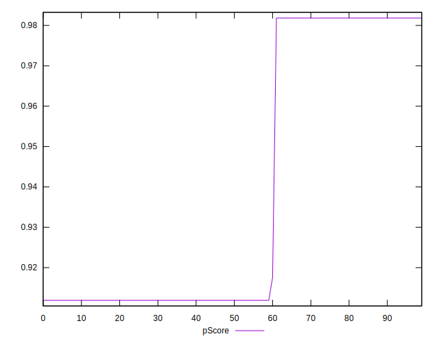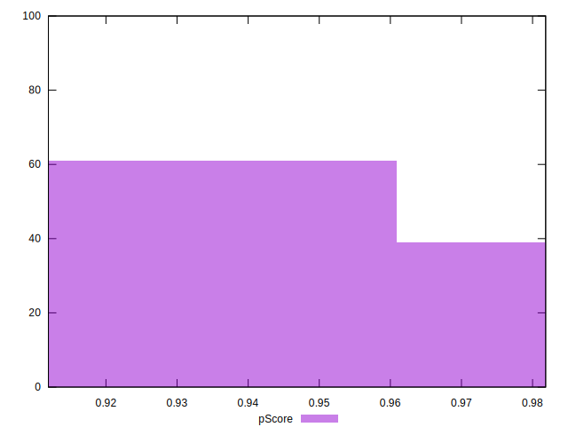
## Score Difference


```yaml
p90min: 0
p90max: 0
p90range: 0
p90mean: 0
median: 0
p90stdev: 0
mad: 0
stdevBySn: 0
lfitCenter: 0
lfitStdev: 0
mfitCenter: 0
mfitStdev: 0
mfitConfidence: 0
p90skewness: .nan
p90eccentricity: .nan
p90discretization: 94
outlandishness: .nan

```


## P Score Difference


```yaml
p90min: 0.0018408984193125644
p90max: 0.0019035147238881667
p90range: 0.0000626163045756023
p90mean: 0.00187886788059777
median: 0.0019035147238881667
p90stdev: 0.000030591295528585374
mad: 0
stdevBySn: 0
lfitCenter: 0.0018624090897269231
lfitStdev: 0.00006812616029938133
mfitCenter: 0.0018624090897269231
mfitStdev: 0.00008538347991015309
mfitConfidence: 0.000008538347991015309
p90skewness: -0.4355035563093449
p90eccentricity: 1.0000000000000004
p90discretization: 47
outlandishness: 0.954604547902002

```

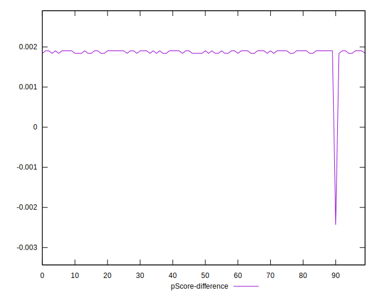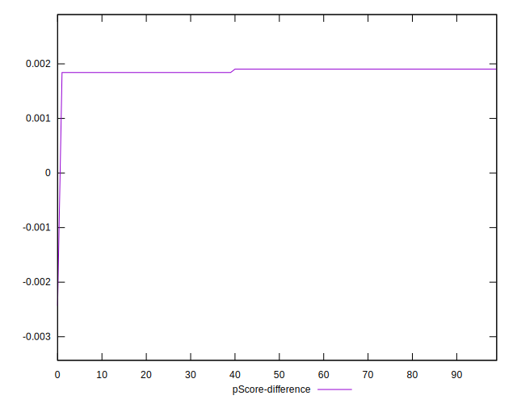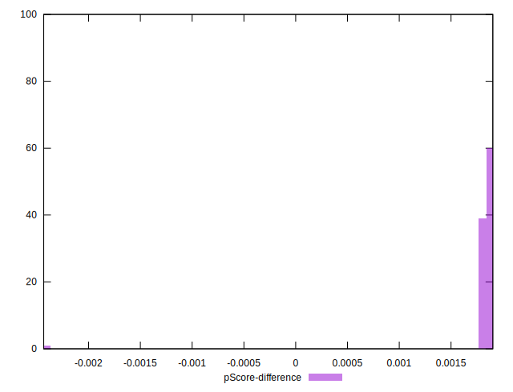