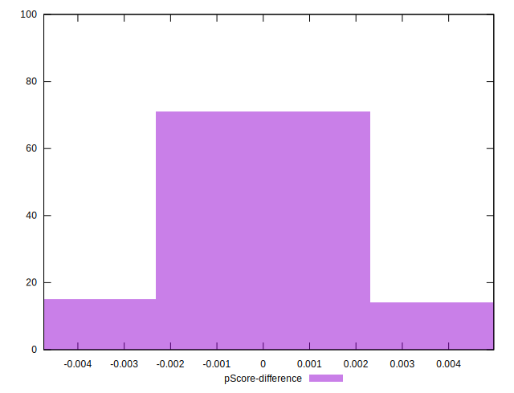

# //estimated-input-latency/samples/agenda

[→ Parent](../..)


## Raw


```yaml
p90min: 12.8
p90max: 430.40000000000003
p90range: 417.6
p90mean: 117.33617021276596
median: 108.80000000000001
p90stdev: 113.33528572156179
mad: 96.00000000000001
stdevBySn: 114.96664000000001
lfitCenter: 113.2512509669813
lfitStdev: 119.60563048988601
mfitCenter: 113.2512509669813
mfitStdev: 149.90342774634718
mfitConfidence: 14.990342774634717
p90skewness: 0.6159403046252615
p90eccentricity: 0.9999999999999992
p90discretization: 1.9183673469387754
outlandishness: 1.2261445969047065

```


## Score


```yaml
p90min: 0
p90max: 1
p90range: 1
p90mean: 0.5302127659574467
median: 0.42
p90stdev: 0.46246789129119903
mad: 0.42
stdevBySn: 0.506855
lfitCenter: 0.5375516326859031
lfitStdev: 0.5531065289488588
mfitCenter: 0.5375516326859031
mfitStdev: 0.6932162328706534
mfitConfidence: 0.06932162328706534
p90skewness: -0.011470934833523102
p90eccentricity: 0.9999999999999988
p90discretization: 4.476190476190476
outlandishness: 0.9931738079349907

```


## Raw Estimate


## Score Estimate


## P Score


```yaml
p90min: 0.00029764519992109273
p90max: 0.9999993380488856
p90range: 0.9997016928489646
p90mean: 0.530284630552761
median: 0.4213927609310104
p90stdev: 0.4623818408874375
mad: 0.4213454496522254
stdevBySn: 0.5065596911151884
lfitCenter: 0.5377278015925503
lfitStdev: 0.5527346708640346
mfitCenter: 0.5377278015925503
mfitStdev: 0.6927501778753992
mfitConfidence: 0.06927501778753992
p90skewness: -0.011931489414489542
p90eccentricity: 1.0000000000000002
p90discretization: 1.9183673469387754
outlandishness: 0.9931682158863685

```


## Score Difference


```yaml
p90min: 0
p90max: 0
p90range: 0
p90mean: 0
median: 0
p90stdev: 0
mad: 0
stdevBySn: 0
lfitCenter: 2.583267684513104e-19
lfitStdev: 6.445158398659724e-19
mfitCenter: 2.583267684513104e-19
mfitStdev: 8.077808146406197e-19
mfitConfidence: 8.077808146406197e-20
p90skewness: .nan
p90eccentricity: .nan
p90discretization: 94
outlandishness: .inf

```


## P Score Difference


```yaml
p90min: -0.004395771342219024
p90max: 0.0046153135300812664
p90range: 0.00901108487230029
p90mean: 0.00006833481461186464
median: -6.619511143668433e-7
p90stdev: 0.001881190742552684
mad: 0.000130553904404751
stdevBySn: 0.00017675459125203786
lfitCenter: 0.00005975691729762366
lfitStdev: 0.0010242203380595443
mfitCenter: 0.00005975691729762366
mfitStdev: 0.0012836698307077709
mfitConfidence: 0.00012836698307077708
p90skewness: -0.1369481111869487
p90eccentricity: 1.0000000000000002
p90discretization: 2.0434782608695654
outlandishness: 1.0532645623688544

```

