# //estimated-input-latency/samples/astro

[→ Parent](../..)


## Raw


```yaml
p90min: 92.4
p90max: 547.2
p90range: 454.80000000000007
p90mean: 239.70638297872352
median: 207.0000000000002
p90stdev: 109.59048220098688
mad: 58.8
stdevBySn: 84.43608000000025
lfitCenter: 231.40463394176325
lfitStdev: 82.47055112715731
mfitCenter: 231.40463394176325
mfitStdev: 103.36150774387376
mfitConfidence: 10.336150774387376
p90skewness: 1.232735183223002
p90eccentricity: 0.9999999999999997
p90discretization: 1.0217391304347827
outlandishness: 1.0505647720371334

```

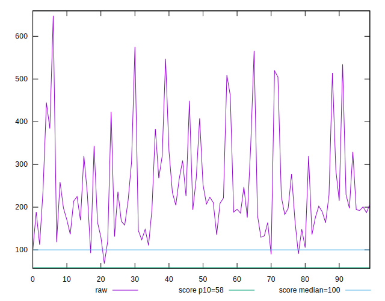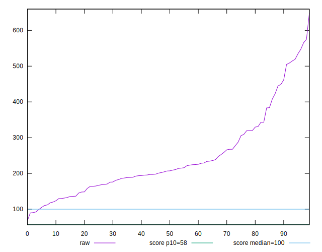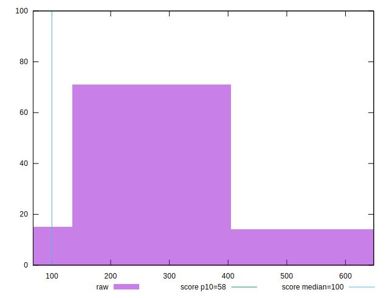
## Score


```yaml
p90min: 0
p90max: 0.57
p90range: 0.57
p90mean: 0.0906382978723404
median: 0.04
p90stdev: 0.12295829175780044
mad: 0.04
stdevBySn: 0.047704
lfitCenter: 0.08005329246881264
lfitStdev: 0.09140885892379029
mfitCenter: 0.08005329246881264
mfitStdev: 0.11456401528034367
mfitConfidence: 0.011456401528034368
p90skewness: 1.9368066849533205
p90eccentricity: 1.0000000000000009
p90discretization: 3.2413793103448274
outlandishness: 1.3496876066256696

```

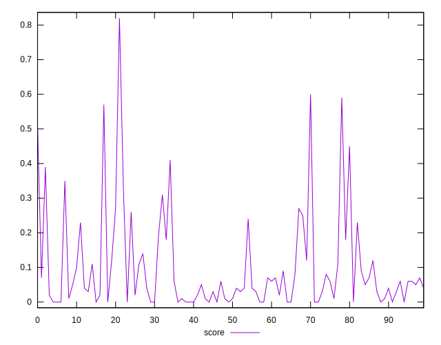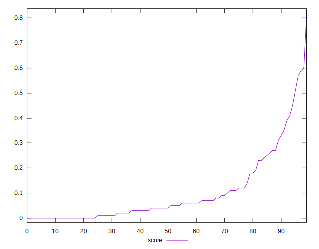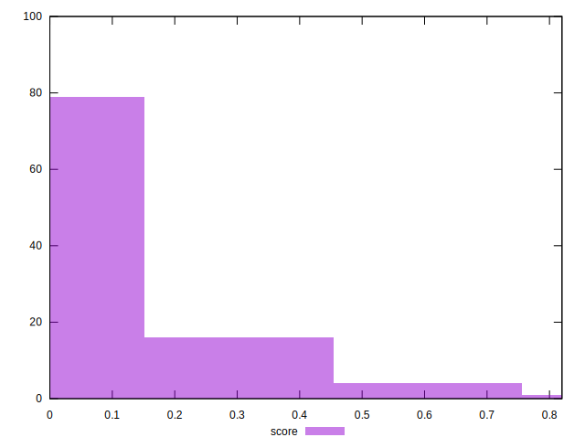
## Raw Estimate

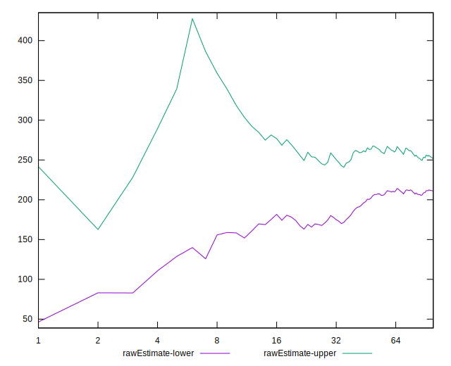
## Score Estimate

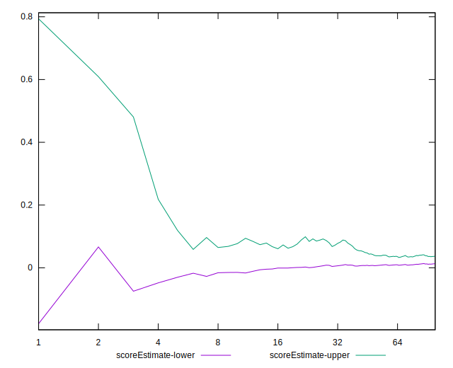
## P Score


```yaml
p90min: 0.0000318651885672927
p90max: 0.5737622673688019
p90range: 0.5737304021802345
p90mean: 0.09093315167782827
median: 0.0434795832835963
p90stdev: 0.12316909996392575
mad: 0.04101532618786477
stdevBySn: 0.05183897085850588
lfitCenter: 0.08009331015818472
lfitStdev: 0.09206094667288696
mfitCenter: 0.08009331015818472
mfitStdev: 0.11538128607587915
mfitConfidence: 0.011538128607587916
p90skewness: 1.9437704743870543
p90eccentricity: 1
p90discretization: 1.0217391304347827
outlandishness: 1.348964482861677

```

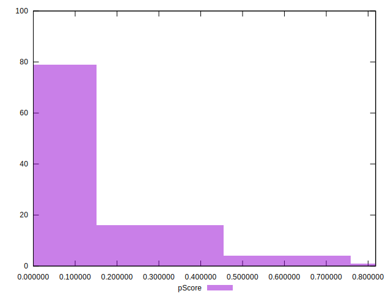
## Score Difference


```yaml
p90min: 0
p90max: 5.551115123125783e-17
p90range: 5.551115123125783e-17
p90mean: 5.905441620346577e-19
median: 0
p90stdev: 5.695001657605474e-18
mad: 0
stdevBySn: 0
lfitCenter: 1.5990456740188313e-18
lfitStdev: 3.930554934686784e-18
mfitCenter: 1.5990456740188313e-18
mfitStdev: 4.926220072095121e-18
mfitConfidence: 4.926220072095121e-19
p90skewness: 9.539955591519897
p90eccentricity: 1.0000000000000029
p90discretization: 47
outlandishness: 31.809599999999996

```

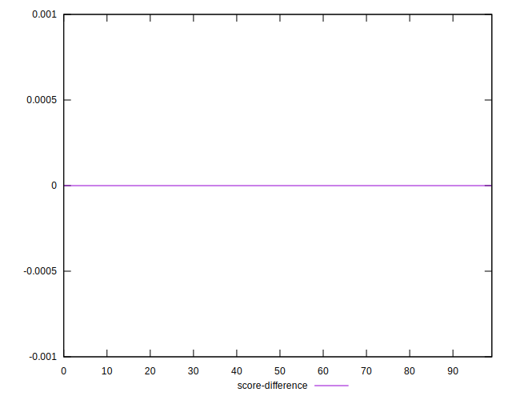
## P Score Difference


```yaml
p90min: -0.004492059057293857
p90max: 0.00455791851159538
p90range: 0.009049977568889237
p90mean: 0.00033767963087454674
median: 0.00021455302427203504
p90stdev: 0.002288704976215972
mad: 0.0020433108366612607
stdevBySn: 0.0026331508491592476
lfitCenter: 0.0003440344162396226
lfitStdev: 0.0018441621446163682
mfitCenter: 0.0003440344162396226
mfitStdev: 0.0023113144896755094
mfitConfidence: 0.00023113144896755094
p90skewness: -0.12614029923379624
p90eccentricity: 1.0000000000000004
p90discretization: 1.010752688172043
outlandishness: 0.8660215890314694

```

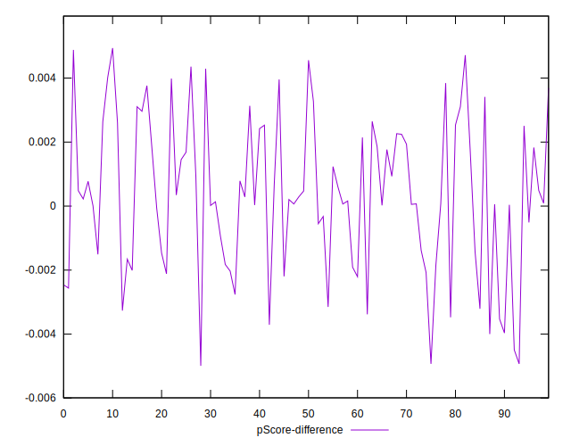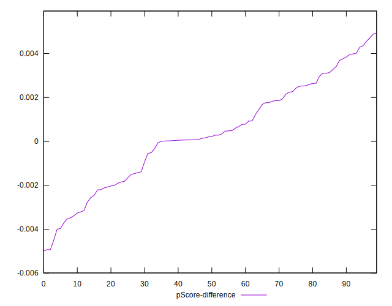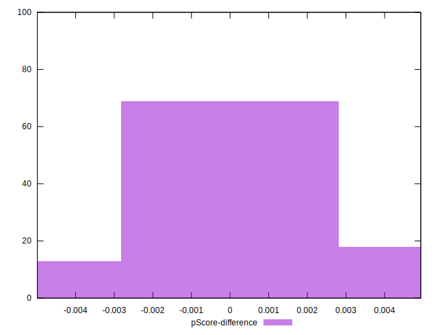