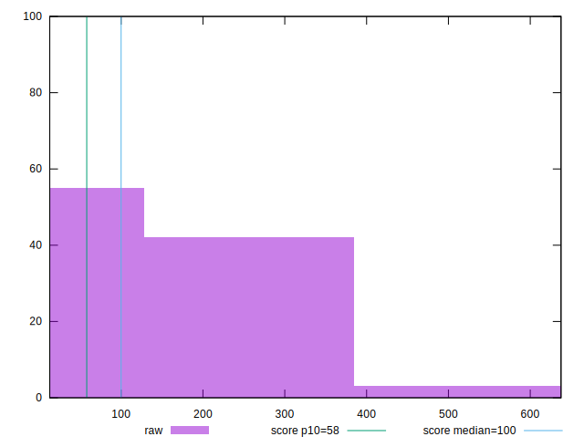
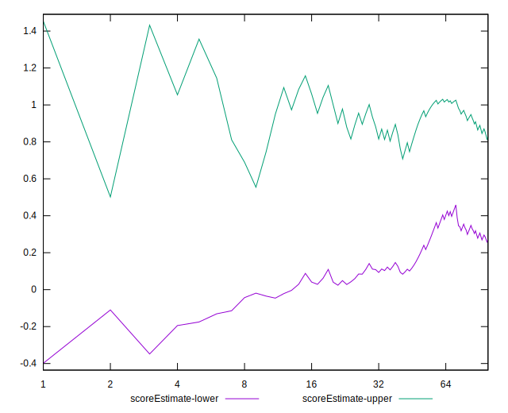

# //estimated-input-latency/samples/card

[→ Parent](../..)


## Raw


```yaml
p90min: 12.8
p90max: 336
p90range: 323.2
p90mean: 103.68085106382986
median: 12.8
p90stdev: 104.29345798274738
mad: 0
stdevBySn: 0
lfitCenter: 95.74951720895652
lfitStdev: 118.36333660449426
mfitCenter: 95.74951720895652
mfitStdev: 148.3464432555184
mfitConfidence: 14.83464432555184
p90skewness: 0.47121939447280553
p90eccentricity: 0.9999999999999994
p90discretization: 2.238095238095238
outlandishness: 1.1823851158393004

```


## Score


```yaml
p90min: 0
p90max: 1
p90range: 1
p90mean: 0.5739361702127659
median: 1
p90stdev: 0.4665769829643777
mad: 0
stdevBySn: 0
lfitCenter: 0.6073262614977737
lfitStdev: 0.5603187993126221
mfitCenter: 0.6073262614977737
mfitStdev: 0.7022554732887951
mfitConfidence: 0.0702255473288795
p90skewness: -0.20089314578891118
p90eccentricity: 1.0000000000000004
p90discretization: 5.222222222222222
outlandishness: 0.9846009851912108

```


## Raw Estimate


## Score Estimate


## P Score


```yaml
p90min: 0.002177305593833112
p90max: 0.9999993380488856
p90range: 0.9978220324550525
p90mean: 0.5741497585475333
median: 0.9999993380488856
p90stdev: 0.4663956991792762
mad: 0
stdevBySn: 0
lfitCenter: 0.607662537961257
lfitStdev: 0.5598380110413469
mfitCenter: 0.607662537961257
mfitStdev: 0.7016528945507442
mfitConfidence: 0.07016528945507441
p90skewness: -0.20155385850144228
p90eccentricity: 0.9999999999999991
p90discretization: 2.238095238095238
outlandishness: 0.9845867722100127

```


## Score Difference


```yaml
p90min: 0
p90max: 0
p90range: 0
p90mean: 0
median: 0
p90stdev: 0
mad: 0
stdevBySn: 0
lfitCenter: 0
lfitStdev: 0
mfitCenter: 0
mfitStdev: 0
mfitConfidence: 0
p90skewness: .nan
p90eccentricity: .nan
p90discretization: 94
outlandishness: .nan

```


## P Score Difference


```yaml
p90min: -0.003223505771589013
p90max: 0.004262842465201866
p90range: 0.007486348236790879
p90mean: 0.0002050185362219539
median: -6.619511143668433e-7
p90stdev: 0.0014394337670830188
mad: 0
stdevBySn: 0
lfitCenter: 0.00013481691432582589
lfitStdev: 0.0008618094175357129
mfitCenter: 0.00013481691432582589
mfitStdev: 0.0010801179277560064
mfitConfidence: 0.00010801179277560064
p90skewness: 0.5484048063613238
p90eccentricity: 0.9999999999999999
p90discretization: 2.41025641025641
outlandishness: 1.0275694124946073

```

