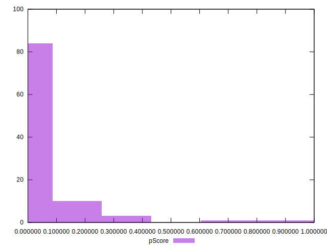
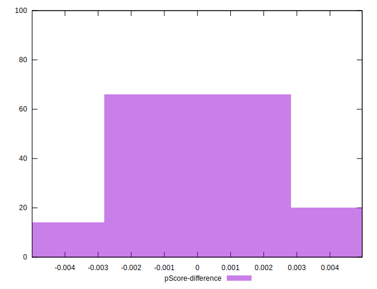

# //estimated-input-latency/samples/music

[→ Parent](../..)


## Raw


```yaml
p90min: 110.4
p90max: 507.9999999999993
p90range: 397.59999999999934
p90mean: 261.5404255319149
median: 251.99999999999983
p90stdev: 85.37016185992111
mad: 57.2
stdevBySn: 87.05979999999981
lfitCenter: 258.29705695739733
lfitStdev: 69.93958240569025
mfitCenter: 258.29705695739733
mfitStdev: 87.65626747519747
mfitConfidence: 8.765626747519747
p90skewness: 0.7701841444122003
p90eccentricity: 0.9999999999999999
p90discretization: 1.0804597701149425
outlandishness: 1.0297629825649712

```


## Score


```yaml
p90min: 0
p90max: 0.41
p90range: 0.41
p90mean: 0.04372340425531914
median: 0.015
p90stdev: 0.07012123305091869
mad: 0.015
stdevBySn: 0.020870500000000004
lfitCenter: 0.04445976603734802
lfitStdev: 0.05990589827382458
mfitCenter: 0.04445976603734802
mfitStdev: 0.07508090929071817
mfitConfidence: 0.007508090929071817
p90skewness: 2.75963699434196
p90eccentricity: 1.0000000000000013
p90discretization: 4.947368421052632
outlandishness: 2.3201738185305523

```


## Raw Estimate


## Score Estimate


## P Score


```yaml
p90min: 0.00006573205053955755
p90max: 0.4079696944965917
p90range: 0.40790396244605215
p90mean: 0.04428211164464384
median: 0.014838109229331514
p90stdev: 0.07007938905337291
mad: 0.014260166136655816
stdevBySn: 0.01766866196649476
lfitCenter: 0.044944587000518656
lfitStdev: 0.05974504608854923
mfitCenter: 0.044944587000518656
mfitStdev: 0.07487931097269163
mfitConfidence: 0.007487931097269163
p90skewness: 2.748612596170977
p90eccentricity: 0.9999999999999997
p90discretization: 1.0930232558139534
outlandishness: 2.2955186949059785

```


## Score Difference


```yaml
p90min: 0
p90max: 0
p90range: 0
p90mean: 0
median: 0
p90stdev: 0
mad: 0
stdevBySn: 0
lfitCenter: 7.818571910696065e-19
lfitStdev: 1.941342063124831e-18
mfitCenter: 7.818571910696065e-19
mfitStdev: 2.4331114555278913e-18
mfitConfidence: 2.4331114555278914e-19
p90skewness: .nan
p90eccentricity: .nan
p90discretization: 94
outlandishness: .inf

```


## P Score Difference


```yaml
p90min: -0.00456265968370472
p90max: 0.004285781270029496
p90range: 0.008848440953734216
p90mean: 0.0005245777228982383
median: 0.0007507512474463117
p90stdev: 0.0022926375257363227
mad: 0.0016799564110230028
stdevBySn: 0.0025184981301308983
lfitCenter: 0.0006007650945108977
lfitStdev: 0.0018253050077551688
mfitCenter: 0.0006007650945108977
mfitStdev: 0.0022876805734342934
mfitConfidence: 0.00022876805734342934
p90skewness: -0.47229828743592317
p90eccentricity: 0.9999999999999996
p90discretization: 1.0930232558139534
outlandishness: 0.8785474638849137

```

