# //first-contentful-paint/samples/agenda

[→ Parent](../..)


## Raw


```yaml
p90min: 1467.111
p90max: 2076.4809999999998
p90range: 609.3699999999997
p90mean: 1741.0840101063827
median: 1743.0985
p90stdev: 155.6752924564741
mad: 124.02150000000017
stdevBySn: 172.85812735000022
lfitCenter: 1742.1185123965706
lfitStdev: 129.70002876397723
mfitCenter: 1742.1185123965706
mfitStdev: 162.5548798236893
mfitConfidence: 16.25548798236893
p90skewness: 0.1748710159786844
p90eccentricity: 1.000000000000001
p90discretization: 1
outlandishness: 1.0072602467491583

```

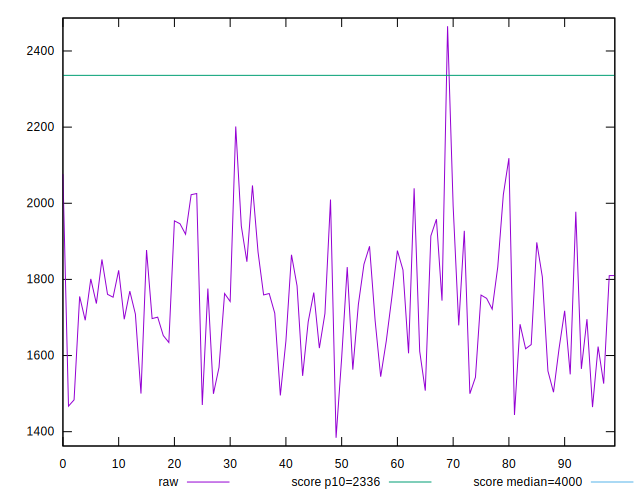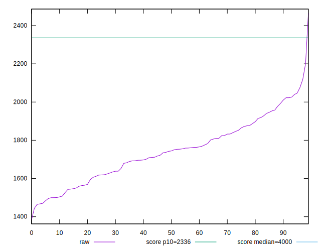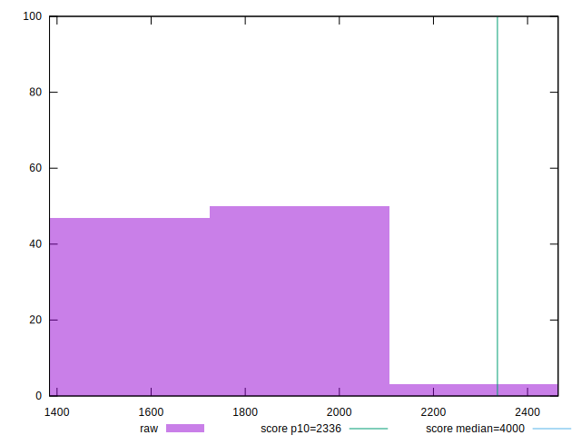
## Score


```yaml
p90min: 0.94
p90max: 0.99
p90range: 0.050000000000000044
p90mean: 0.9742553191489358
median: 0.98
p90stdev: 0.012757089118230883
mad: 0.010000000000000009
stdevBySn: 0.011926000000000011
lfitCenter: 0.9744965608137264
lfitStdev: 0.01177001404375893
mfitCenter: 0.9744965608137264
mfitStdev: 0.014751525012288656
mfitConfidence: 0.0014751525012288657
p90skewness: -0.6791226808744517
p90eccentricity: 0.9999999999999999
p90discretization: 15.666666666666666
outlandishness: 0.9972196683817387

```

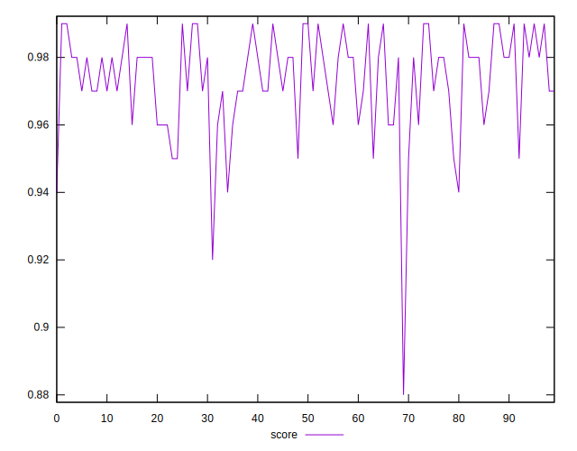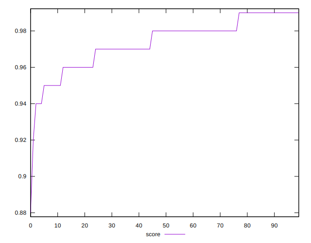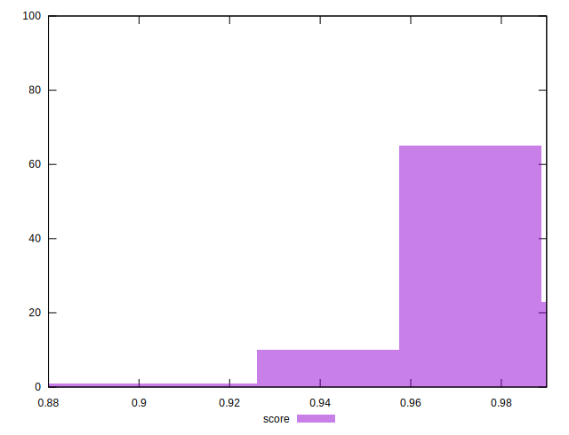
## Raw Estimate

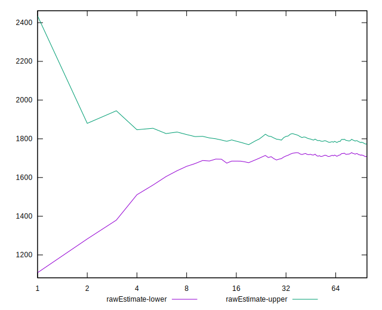
## Score Estimate

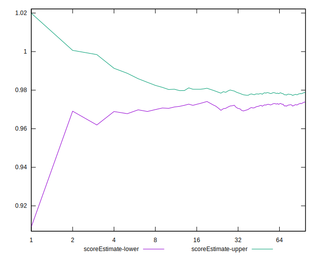
## P Score


```yaml
p90min: 0.9408739669381836
p90max: 0.9915725564937194
p90range: 0.050698589555535856
p90mean: 0.9742814866677457
median: 0.976100510721859
p90stdev: 0.012609454403355626
mad: 0.008806943309655313
stdevBySn: 0.013445874209383524
lfitCenter: 0.9744709362470372
lfitStdev: 0.0106294638538473
mfitCenter: 0.9744709362470372
mfitStdev: 0.013322057333516142
mfitConfidence: 0.0013322057333516142
p90skewness: -0.7518342875155287
p90eccentricity: 1
p90discretization: 1
outlandishness: 0.9972501735329831

```

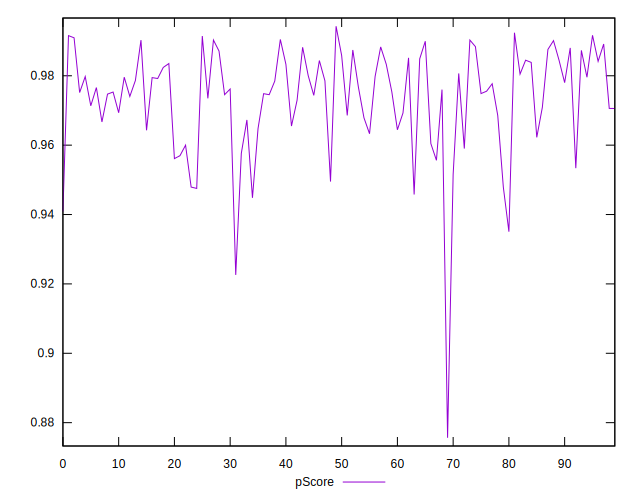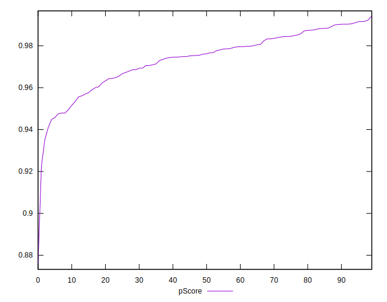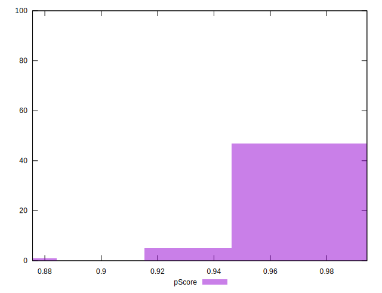
## Score Difference


```yaml
p90min: 0
p90max: 1.1102230246251565e-16
p90range: 1.1102230246251565e-16
p90mean: 8.267618268485208e-18
median: 0
p90stdev: 2.9146809503185717e-17
mad: 0
stdevBySn: 0
lfitCenter: 5.8453853350884466e-18
lfitStdev: 1.388076134647322e-17
mfitCenter: 5.8453853350884466e-18
mfitStdev: 1.739695444974298e-17
mfitConfidence: 1.739695444974298e-18
p90skewness: 3.2417635938924163
p90eccentricity: 0.9999999999999963
p90discretization: 47
outlandishness: 1.8032653061224493

```

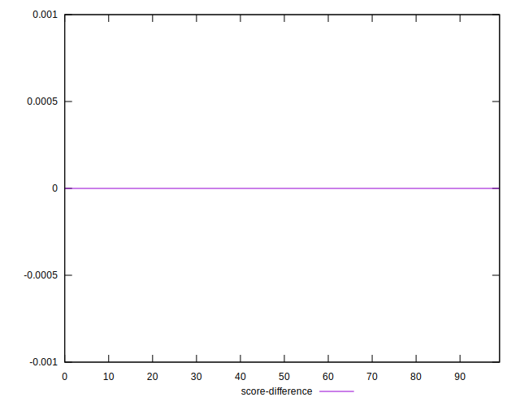
## P Score Difference


```yaml
p90min: -0.0046908389344908485
p90max: 0.0048033068827952885
p90range: 0.009494145817286137
p90mean: 0.000044082236721678564
median: -0.00012143400076247701
p90stdev: 0.002825262770912145
mad: 0.002408256352510074
stdevBySn: 0.003227192389070373
lfitCenter: -0.000017821145871652222
lfitStdev: 0.002385710778308451
mfitCenter: -0.000017821145871652222
mfitStdev: 0.0029900450490086576
mfitConfidence: 0.00029900450490086576
p90skewness: 0.1454818228315741
p90eccentricity: 1.0000000000000002
p90discretization: 1
outlandishness: 0.8655552201548052

```

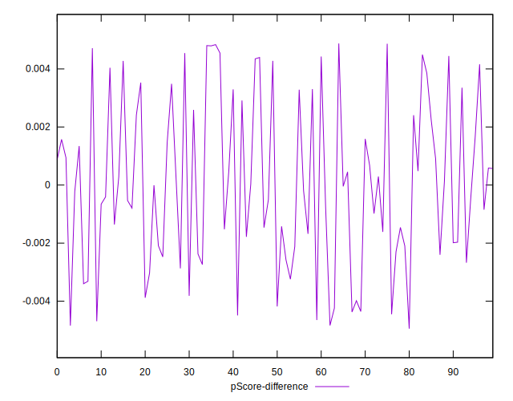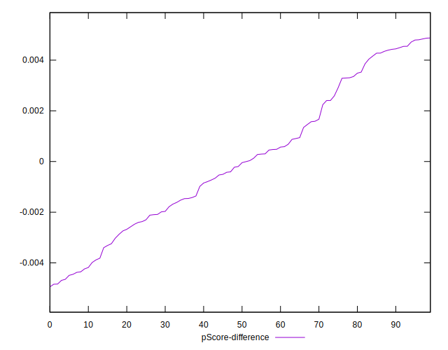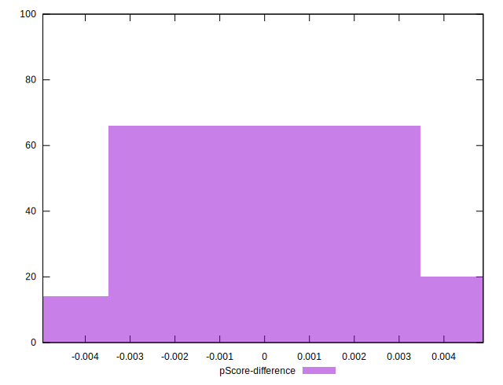