# //first-contentful-paint/samples/astro

[→ Parent](../..)


## Raw


```yaml
p90min: 2558.581
p90max: 3355.1759999999995
p90range: 796.5949999999993
p90mean: 2808.0966542553183
median: 2747.8005000000003
p90stdev: 208.08063584886054
mad: 136.52400000000034
stdevBySn: 199.00200640000088
lfitCenter: 2797.1821210540616
lfitStdev: 175.52977755135393
mfitCenter: 2797.1821210540616
mfitStdev: 219.99395194632407
mfitConfidence: 21.999395194632406
p90skewness: 0.9270243691488506
p90eccentricity: 1.0000000000000002
p90discretization: 1
outlandishness: 1.0127202729770726

```

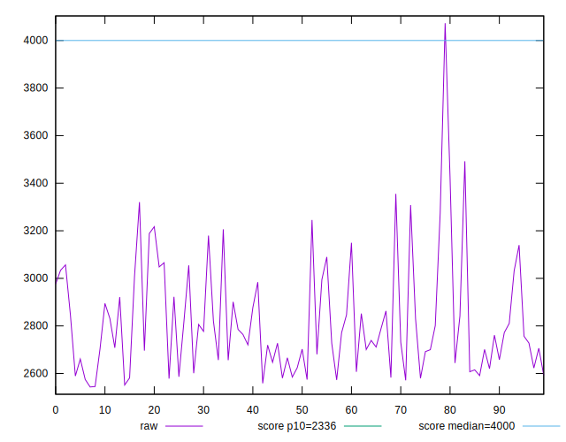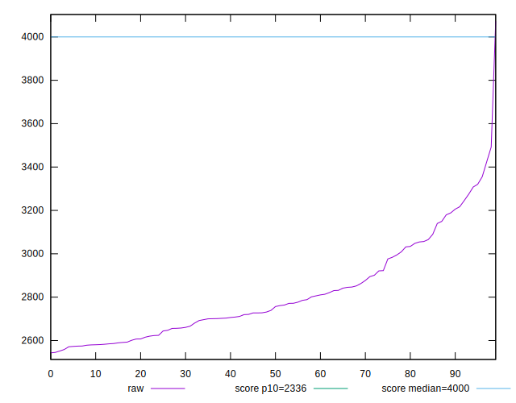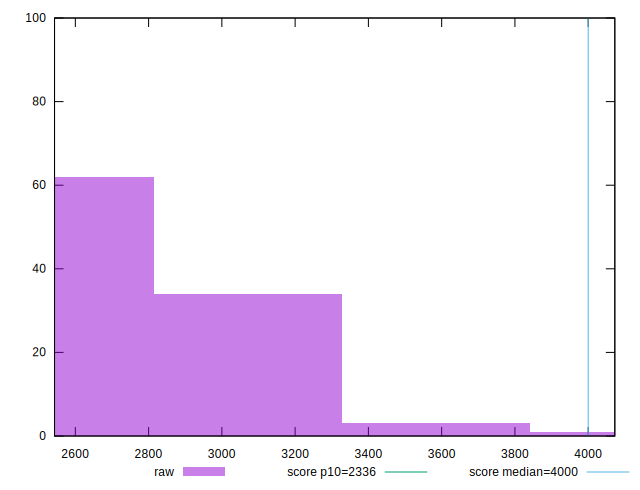
## Score


```yaml
p90min: 0.66
p90max: 0.86
p90range: 0.19999999999999996
p90mean: 0.7987234042553192
median: 0.815
p90stdev: 0.050449765251613994
mad: 0.03499999999999992
stdevBySn: 0.04174099999999997
lfitCenter: 0.8017462731581553
lfitStdev: 0.04255664207215306
mfitCenter: 0.8017462731581553
mfitStdev: 0.05333684119937483
mfitConfidence: 0.0053336841199374836
p90skewness: -1.0385747179643854
p90eccentricity: 1
p90discretization: 4.476190476190476
outlandishness: 0.9884565220930023

```

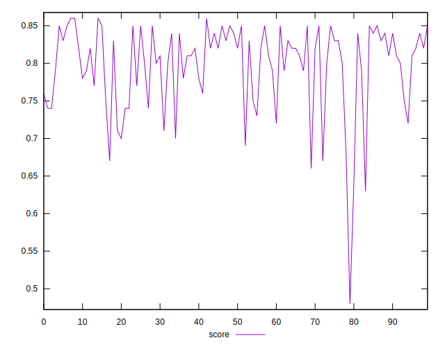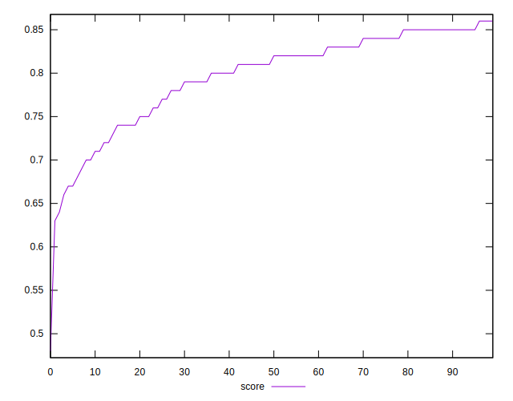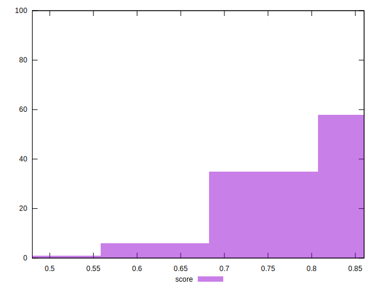
## Raw Estimate

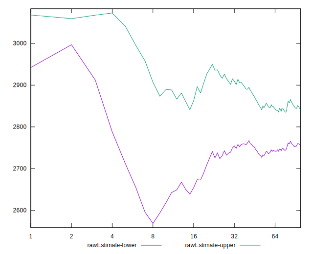
## Score Estimate

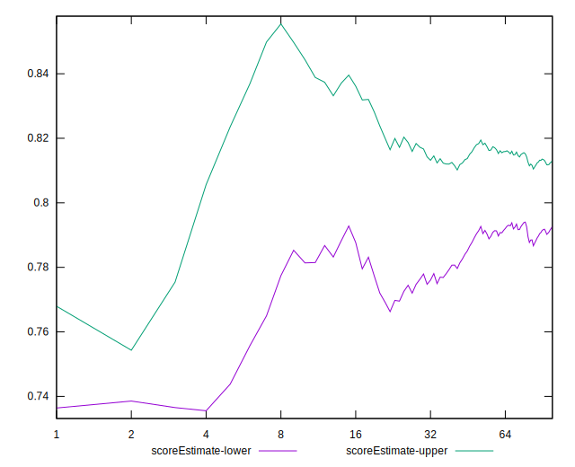
## P Score


```yaml
p90min: 0.6623396934525921
p90max: 0.856492858801225
p90range: 0.19415316534863292
p90mean: 0.7987654706510204
median: 0.8145206480442106
p90stdev: 0.050375454854220215
mad: 0.031124325561668886
stdevBySn: 0.04532094535639195
lfitCenter: 0.8016682732934027
lfitStdev: 0.042249990006627276
mfitCenter: 0.8016682732934027
mfitStdev: 0.05295250983002764
mfitConfidence: 0.005295250983002764
p90skewness: -1.0168964523161927
p90eccentricity: 0.9999999999999992
p90discretization: 1
outlandishness: 0.9884800987356319

```

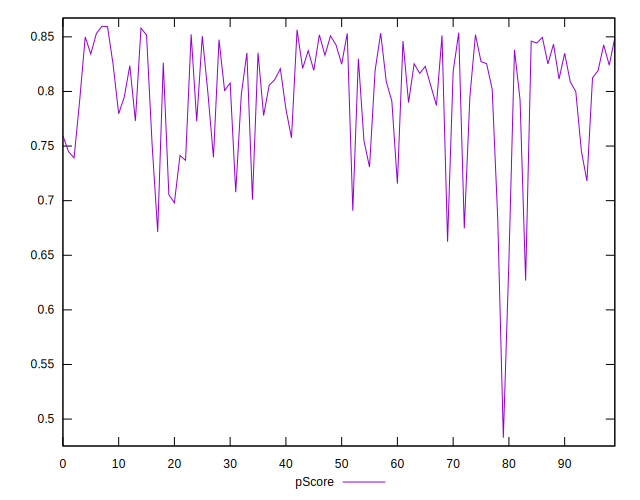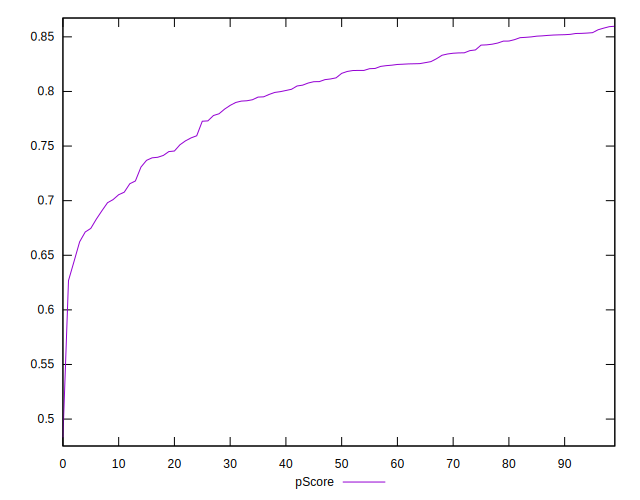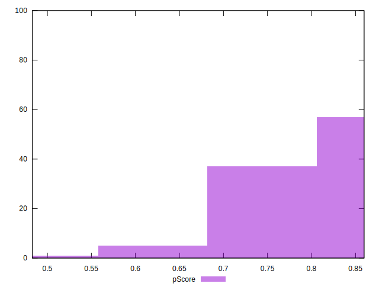
## Score Difference


```yaml
p90min: 0
p90max: 1.1102230246251565e-16
p90range: 1.1102230246251565e-16
p90mean: 2.362176648138631e-17
median: 0
p90stdev: 4.543737504845804e-17
mad: 0
stdevBySn: 0
lfitCenter: 1.635256425389315e-17
lfitStdev: 3.4952379347472356e-17
mfitCenter: 1.635256425389315e-17
mfitStdev: 4.3806311213081194e-17
mfitConfidence: 4.3806311213081194e-18
p90skewness: 1.4036631612571024
p90eccentricity: 1.0000000000000022
p90discretization: 47
outlandishness: 1.168561

```

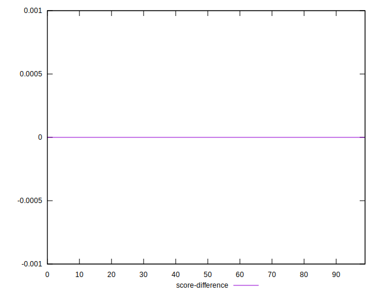
## P Score Difference


```yaml
p90min: -0.004763871847941581
p90max: 0.004811765061565332
p90range: 0.009575636909506913
p90mean: 0.00005646449870030107
median: -0.00005735562477354739
p90stdev: 0.002736699357341852
mad: 0.0024847883698989603
stdevBySn: 0.0032459704381358474
lfitCenter: 0.00009699113849746853
lfitStdev: 0.0024109918605370677
mfitCenter: 0.00009699113849746853
mfitStdev: 0.0030217301868043014
mfitConfidence: 0.0003021730186804301
p90skewness: -0.12301007268327681
p90eccentricity: 1.0000000000000004
p90discretization: 1
outlandishness: 0.8252360577201961

```

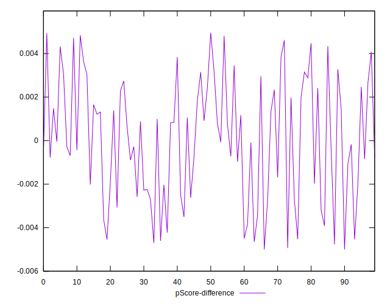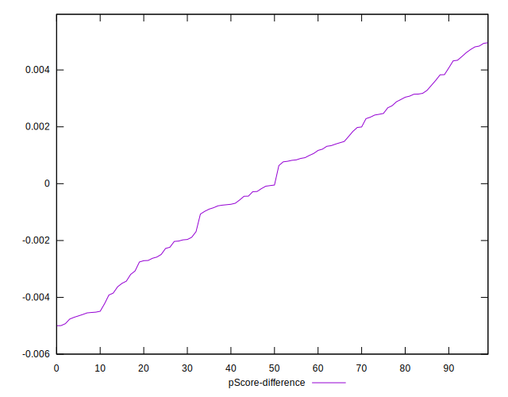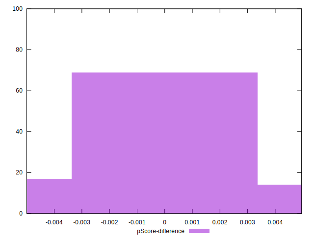