# //first-contentful-paint/samples/card

[→ Parent](../..)


## Raw


```yaml
p90min: 1595.5299999999997
p90max: 2398.0975
p90range: 802.5675000000001
p90mean: 1882.9992010638312
median: 1876.073
p90stdev: 170.22894244201456
mad: 127.86950000000002
stdevBySn: 203.33412589999983
lfitCenter: 1881.4369424720173
lfitStdev: 143.93974552564995
mfitCenter: 1881.4369424720173
mfitStdev: 180.40171817042048
mfitConfidence: 18.040171817042047
p90skewness: 0.5471906538945761
p90eccentricity: 1
p90discretization: 1
outlandishness: 1.0080912199974645

```

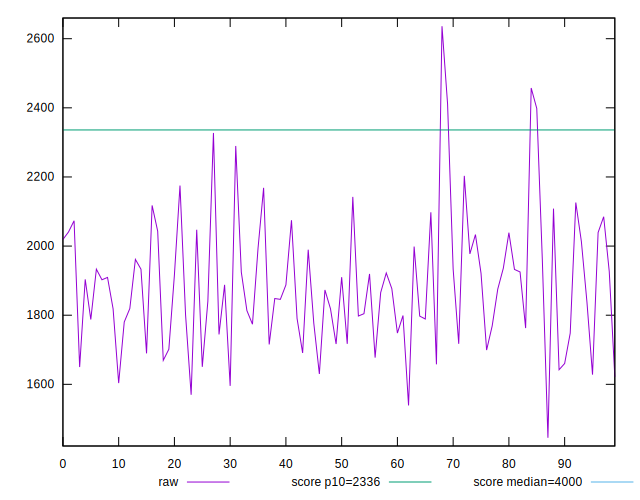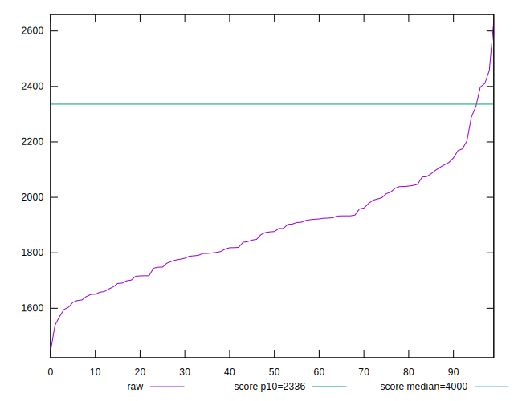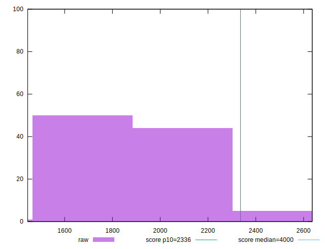
## Score


```yaml
p90min: 0.89
p90max: 0.99
p90range: 0.09999999999999998
p90mean: 0.961170212765957
median: 0.96
p90stdev: 0.018557351183114842
mad: 0.010000000000000009
stdevBySn: 0.023852000000000022
lfitCenter: 0.9615665647169925
lfitStdev: 0.014814114443881837
mfitCenter: 0.9615665647169925
mfitStdev: 0.018566739083009497
mfitConfidence: 0.0018566739083009497
p90skewness: -1.3197291302601044
p90eccentricity: 0.9999999999999997
p90discretization: 8.545454545454545
outlandishness: 0.9961122530796277

```

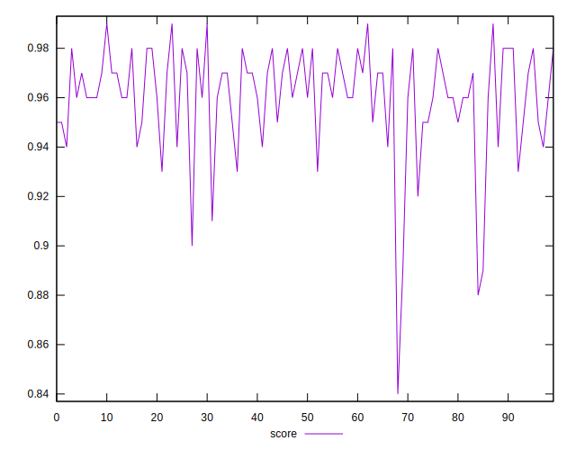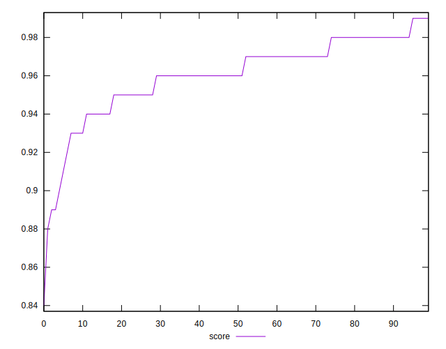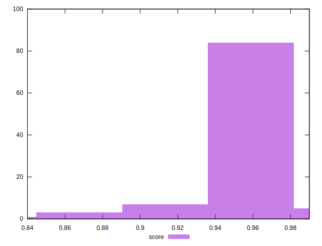
## Raw Estimate

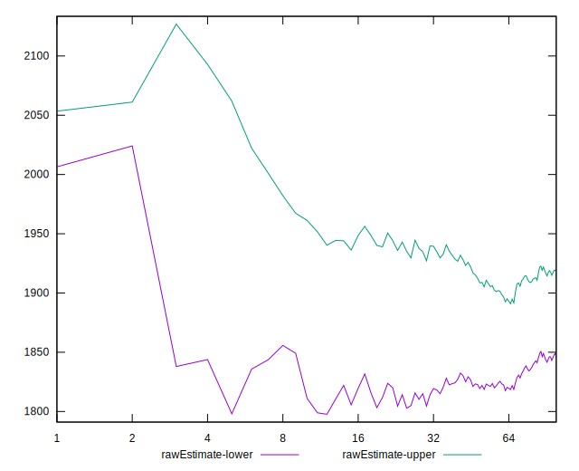
## Score Estimate

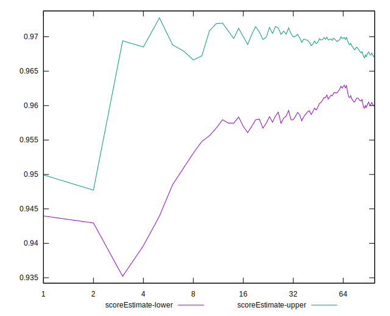
## P Score


```yaml
p90min: 0.8885853488087669
p90max: 0.9857351169648352
p90range: 0.09714976815606824
p90mean: 0.9611708773390195
median: 0.964383050969035
p90stdev: 0.018895506447066494
mad: 0.012691867034497262
stdevBySn: 0.017300176611243005
lfitCenter: 0.9616424566389109
lfitStdev: 0.015330115174064901
mfitCenter: 0.9616424566389109
mfitStdev: 0.019213450093663802
mfitConfidence: 0.0019213450093663802
p90skewness: -1.2964867380422227
p90eccentricity: 1.0000000000000007
p90discretization: 1
outlandishness: 0.995928060301296

```

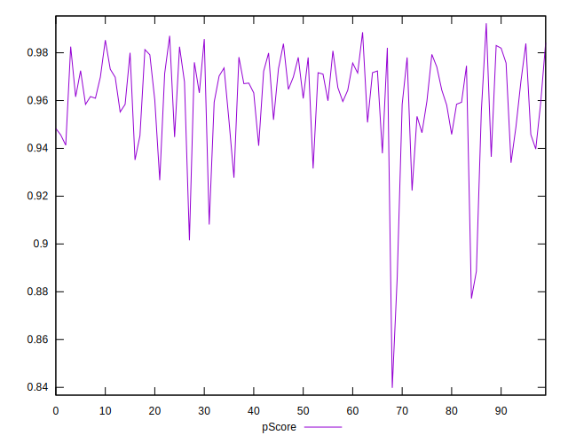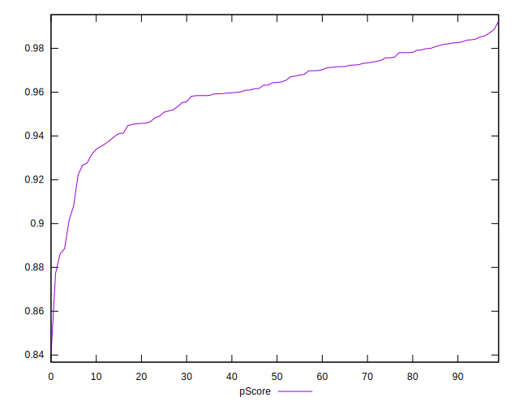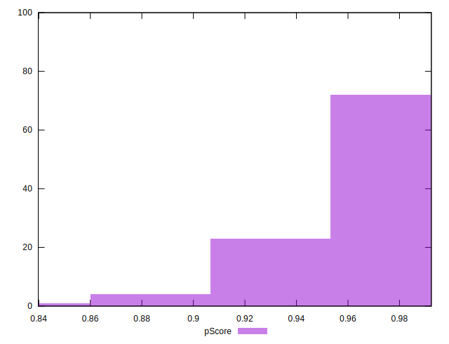
## Score Difference


```yaml
p90min: 0
p90max: 1.1102230246251565e-16
p90range: 1.1102230246251565e-16
p90mean: 1.7716324861039733e-17
median: 0
p90stdev: 4.0657582449828966e-17
mad: 0
stdevBySn: 0
lfitCenter: 1.1841287445510115e-17
lfitStdev: 2.6515949121427835e-17
mfitCenter: 1.1841287445510115e-17
mfitStdev: 3.323281393166429e-17
mfitConfidence: 3.3232813931664293e-18
p90skewness: 1.8591772600772125
p90eccentricity: 1.0000000000000022
p90discretization: 47
outlandishness: 1.2723839999999997

```

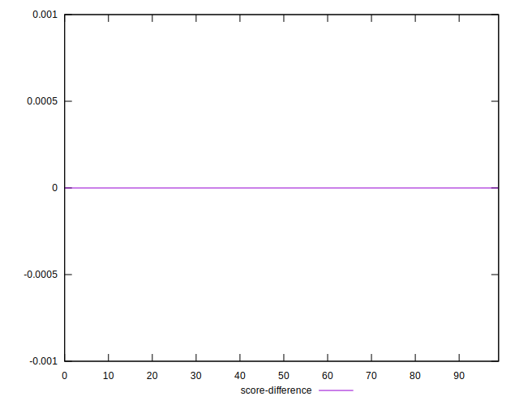
## P Score Difference


```yaml
p90min: -0.0047064198394562995
p90max: 0.004443480217423135
p90range: 0.009149900056879434
p90mean: -0.00009004841989603262
median: -0.0001640598398418569
p90stdev: 0.0025444938843412267
mad: 0.0019460641511530596
stdevBySn: 0.0030083890210592795
lfitCenter: -0.00006994668635126059
lfitStdev: 0.002212295162675676
mfitCenter: -0.00006994668635126059
mfitStdev: 0.0027727008060861283
mfitConfidence: 0.0002772700806086128
p90skewness: -0.07702340412906812
p90eccentricity: 0.9999999999999989
p90discretization: 1
outlandishness: 0.9557544825367498

```

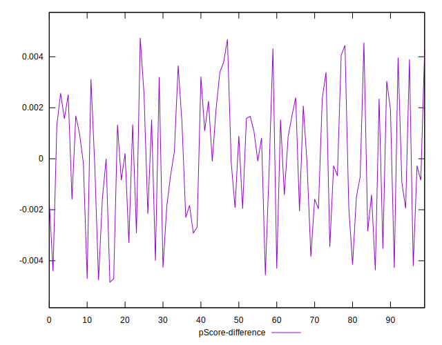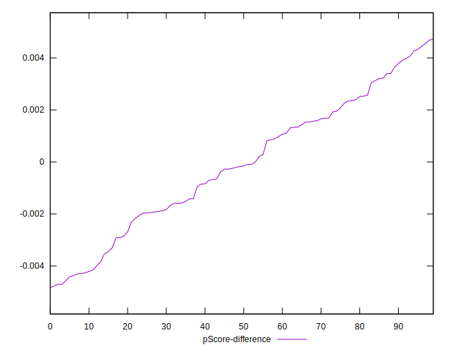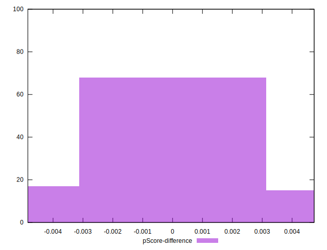