# //first-cpu-idle/samples/agenda

[→ Parent](../..)


## Raw


```yaml
p90min: 1483.5720000000001
p90max: 6565.942999999998
p90range: 5082.370999999998
p90mean: 2612.7975457446805
median: 2487.033
p90stdev: 1020.3633456026441
mad: 164.87795000000028
stdevBySn: 328.9035762000001
lfitCenter: 2591.2831509309467
lfitStdev: 523.9364906529319
mfitCenter: 2591.2831509309467
mfitStdev: 656.6570114515462
mfitConfidence: 65.66570114515461
p90skewness: 2.572788160730424
p90eccentricity: 0.9999999999999997
p90discretization: 1
outlandishness: 1.0740730109422376

```

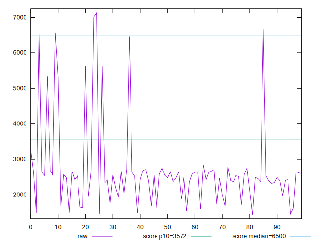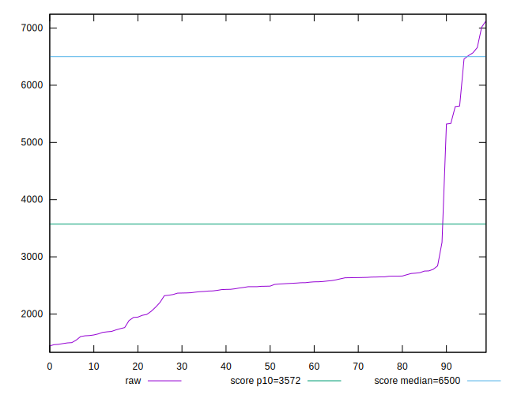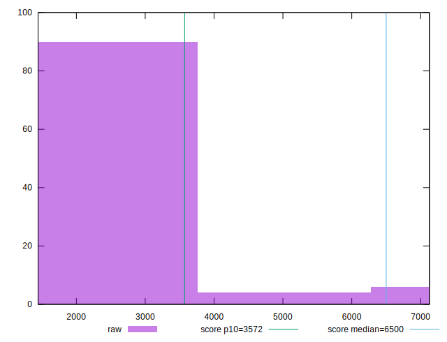
## Score


```yaml
p90min: 0.49
p90max: 1
p90range: 0.51
p90mean: 0.951914893617021
median: 0.98
p90stdev: 0.107587436937083
mad: 0.010000000000000009
stdevBySn: 0.011926000000000011
lfitCenter: 0.9581988842410327
lfitStdev: 0.0546172096903092
mfitCenter: 0.9581988842410327
mfitStdev: 0.06845252111446949
mfitConfidence: 0.006845252111446949
p90skewness: -3.367312008149388
p90eccentricity: 0.9999999999999999
p90discretization: 7.833333333333333
outlandishness: 0.9713922037605047

```

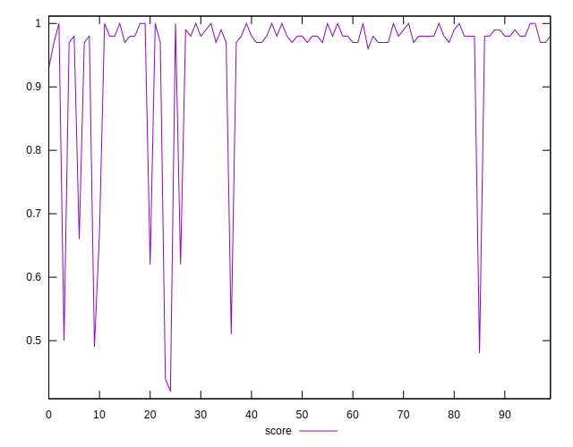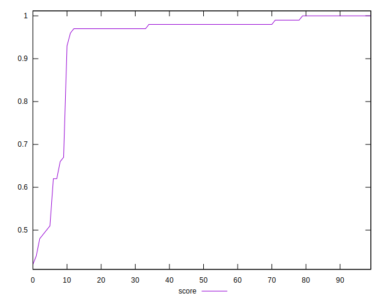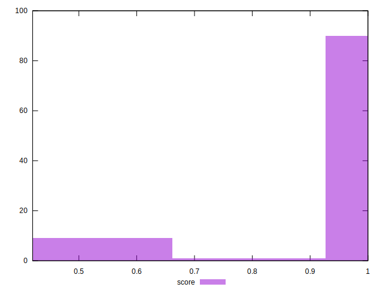
## Raw Estimate

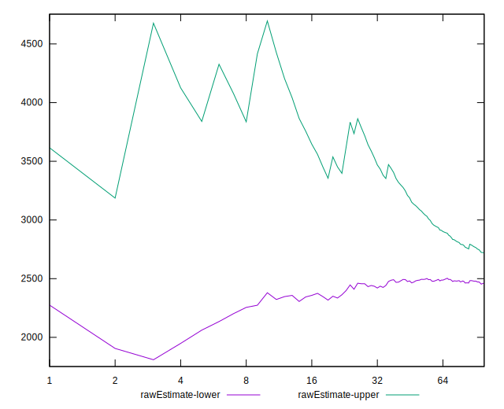
## Score Estimate

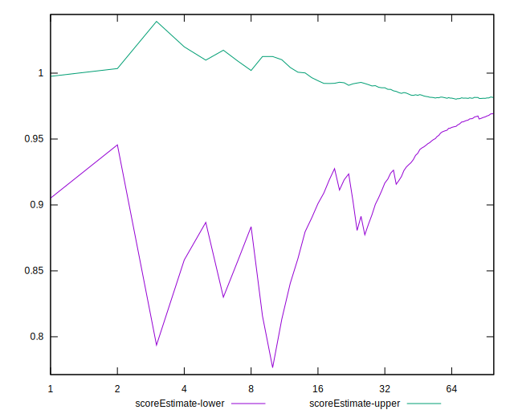
## P Score


```yaml
p90min: 0.491380463410557
p90max: 0.9992177634263018
p90range: 0.5078373000157448
p90mean: 0.9519674091164619
median: 0.9801347468667987
p90stdev: 0.10775077193726883
mad: 0.007519728696881112
stdevBySn: 0.013389832970598191
lfitCenter: 0.9583471075727377
lfitStdev: 0.054735094063058196
mfitCenter: 0.9583471075727377
mfitStdev: 0.06860026726555304
mfitConfidence: 0.006860026726555305
p90skewness: -3.3799212205274354
p90eccentricity: 1.0000000000000002
p90discretization: 1
outlandishness: 0.9712664876299744

```

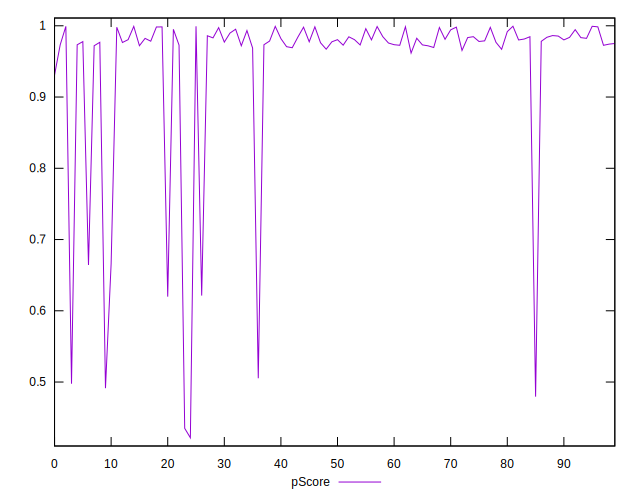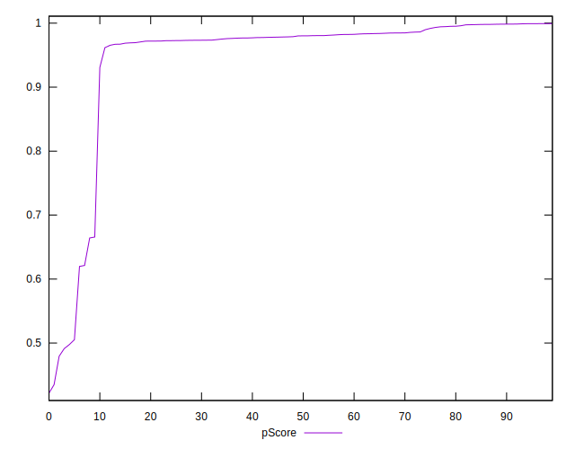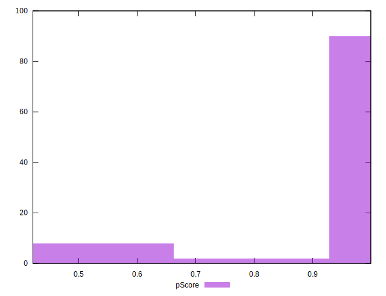
## Score Difference


```yaml
p90min: 0
p90max: 0
p90range: 0
p90mean: 0
median: 0
p90stdev: 0
mad: 0
stdevBySn: 0
lfitCenter: 0
lfitStdev: 0
mfitCenter: 0
mfitStdev: 0
mfitConfidence: 0
p90skewness: .nan
p90eccentricity: .nan
p90discretization: 94
outlandishness: .nan

```


## P Score Difference


```yaml
p90min: -0.004827176647798748
p90max: 0.004568466894322887
p90range: 0.009395643542121634
p90mean: -0.0000027191396575151846
median: -0.00035701944324523227
p90stdev: 0.002651418435907594
mad: 0.0023348828972787894
stdevBySn: 0.0030969655063230457
lfitCenter: -0.000030452658703752018
lfitStdev: 0.0024090283640317203
mfitCenter: -0.000030452658703752018
mfitStdev: 0.0030192693088731035
mfitConfidence: 0.0003019269308873104
p90skewness: 0.00768903535489111
p90eccentricity: 1.0000000000000009
p90discretization: 1
outlandishness: 10.849994520017097

```

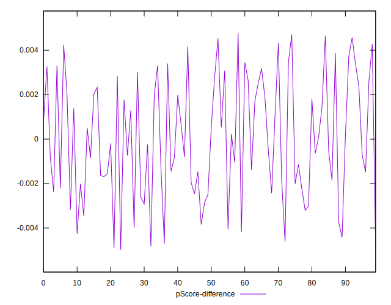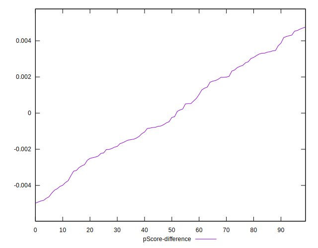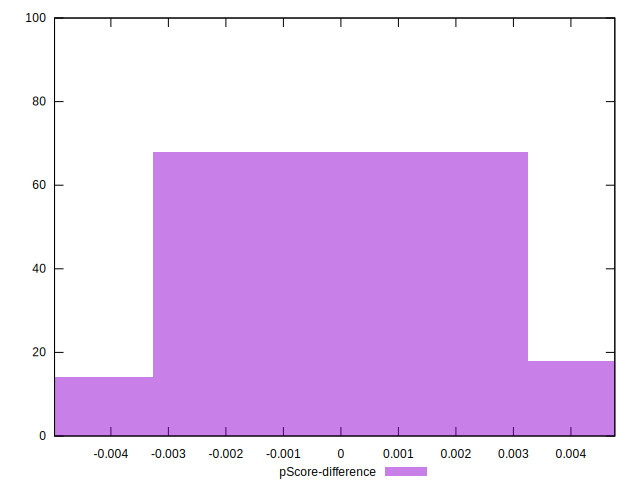